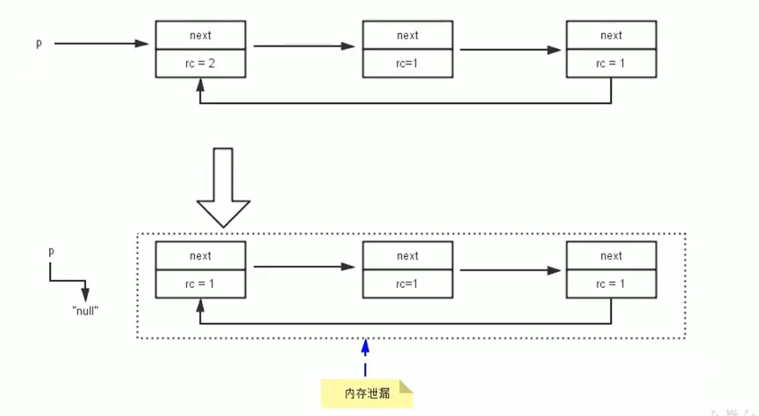

# 垃圾回收相关算法

垃圾清楚的主要目的是收集没用的对象，然后清楚之。因此，垃圾回收的两个阶段：

1.  标记阶段
2.  清楚阶段


## 标记阶段

#### 判断对象是否存活

-   堆里几乎存放了所有对象，在GC之前首先要区分出存活的对象与死亡的对象。只有被标记为死亡的对象，GC才会对其进行回收，释放空间。这个过程被称为垃圾标记阶段
-   JVM标记对象死亡的方法：当一个对象没有被任何其他存活的对象引用时，该对象就可以被判断为已经死亡。
-   判断对象是否存活有两种方式：**引用计数法** 与 可达性分析算法


### 引用计数算法

引用计数算法（Reference Counting）比较简单，对每个对象保存一个整型的引用计数器属性。用于记录对象被引用的情况。

对于一个对象A，只要有任何一个对象引用了A，则A的引用计数器就加1；当引用失效时，引用计数器就减1。只要对象A的引用计数器的值为0，即表示对象A不可能再被使用，可进行回收。

优点：实现简单，垃圾对象便于辨识；判定效率高，回收没有延迟性。

缺点：它需要单独的字段存储计数器，这样的做法增加了存储空间的开销。

>   每次赋值都需要更新计数器，伴随着加法和减法操作，这增加了时间开销。 引用计数器有一个严重的问题，即**无法处理循环引用**的情况。这是一条致命缺陷，导致在Java的垃圾回收器中没有使用这类算法。

#### 循环引用



##### 示例代码

```java
public class RefCountGC {
    // 这个成员属性的唯一作用就是占用一点内存
    private byte[] bigSize = new byte[5*1024*1024];
    // 引用
    Object reference = null;

    public static void main(String[] args) {
        RefCountGC obj1 = new RefCountGC();
        RefCountGC obj2 = new RefCountGC();
        obj1.reference = obj2;
        obj2.reference = obj1;
        obj1 = null;
        obj2 = null;
        // 显示的执行垃圾收集行为，判断obj1 和 obj2是否被回收？
        System.gc();
    }
}

/*执行结果：
[GC (System.gc()) [PSYoungGen: 15490K->808K(76288K)] 15490K->816K(251392K), 0.0061980 secs] [Times: user=0.00 sys=0.00, real=0.36 secs] 
[Full GC (System.gc()) [PSYoungGen: 808K->0K(76288K)] [ParOldGen: 8K->672K(175104K)] 816K->672K(251392K), [Metaspace: 3479K->3479K(1056768K)], 0.0045983 secs] [Times: user=0.00 sys=0.00, real=0.00 secs] 
Heap
 PSYoungGen      total 76288K, used 655K [0x000000076b500000, 0x0000000770a00000, 0x00000007c0000000)
  eden space 65536K, 1% used [0x000000076b500000,0x000000076b5a3ee8,0x000000076f500000)
  from space 10752K, 0% used [0x000000076f500000,0x000000076f500000,0x000000076ff80000)
  to   space 10752K, 0% used [0x000000076ff80000,0x000000076ff80000,0x0000000770a00000)
 ParOldGen       total 175104K, used 672K [0x00000006c1e00000, 0x00000006cc900000, 0x000000076b500000)
  object space 175104K, 0% used [0x00000006c1e00000,0x00000006c1ea8070,0x00000006cc900000)
 Metaspace       used 3486K, capacity 4496K, committed 4864K, reserved 1056768K
  class space    used 385K, capacity 388K, committed 512K, reserved 1048576K
*/
```

可见进行了GC行为，因此Java使用的不是引用计数算法

#### 小结

引用计数算法，是很多语言的资源回收选择，例如因人工智能而更加火热的Python，它更是同时支持引用计数和垃圾收集机制。

具体哪种最优是要看场景的，业界有大规模实践中仅保留引用计数机制，以提高吞吐量的尝试。

Java并没有选择引用计数，是因为其存在一个基本的难题，也就是很难处理循环引用关系。Python如何解决循环引用？

>   手动解除：很好理解，就是在合适的时机，解除引用关系。 使用弱引用weakref，weakref是Python提供的标准库，旨在解决循环引用。


### 可达性分析算法

可达性分析算法（GC Roots）：也可以称为 根搜索算法或追踪性垃圾收集

相对于引用计数算法而言，可达性分析算法不仅同样具备实现简单和执行高效等特点，更重要的是该算法可以有效地解决在引用计数算法中循环引用的问题，防止内存泄漏的发生。

相较于引用计数算法，这里的可达性分析就是Java、C#选择的。这种类型的垃圾收集通常也叫作追踪性垃圾收集（Tracing Garbage Collection）

#### 可达性分析算法的基本思路

-   可达性分析算法是以根对象集合（GCRoots）为起始点，**按照从上至下的方式搜索被根对象集合所连接的目标对象是否可达。**
-   使用可达性分析算法后，内存中的存活对象都会被根对象集合直接或间接连接着，**搜索所走过的路径称为引用链（Reference Chain）**
-   如果目标对象**没有任何引用链相连，则是不可达的，就意味着该对象己经死亡，可以标记为垃圾对象。**
-   在可达性分析算法中，只有能够被根对象集合直接或者间接连接的对象才是存活对象。


####  GC Roots具体元素

-   虚拟机栈中引用的对象
    -   比如：各个线程被调用的方法中使用到的参数、局部变量等。
-   本地方法栈内JNI（通常说的本地方法）引用的对象方法区中类静态属性引用的对象
    -   比如：Java类的引用类型静态变量
-   方法区中常量引用的对象
    -   比如：字符串常量池（string Table）里的引用
-   所有被同步锁synchronized持有的对象
-   Java虚拟机内部的引用。
    -   基本数据类型对应的Class对象，一些常驻的异常对象（如：Nu11PointerException、outofMemoryError），系统类加载器。
-   反映java虚拟机内部情况的JMXBean、JVMTI中注册的回调、本地代码缓存等。


小结：除了堆空间外的一些结构，比如 虚拟机栈、本地方法栈、方法区、字符串常量池 等地方对堆空间进行引用的，都可以作为GC Roots进行可达性分析

>   例外： 堆在进行可达性分析时，堆中非分析区域的对象也可以作为可达性分析的具体元素（根）

##### 小技巧

由于Root采用栈方式存放变量和指针，所以如果一个指针，它保存了堆内存里面的对象，但是自己又不存放在堆内存里面，那它就是一个Root。

#### 注意

如果要使用可达性分析算法来判断内存是否可回收，那么分析工作必须在一个能保障一致性的快照中进行。这点不满足的话分析结果的准确性就无法保证。

这点也是导致GC进行时必须“stop The World”的一个重要原因。

即使是号称（几乎）不会发生停顿的CMS收集器中，枚举根节点时也是必须要停顿的。


##  对象的finalization机制

Java语言提供了**对象终止（finalization）机制**来允许开发人员提供对象被销毁之前的自定义处理逻辑。

当垃圾回收器发现没有引用指向一个对象，即：**垃圾回收此对象之前，会先调用这个对象的finalize()方法。**（只调用一次）

**finalize() 方法允许在子类中被重写，用于在对象被回收时进行资源释放。**通常在这个方法中进行一些资源释放和清理的工作，比如关闭文件、套接字和数据库连接等。

### 不要主动调用某个对象的finalize（）！

应该交给垃圾回收机制调用。理由包括下面三点：

-   在finalize（）时可能会导致对象复活。
-   finalize（）方法的执行时间是没有保障的，它完全由Gc线程决定，极端情况下，若不发生GC，则finalize（）方法将没有执行机会。
    -   因为**优先级比较低**，即使主动调用该方法，也不会因此就直接进行回收
-   一个糟糕的finalize（）会严重影响Gc的性能。

Java采用的是基于垃圾回收器的自动内存管理机制，不需要手动调用finalize()方法

### 对象存在的三种可能的状态

如果从所有的根节点都无法访问到某个对象，说明对象己经不再使用了。一般来说，此对象需要被回收。但事实上，也并非是“非死不可”的，这时候它们暂时处于“缓刑”阶段。**一个无法触及的对象有可能在某一个条件下“复活”自己**，如果这样，那么对它的回收就是不合理的，为此，定义虚拟机中的对象可能的三种状态。如下：

-   **可触及的状态**：从根节点开始，可以到达这个对象。
-   **可复活的状态**：对象的所有引用都被释放，但是对象有可能在finalize（）中复活。
-   **不可触及的状态**：对象的finalize（）被调用，并且没有复活，那么就会进入不可触及状态。不可触及的对象不可能被复活，因为**finalize()只会被调用一次**。

以上3种状态中，是由于finalize（）方法的存在，进行的区分。只有在对象不可触及时才可以被回收。

### 具体过程分析

判定一个对象objA是否可回收，至少要经历两次标记过程：

-   如果对象objA到GC Roots没有引用链，则进行第一次标记。
-   进行筛选，判断此对象是否有必要执行finalize（）方法
    -   如果对象objA没有重写finalize（）方法，或者finalize（）方法已经被虚拟机调用过，则虚拟机视为“没有必要执行”，objA被判定为不可触及的。
    -   如果对象objA重写了finalize（）方法，且还未执行过，那么objA会被插入到F-Queue队列中，由一个虚拟机自动创建的、低优先级的Finalizer线程触发其finalize（）方法执行。
    -   **finalize（）方法是对象逃脱死亡的最后机会**，稍后GC会对F-Queue队列中的对象进行第二次标记。如果objA在finalize（）方法中与引用链上的任何一个对象建立了联系，那么在第二次标记时，objA会被移出“即将回收”集合。之后，对象会再次出现没有引用存在的情况。在这个情况下，finalize方法不会被再次调用，对象会直接变成不可触及的状态，也就是说，一个对象的finalize方法只会被调用一次。

##### 代码示例

```java
public class FinalizeEscapeGC {
    public static FinalizeEscapeGC SAVE_HOOK = null;
    public void isAlive() {
        System.out.println("yes, i am still alive :)");
    }
    @Override
    protected void finalize() throws Throwable {
        super.finalize();
        System.out.println("finalize method executed!");
        FinalizeEscapeGC.SAVE_HOOK = this;
    }
    public static void main(String[] args) throws Throwable {
        SAVE_HOOK = new FinalizeEscapeGC();
        //对象第一次成功拯救自己
        SAVE_HOOK = null;
        System.gc();
        // 因为Finalizer方法优先级很低，暂停0.5秒，以等待它
        Thread.sleep(500);
        if (SAVE_HOOK != null) {
            SAVE_HOOK.isAlive();
        } else {
            System.out.println("no, i am dead :(");
        }
        // 下面这段代码与上面的完全相同，但是这次自救却失败了
        SAVE_HOOK = null;
        System.gc();
        // 因为Finalizer方法优先级很低，暂停0.5秒，以等待它
        Thread.sleep(500);
        if (SAVE_HOOK != null) {
            SAVE_HOOK.isAlive();
        } else {
            System.out.println("no, i am dead :(");
        }
    }
}
```

