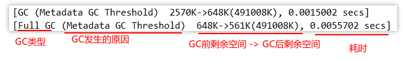
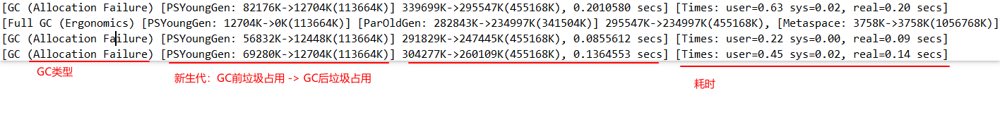

# GC日志分析

通过阅读Gc日志，我们可以了解Java虚拟机内存分配与回收策略。 内存分配与垃圾回收的参数列表

-   -XX:+PrintGC  输出GC日志。类似：-verbose:gc
-   -XX:+PrintGCDetails  输出Gc的详细日志
-   -XX:+PrintGCTimestamps   输出Gc的时间戳（以基准时间的形式）
-   -XX:+PrintGCDatestamps  输出Gc的时间戳（以日期的形式，如2013-05-04T21：53：59.234+0800）
-   -XX:+PrintHeapAtGC  在进行Gc的前后打印出堆的信息
-   -Xloggc:../logs/gc.1og  日志文件的输出路径


## 参数分析

#### 1、-verbose:gc 参数分析



```
[GC (Metadata GC Threshold)  2570K->696K(491008K), 0.0020281 secs]
[Full GC (Metadata GC Threshold)  696K->561K(491008K), 0.0065079 secs]
[GC (Allocation Failure)  129073K->30427K(491008K), 0.0866403 secs]

分析：
Metadata GC Threshold：元空间不足
Allocation Failure：堆空间内存分配失败
```

#### 2、 PrintGCDetails 参数分析



```
[GC (Metadata GC Threshold) [PSYoungGen: 2570K->696K(149504K)] 2570K->696K(491008K), 0.0011210 secs] [Times: user=0.00 sys=0.00, real=0.00 secs] 

[Full GC (Metadata GC Threshold) [PSYoungGen: 696K->0K(149504K)] [ParOldGen: 0K->561K(341504K)] 696K->561K(491008K), [Metaspace: 2695K->2695K(1056768K)], 0.0119130 secs] [Times: user=0.02 sys=0.00, real=0.01 secs] 

[GC (Allocation Failure) [PSYoungGen: 128512K->20978K(149504K)] 129073K->30427K(491008K), 0.0650458 secs] [Times: user=0.19 sys=0.00, real=0.07 secs] 

[Full GC (Ergonomics) [PSYoungGen: 12704K->0K(113664K)] [ParOldGen: 282827K->234995K(341504K)] 295531K->234995K(455168K), [Metaspace: 3758K->3758K(1056768K)], 4.3003995 secs] [Times: user=8.61 sys=0.05, real=4.30 secs] 

分析：
Metadata GC Threshold：元空间不足
Allocation Failure：堆空间内存分配失败
Ergonomics：老年代空间即将不足
```

