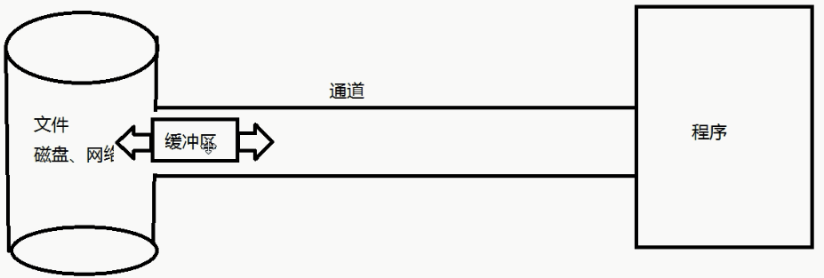
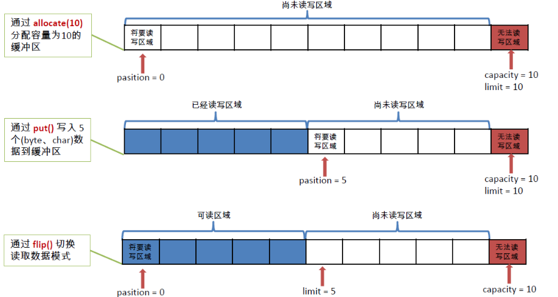
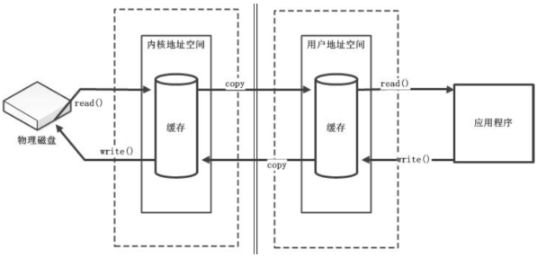
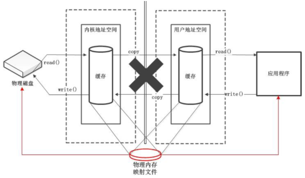
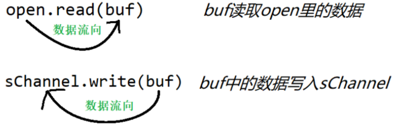

# 通道和缓冲区

Java NIO系统的核心在于：通道(Channel)和缓冲区(Buffer)。通道表示打开到IO 设备(例如：文件、套接字)的连接。若需要使用NIO 系统，需要获取用于连接IO 设备的通道以及用于容纳数据的缓冲区。然后操作缓冲区，对数据进行处理。

 

简而言之，Channel 负责传输，Buffer 负责存储




## 缓冲区(Buffer)

#### 缓冲区概述

-   缓冲区（Buffer）：一个用于特定基本数据类型的容器。由java.nio 包定义的，所有缓冲区都是Buffer 抽象类的子类。
-   Java NIO中的Buffer 主要用于与NIO 通道进行交互，数据是从通道读入缓冲区，从缓冲区写入通道中的。
-   Buffer 就像一个数组，可以保存多个相同类型的数据。根据数据类型不同(boolean 除外) ，有以下Buffer 常用子类：
    ByteBuffer
    CharBuffer
    ShortBuffer
    IntBuffer
    LongBuffer
    FloatBuffer
    DoubleBuffer
-   上述Buffer 类他们都采用相似的方法进行管理数据，只是各自管理的数据类型不同而已。都是通过如下方法获取一个Buffer 对象：
    static XxxBuffer allocate(int capacity) : 创建一个容量为capacity 的XxxBuffer 对象

#### 缓冲区的基本属性

-   -   Buffer 中的重要概念：
    -   容量(capacity) ：表示Buffer 最大数据容量，缓冲区容量不能为负，并且创建后不能更改。
    -   限制(limit)：第一个不应该读取或写入的数据的索引，即位于limit 后的数据不可读写。缓冲区的限制不能为负，并且不能大于其容量。
    -   位置(position)：下一个要读取或写入的数据的索引。缓冲区的位置不能为负，并且不能大于其限制
    -   标记(mark)与重置(reset)：标记是一个索引，通过Buffer 中的mark() 方法指定Buffer 中一个特定的position，之后可以通过调用reset() 方法恢复到这个position.
    -   标记、位置、限制、容量遵守以下不变式：0<=mark<=position<=limit<=capacity



#### 缓冲区的常用方法

| 方法                   | 描述                                                      |
| ---------------------- | --------------------------------------------------------- |
| Buffer clear()         | 清空缓冲区并返回对缓冲区的引用                            |
| Buffer flip()          | 将缓冲区的界限设置为当前位置，并将当前位置充值为0         |
| int capacity()         | 返回Buffer 的capacity大小                                 |
| boolean hasRemaining() | 判断缓冲区中是否还有元素                                  |
| int limit()            | 返回Buffer 的界限(limit)   的位置                         |
| Bufferlimit(int n)     | 将设置缓冲区界限为n,   并返回一个具有新limit 的缓冲区对象 |
| Buffer mark()          | 对缓冲区设置标记                                          |
| int position()         | 返回缓冲区的当前位置position                              |
| Buffer position(int n) | 将设置缓冲区的当前位置为n ,   并返回修改后的Buffer 对象   |
| int remaining()        | 返回position 和limit   之间的元素个数                     |
| Buffer reset()         | 将位置position   转到以前设置的mark 所在的位置            |
| Buffer rewind()        | 将位置设为为0，取消设置的mark                             |

#### 缓冲区的数据操作

`Buffer`  所有子类提供了两个用于数据操作的方法：get() 与put() 方法

-   获取Buffer 中的数据

| get()           | 读取单个字节                             |
| --------------- | ---------------------------------------- |
| get(byte[] dst) | 批量读取多个字节到dst 中                 |
| get(int index)  | 读取指定索引位置的字节(不会移动position) |

-   放入数据到Buffer 中

| put(byte b)            | 将给定单个字节写入缓冲区的当前位置               |
| ---------------------- | ------------------------------------------------ |
| put(byte[] src)        | 将src 中的字节写入缓冲区的当前位置               |
| put(int index, byte b) | 将指定字节写入缓冲区的索引位置(不会移动position) |


#### 直接缓冲区和非直接缓冲区

-   字节缓冲区要么是直接的，要么是非直接的。如果为直接字节缓冲区，则Java      虚拟机会尽最大努力直接在此缓冲区上执行本机I/O 操作。也就是说，在每次调用基础操作系统的一个本机I/O      操作之前（或之后），虚拟机都会尽量避免将缓冲区的内容复制到中间缓冲区中（或从中间缓冲区中复制内容）。


-   直接字节缓冲区可以通过调用此类的allocateDirect()      工厂方法来创建。此方法返回的缓冲区进行分配和取消分配所需成本通常高于非直接缓冲区。直接缓冲区的内容可以驻留在常规的垃圾回收堆之外，因此，它们对应用程序的内存需求量造成的影响可能并不明显。所以，建议将直接缓冲区主要分配给那些易受基础系统的本机I/O      操作影响的大型、持久的缓冲区。一般情况下，最好仅在直接缓冲区能在程序性能方面带来明显好处时分配它们。


-   直接字节缓冲区还可以通过FileChannel 的map()      方法将文件区域直接映射到内存中来创建。该方法返回MappedByteBuffer。Java 平台的实现有助于通过JNI      从本机代码创建直接字节缓冲区。如果以上这些缓冲区中的某个缓冲区实例指的是不可访问的内存区域，则试图访问该区域不会更改该缓冲区的内容，并且将会在访问期间或稍后的某个时间导致抛出不确定的异常。


-   字节缓冲区是直接缓冲区还是非直接缓冲区可通过调用其isDirect()方法来确定。提供此方法是为了能够在性能关键型代码中执行显式缓冲区管理。

#### 非直接缓冲区

****

#### 直接缓冲区




## 通道(Channel)

通道（Channel）：由java.nio.channels包定义的。Channel 表示IO 源与目标打开的连接。Channel 类似于传统的“流”。只不过Channel 本身不能直接访问数据，Channel只能与Buffer 进行交互。

#### 通道概述: 

通道（Channel）：由java.nio.channels包定义的。Channel 表示IO 源与目标打开的连接。Channel 类似于传统的“流”。只不过Channel 本身不能直接访问数据，Channel只能与Buffer 进行交互。

#### 主要实现类

Java 为Channel    接口提供的最主要实现类如下：

| FileChannel         | 用于读取、写入、映射和操作文件的通道。                       |
| ------------------- | ------------------------------------------------------------ |
| DatagramChannel     | 通过UDP 读写网络中的数据通道。                               |
| SocketChannel       | 通过TCP 读写网络中的数据。                                   |
| ServerSocketChannel | 可以监听新进来的TCP   连接，对每一个新进来的连接都会创建一个SocketChannel。 |

#### 获取通道

-   获取通道的一种方式是对支持通道的对象调用
-   .getChannel()      方法。支持通道的类如下：
    -   FileInputStream
    -   FileOutputStream
    -   RandomAccessFile
    -   DatagramSocket
    -   Socket
    -   ServerSocket
-   获取通道的其他方式是使用Files      类的静态方法newByteChannel() 获取字节通道。或者通过通道的静态方法open() 打开并返回指定通道

#### 通道的数据传输



| buf      | 字节缓冲区(ByteBuffer)  |
| -------- | ----------------------- |
| open     | 文件通道(FileChannel)   |
| sChannel | 网络通道(SocketChannel) |

>   通道(Channel) 本身不含有数据,但是需要配合缓冲区进行数据传输
>
>   通道的获取方式: [相应通道的名称(File,Socket,...)]Channel.open(...,...);

```java
// 将Buffer中的数据写入Channel
int bytesWritten = inChannel.write(buf);

// 从通道中读取数据
int bytesRed = inChannel.red(buf)
```