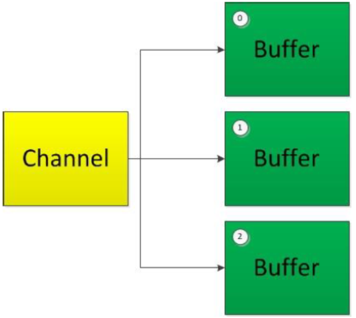
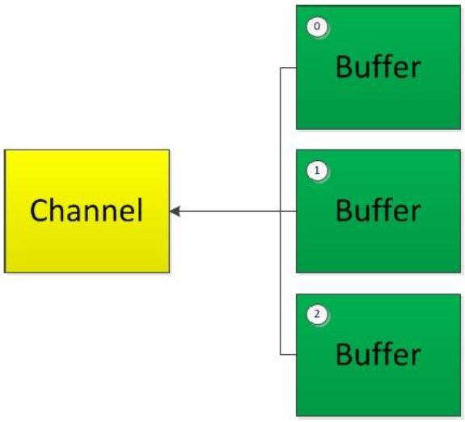

# 分散(Scatter)和聚集(Gather)

## 分散读取（Scattering Reads）

指从Channel 中读取的数据“分散”到多个Buffer 中。

注意：按照缓冲区的顺序，从Channel 中读取的数据依次将Buffer 填满。



## 聚集写入（Gathering Writes）

指将多个Buffer 中的数据“聚集”到Channel。

注意：按照缓冲区的顺序，写入position 和limit      之间的数据到Channel 。



## 代码示例

```java
@Test
public void test4() throws IOException{
    RandomAccessFile raf1 = new RandomAccessFile("d:/1.txt", "rw");

    //1. 获取通道
    FileChannel channel1 = raf1.getChannel();

    //2. 分配指定大小的缓冲区
    ByteBuffer buf1 = ByteBuffer.allocate(300);
    ByteBuffer buf2 = ByteBuffer.allocate(1024);

    //3. 分散读取
    ByteBuffer[] bufs = {buf1, buf2};
    //轮训缓冲区数组，然后从下标0开始轮训，依次写满
    channel1.read(bufs);

    //3. 反转，准备读取数据
    for (ByteBuffer byteBuffer : bufs) {
        byteBuffer.flip();
    }

    System.out.println(new String(bufs[0].array(), 0, bufs[0].limit()));
    System.out.println("-----------------");
    System.out.println(new String(bufs[1].array(), 0, bufs[1].limit()));

    //4. 聚集写入
    RandomAccessFile raf2 = new RandomAccessFile("d:/2.txt", "rw");
    FileChannel channel2 = raf2.getChannel();

    channel2.write(bufs);
}
```