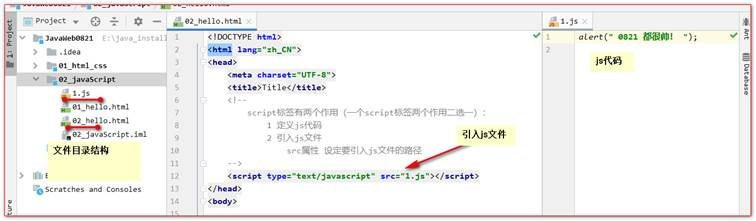
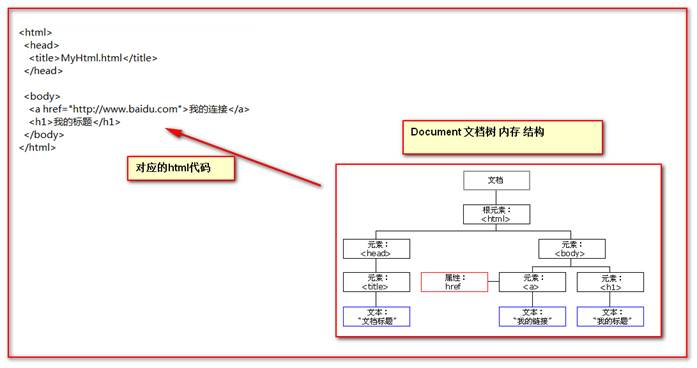

# JavaScript（后端）

Javascript语言诞生主要是完成页面的数据验证。因此它运行在客户端，需要运行浏览器来解析执行JavaScript代码。

JS是Netscape网景公司的产品，最早取名为LiveScript;为了吸引更多java程序员。更名为JavaScript。

**JS是弱类型，Java是强类型。**

**特点：**

-   交互性（它可以做的就是信息的动态交互）

-   安全性（不允许直接访问本地硬盘）

-   跨平台性（只要是可以解释JS的浏览器都可以执行，和平台无关）

 

## JavaScript 和 html 代码的结合方式

1、只需要在head 标签中，或者在body标签中， 使用script 标签 来书写JavaScript代码。


2、把javaScript代码写在一个单独的js文件中，然后在html页面中，使用script标签的src属性引入单独的js文件。




## JS 变量

### JavaScript的变量类型

|变量类型|关键字|
|---|---|
|数值类型 |number，类似Java中的 shoft byte int long float double|
|字符串类型| string|
|对象类型| object|
|布尔类型| boolean|
|函数类型| function |

### JavaScript里特殊的值

-   undefined：未定义 ， 所有变量未赋于初始值的时候，默认值都是undefined。
-   null：显示的赋于空值。
-   NaN：not a number 非数字，非数值。一切用于非法的算术运算结果（加法除外）

### JS中的定义变量格式：

```js
var 变量名
var 变量名 = 值;
```

**代码示例**

```js
var i ;
// alert( i ); // undefined
// typeof()是一个函数。用于取变量的数据类型
// alert( typeof (i)); //未赋过值的js变量数据类型，也是未知。
i = 12;
// alert(typeof(i));//number

i = "abc";
// alert(typeof(i));//string

var a = 12;
var b = "abc";

alert( a * b );//NaN
```

### 关系（比较）运算

一般的关系运算符 > < 与Java的关系运算符无异

主要区别位 ==  与 ===

| 关系运算符  | 说明                                   |
| ----------- | -------------------------------------- |
| 全等于：=== | 比较字面量与数据类型                   |
| 等于：==    | 将字符串转为number类型，然后比较字面量 |

### 逻辑运算

与Java中的有区别，主要体现在返回值不同

| 逻辑运算符   | 说明                                                         |
| ------------ | ------------------------------------------------------------ |
| 且运算：&&   | 当表达式全为真的时候。返回最后一个表达式的值。<br>当表达式中有一个为假的时候。返回第一个为假的表达式的值 |
| 或运算：\|\| | 当表达式全为假时，返回最后一个表达式的值。<br>只要有一个表达式为真。就会把回第一个为真的表达式的值 |
| 取反运算：!  | 取反运算                                                     |


## 数组

**JS中数组的声明方式**

```js
// 空数组
var 数组名 = [];

// 动态赋值
var 数组名 = [123,'Leo',true];
```

**数组的赋值方式**

```js
var arr1 = [];
arr1[6] = 123;
arr1[7] = 'Leo';
```

说明：

-   JS中数组不需要指定长度，直接赋值即可。可以与Java中一样通过for循环取出数组的内容。

-   数组的长度位最大赋值的下标+1

**数组遍历**

```js
for (var i = 0; i < arr.length; i++) {
    alert( arr[i] );
}
```


## 函数

### 函数的两种定义方式

#### 1、通过function关键字定义

格式如下

```js
function 函数名( 参数列表 ){
    // 函数体
}
```

>   在javaScript中，定义带有返回值的函数。只需要在函数体内直接使用return语句返回即可

**代码示例**

```js
// 函数都是调用都会执行。

// 无参函数的定义
function fun() {
    alert(" 无参函数fun()调用 ");
}

// 函数调用
// fun();

// 有参函数的定义
function fun2( a , b ) {
    alert("fun2()有参函数调用  a=" + a + ",b=" + b);
}

// fun2(12,"abc");

function sum(num1,num2) {
    return num1 + num2;
}

alert( sum(100,200) );
```

#### 2、通过 变量名接收函数 来定义函数

格式如下

```js
var fun1 = function(  参数列表 ){
    // 函数体
}
```

**代码示例**

```js

var fun = function () {
    alert("fun()函数")
}

// fun();

var fun = function (a, b) {
    alert("a=" + a);
    alert("b=" + b);
}
// fun(12,"abc");

var sum = function (num1, num2) {
    return num1 + num2;
}

var result = sum(10, 20);
alert(result)
```

### 函数的 arguments 隐形参数（只在function函数内）

所谓隐形参数是指，用户不需要显示的定义。而可以直接在function函数体内使用的变量，它可以获取全部的参数。js中的隐形参数就跟java中的可变长参数类似，也是一个数组，但无需声明。

```js
// 函数体内的隐形参数：arguments 类似数组z

function add() {
    var sum = 0;
    for (let i = 0; i < arguments.length; i++) {
        if (typeof (arguments[i]) == 'number') {
            sum += arguments[i];
        }
    }
    return sum;
}

let sum = add(1, 1, 1, 1, 1, "ad");
alert("sum=" + sum);
```

JS中的函数与函数调用：
var v1 = func()	代表将函数执行完的返回值赋予v1
var v2 = func	代表将func函数赋予v2（可作为回调函数）

>   说白了，func 即 将该函数的地址赋予变量 ；func() 即调用该函数


## JS 自定义对象

#### Object形式的自定义对象

定义：

```js
var 变量名 = new Object();		// 有一个对象实例
变量名.属性名 = 值;			 // 添加一个属性
变量名.属性名 = 值;			 // 添加一个属性
变量名.函数名 = function( 参数列表 ){ 函数体 }	// 添加一个函数
```

访问:

```javascript
变量名.属性名/函数名( 参数 );
```

**代码示例**

```js
var obj = new Object();
obj.name = "华仔";
obj.age = 18 ;
obj.fun = function () {
    alert("姓名：" + this.name + " , 年龄：" + this.age);
}
```

#### {}花括号形式的自定义对象

在javaScript语言中，中括号[]是数组，大括号{} 是对象。

定义:

```js
var 变量名 = {
    属性名：值 ,                             // 添加一个属性
    属性名：值 ,                             // 添加一个属性
    函数名 : function( 参数列表 ){ 函数体 }    // 添加一个方法、函数
};    
```

**代码示例**

```js
// 通过花括号定义
var obj2 = {
    name: "LeoNardo",
    age: '22',
    skill: function (str) {
        alert("我会" + str)
    }
}

alert("name:" + obj2.name);
alert("age:" + obj2.age);

obj2.skill("敲代码");
```


## JS 事件

事件是电脑输入设备与页面进行交互的响应。

#### 常用的事件

| 事件函数 | 事件名称 | 事件描述 |
| -------- | -------- | -------- |
|onload|加载完成事件|页面加载完成之后，用于初始化js操作|
|onclick|单击事件|单击事件，常用于按钮点击之后的响应操作|
|onblur|失去焦点事件|失去焦点之后做一些操作|
|onchange|内容发生改变事件|常用于下拉列表，以及输入框内容发生改变之后的操作|
|onsubmit|表单提交事件|用于表单提交前验证表单项是否合法，如果不合法就阻止提交。|

### 事件绑定（事件注册）

事件绑定分为静态绑定与动态绑定

-   静态绑定：通过标签事件属性，直接赋于事件响应后的js操作。

-   先通过js代码获取到标签对象。然后再通过标签对象.事件名=function(){}的形式叫动态注册。

#### 动态绑定步骤：

1.  设置页面加载完再加载 script脚本
2.  获取标签对象
3.  给标签对象绑定事件

代码示例1：给btn02元素绑定一个单击事件（onclick）

```js
window.onload = function () {
    // Element，元素，这里指的是标签对象
    let btn02 = document.getElementById('btn02');
    btn02.onclick = function () {
        alert("我是第二个按钮~~~~");
    }
}
```

代码示例2：给输入完毕的输入框检验是否符合正则条件（onchange）

```html
<!DOCTYPE html>
<html lang="en">
<head>
   <meta charset="UTF-8">
   <title>Title</title>
   <script>
        /*
      * DOM 模型：Document Object Model 文档对象模型，将html文档转为对象来管理
      * */
        function checkUser() {
            let element = document.getElementById('username');
            let warningString = document.getElementById('warningString');
            var rex = /^\w{5,12}$/;

            if (!rex.test(element.value)) {
                warningString.style.color = 'red';
                warningString.innerText = "用户名不合法！";
            } else {
                warningString.style.color = 'green';
                warningString.innerText = "√";
                // alert("登陆成功")
            }

        }
   
   </script>
</head>
<body>
   <p>请输入5~12位用户名，不以数字开头</p>
   用户名：<input type="text" id="username" onchange="checkUser()">
   <span id="warningString" style="color: red"></span> <br><br>
</body>
</html>
```

#### 静态绑定步骤：

1.  再脚本代码中声明函数
2.  直接再标签上使用属性，指明需要调用的方法

代码示例

```html
<button id="btn01" onclick="clickFunc()">按钮2</button>

<script>
    function clickFunc() {
        let btn01 = document.getElementById('btn01');
        btn02.onclick = function () {
            alert("我是第1个按钮~~~~");
        }
    }
</script>
```


## DOM 模型

### Document对象



**Document** **对象的理解：**

1.  Document它管理了所有的Html文档内容。
2.  document它是一种树结构的文档。有层级关系。
3.  **它让我们把所有的标签** **都** **对象化** 
4.  我们可以通过document访问所有的标签对象。

**那么 html** **标签** **要** **对象化** **怎么办？**

```html
<body>
    <div id="div01">div01</div>
</body>
```

**模拟对象化，相当于：**

```java
class Dom{
    private String id;        // id属性
    private String tagName; //表示标签名
    private Dom parentNode; //父亲
    private List<Dom> children; // 孩子结点
    private String innerHTML; // 起始标签和结束标签中间的内容
    //...
}
```

### Document 常用方法

| 方法名称                                | 方法描述                                                     |
| --------------------------------------- | ------------------------------------------------------------ |
| document.getElementById(elementId)      | 通过标签的id属性查找标签dom对象，elementId是标签的id属性值（只获取第一个id） |
| document.getElementsByName(elementName) | 通过标签的name属性查找标签dom对象，elementName标签的name属性值 |
| document.getElementsByTagName(tagname)  | 通过标签名查找标签dom对象。tagname是标签名                   |
| document.createElement( tagName )       | 通过给定的标签名，创建一个标签对象。tagName是要创建的标签名  |

**getElementById 代码示例**

```html
<!DOCTYPE html>
<html lang="en">
<head>
   <meta charset="UTF-8">
   <title>Title</title>
   <script>
        /*
      * DOM 模型：Document Object Model 文档对象模型，将html文档转为对象来管理
      * */
        function checkUser() {
            let element = document.getElementById('username');
            let warningString = document.getElementById('warningString');
            var rex = /^\w{5,12}$/;

            if (!rex.test(element.value)) {
                warningString.style.color = 'red';
                warningString.innerText = "用户名不合法！";
            } else {
                warningString.style.color = 'green';
                warningString.innerText = "√";
                // alert("登陆成功")
            }

        }
   
   </script>
</head>
<body>
   <p>请输入5~12位用户名，不以数字开头</p>
   用户名：<input type="text" id="username" onchange="checkUser()">
   <span id="warningString" style="color: red"></span> <br><br>
<!--   <button onclick="">点击验证</button>-->
</body>
</html>
```

**getElementByName 代码示例**

```html
<!DOCTYPE html>
<html lang="en">
<head>
   <meta charset="UTF-8">
   <title>Title</title>
   
   <script>

        window.onload = function () {
            let hobbys = document.getElementsByName('hobby');


            let all = document.getElementById('all');
            let none = document.getElementById('none');
            let reverse = document.getElementById('reverse');

            all.onclick = function () {
                for (let i = 0; i < hobbys.length; i++) {
                    hobbys[i].checked = true;
                }
            }

            none.onclick = function () {
                for (let i = 0; i < hobbys.length; i++) {
                    hobbys[i].checked = false;
                }
            }

            reverse.onclick = function () {
                for (let i = 0; i < hobbys.length; i++) {
                    hobbys[i].checked = !hobbys[i].checked;
                }
            }

        }
   </script>

</head>
<body>
   
   <input type="checkbox" name="hobby">Java
   <input type="checkbox" name="hobby">JavaScript
   <input type="checkbox" name="hobby">C++
   <input type="checkbox" name="hobby">Lua
   <br><br>
   <button id="all">全选</button>
   <button id="none">全不选</button>
   <button id="reverse">反选</button>
</body>
</html>
```


### DOM节点对象常用的属性和方法

#### 属性

| 属性名称        | 属性描述                                |
| --------------- | --------------------------------------- |
| childNodes      | 获取当前节点的所有子节点（包括空格）    |
| firstChild      | 获取当前节点的第一个子节点              |
| lastChild       | 获取当前节点的最后一个子节点            |
| parentNode      | 获取当前节点的父节点                    |
| nextSibling     | 获取当前节点的下一个兄弟节点            |
| previousSibling | 获取当前节点的上一个兄弟节点            |
| className       | 获取或设置标签的class属性值             |
| innerHTML       | 表示获取/设置起始标签和结束标签中的内容 |
| innerText       | 表示获取/设置起始标签和结束标签中的文本 |

#### 方法

| 方法名称                  | 方法描述                                         |
| ------------------------- | ------------------------------------------------ |
| getElementsByTagName()    | 获取当前节点的指定标签名孩子节点                 |
| appendChild( oChildNode ) | 可以添加一个子节点，oChildNode是要添加的孩子节点 |

