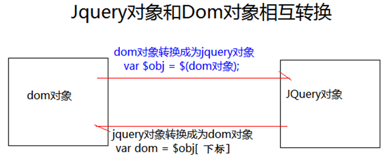

# jQuery

## jQuery概述

jQuery 是一个 JavaScript 库。

jQuery 极大地简化了 JavaScript 编程。

**jQuery核心思想**

它的核心思想是write less,do more(写得更少,做得更多)，所以它实现了很多浏览器的兼容问题。

### jQuery初体验

```html
<!DOCTYPE html PUBLIC "-//W3C//DTD HTML 4.01 Transitional//EN" "http://www.w3.org/TR/html4/loose.dtd">
<html>
<head>
<meta http-equiv="Content-Type" content="text/html; charset=UTF-8">
<title>Insert title here</title>

<script type="text/javascript" src="../script/jquery-1.7.2.js"></script>
<script type="text/javascript">

   //使用$()代替window.onload
   $(function(){
      //使用选择器获取按钮对象，随后绑定单击响应函数
      $("#btnId").click(function(){
         //弹出Hello提示框
         alert('Hello');
      });
   });

</script>


</head>
<body>

   <button id="btnId">SayHello</button>

</body>
</html>
```

### jQuery 核心函数 $

$ 是jQuery 的核心函数，能完成jQuery 的很多功能。$()就是调用$这个函数

1.  传入参数为[ 函数] 时：

    表示页面加载完成之后。相当于window.onload = function(){}

2.  传入参数为[ HTML 字符串] 时：

    会对我们创建这个html 标签对象

3.  传入参数为[ 选择器字符串] 时：

    $(“#id 属性值”); id 选择器，根据id 查询标签对象

    $(“标签名”); 标签名选择器，根据指定的标签名查询标签对象

    $(“.class 属性值”); 类型选择器，可以根据class 属性查询标签对象

4.  传入参数为[ DOM 对象] 时：

    会把这个dom 对象转换为jQuery 对象

### jQuery 对象和dom 对象区分

#### Dom 对象

-   通过getElementById()查询出来的标签对象是Dom      对象

-   通过getElementsByName()查询出来的标签对象是Dom      对象

-   通过getElementsByTagName()查询出来的标签对象是Dom      对象

-   通过createElement() 方法创建的对象，是Dom      对象

-   DOM 对象Alert 出来的效果是：[object HTML 标签名Element]


#### jQuery 对象

-   通过JQuery 提供的API 创建的对象，是JQuery 对象

-   通过JQuery 包装的Dom 对象，也是JQuery 对象

-   通过JQuery 提供的API 查询到的对象，是JQuery 对象

-   jQuery 对象Alert 出来的效果是：[object Object]

**Query 对象的本质**

jQuery 对象是dom 对象的数组+ jQuery 提供的一系列功能函数。

jQuery 对象和Dom 对象不能使用彼此的属性和方法

### Dom 对象和jQuery 对象互转

**dom 对象转化为jQuery 对象（*重点）**
	$(DOM对象)就可以转换成为jQuery对象

**jQuery 对象转为dom 对象（*重点）**
	jQuery 对象[下标]取出相应的DOM对象

**类比如下关系**

```java
class jQuery{
    Dom dom[];
    // jQuery的属性与方法
}

class Dom{
    // Dom的属性与方法
}
```




## jQuery 选择器

选择器的作用是用于选择各种标签元素，将其选中成为jQuery对象

使用选择器的语法格式：`$("选择器")`

选择器的语法：与CSS一致

| 语法                             | 说明（都是数组）       |
| -------------------------------- | ---------------------- |
| #ID 选择器                       | 根据id 查找标签对象    |
| .class 选择器                    | 根据class 查找标签对象 |
| element 选择器                   | 根据标签名查找标签对象 |
| * 选择器                         | 表示任意的，所有的元素 |
| selector1，selector2  组合选择器 | 选择器1与选择器2的并集 |
| selector1selector2               | 选择器1与选择器2的交集 |

#### 层级选择器

| 选择器                               | 说明                                        |
| ------------------------------------ | ------------------------------------------- |
| ancestor descendant  后代选择器      | 在给定的祖先元素下匹配所有的后代元素        |
| parent > child  子元素选择器         | 在给定的父元素下匹配所有的子元素            |
| prev + next 相邻元素选择器           | 匹配所有紧接在prev 元素后的next  元素       |
| prev ~ sibings  之后的兄弟元素选择器 | 匹配prev  元素之后的所有siblings(兄弟) 元素 |

#### 基本过滤器

| 过滤器            | 说明                                         |
| ----------------- | -------------------------------------------- |
| XXX:first         | 获取XXX中的第一个元素                        |
| XXX:last          | 获取XXX中的最后个元素                        |
| XXX:not(selector) | 去除XXX中所有与给定选择器匹配的元素          |
| XXX:even          | 匹配所有索引值为**偶数**的元素，从0 开始计数 |
| XXX:odd           | 匹配所有索引值为**奇数**的元素，从0 开始计数 |
| XXX:eq(index)     | 在XXX中匹配一个给定索引值的元素              |
| XXX:gt(index)     | 匹配所有大于给定索引值的元素                 |
| XXX:lt(index)     | 匹配所有小于给定索引值的元素                 |
| XXX:header        | 匹配如h1, h2, h3 之类的标题元素              |
| XXX:animated      | XXX中匹配所有正在执行动画效果的元素          |

#### 内容过滤器

| 过滤器          | 说明                                                         |
| --------------- | ------------------------------------------------------------ |
| :contains(text) | 匹配包含给定文本的元素                                       |
| :empty          | 匹配所有不包含子元素或者文本的空元素                         |
| :parent         | 匹配含有子元素或者文本的元素(是否为父元素)                   |
| :has(selector)  | 匹配含有选择器所匹配的元素的元素(匹配选择器所匹配元素的父元素) |

#### 属性过滤器

| 属性形式                         | 说明                                                   |
| -------------------------------- | ------------------------------------------------------ |
| [attribute]                      | 匹配含有某个属性的元素。                               |
| [attribute=value]                | 匹配属性的值等于value的元素                            |
| [attribute!=value]               | 匹配所有不含有指定的属性，或者属性不等于特定值的元素。 |
| [attribute^=value]               | 匹配给定的属性是以value开始的元素                      |
| [attribute$=value]               | 匹配给定的属性是以value结尾的元素                      |
| [attribute*=value]               | 匹配给定的属性是以包含value的元素                      |
| \[attribute1..][attribute2..]... | 选中同时满足多个属性条件的元素（交集）                 |

#### 表单过滤器（选择器）

`<input type="XXX"/>`，此处XXX指的是匹配input中的type类型，若type类型为password,就匹配type="password"类型的input标签

| 表单元素过滤器 | 说明                                                |
| -------------- | --------------------------------------------------- |
| :input         | 匹配所有input, textarea,  select 和button 元素      |
| :text          | 匹配所有文本输入框                                  |
| :password      | 匹配所有的密码输入框                                |
| :radio         | 匹配所有的单选框                                    |
| :checkbox      | 匹配所有的复选框                                    |
| :submit        | 匹配所有提交按钮                                    |
| :image         | 匹配所有img 标签                                    |
| :reset         | 匹配所有重置按钮                                    |
| :button        | 匹配所有input type=button  <button>按钮             |
| :file          | 匹配所有input type=file  文件上传                   |
| :hidden        | 匹配所有不可见元素display:none  或input type=hidden |

#### 表单对象属性过滤选择器

| 表单的属性（属性的状态） | 说明                                                         |
| ------------------------ | ------------------------------------------------------------ |
| :enabled                 | 匹配所有可用元素                                             |
| :disabled                | 匹配所有不可用元素                                           |
| :checked                 | 匹配所有选中的单选，复选，和下拉列表中选中的option  标签对象 |
| :selected                | 匹配所有选中的option                                         |


## jQuery 筛选器

使用选择器的语法格式：`$("选择器").筛选器`

筛选器返回的依然为jQuery对象（或对象数组）

| 筛选器         | 说明                                                 |
| -------------- | ---------------------------------------------------- |
| eq()           | 获取给定索引的元素                                   |
| first()        | 获取第一个元素                                       |
| last()         | 获取最后一个元素                                     |
| filter(expr)   | 留下匹配的元素                                       |
| is(expr)       | 判断是否匹配给定的选择器，只要有一个匹配就返回，true |
| has(expr)      | 返回包含有匹配选择器的元素的元素                     |
| not(expr)      | 删除匹配选择器的元素                                 |
| children(expr) | 返回匹配给定选择器的子元素                           |
| find(expr)     | 返回匹配给定选择器的后代元素                         |
| next()         | 返回当前元素的下一个兄弟元素                         |
| nextAll()      | 返回当前元素后面所有的兄弟元素                       |
| nextUntil()    | 返回当前元素到指定匹配的元素为止的后面元素           |
| parent()       | 返回父元素                                           |
| prev(exp)      | 返回当前元素的上一个兄弟元素                         |
| prevAll()      | 返回当前元素前面所有的兄弟元素                       |
| prevUnit(expr) | 返回当前元素到指定匹配的元素为止的前面元素           |
| siblings(expr) | 返回所有兄弟元素                                     |
|add(expr) |把add 匹配的选择器的元素添加到当前jquery 对象中|


## jQuery 属性操作

#### 属性读写操作API

| jQuery方法                        | 说明                                   |
| --------------------------------- | -------------------------------------- |
| attr(name) /  attr(name, value)   | 读写非布尔值的标签属性                 |
| prop(name) /  prop(name, value)   | 读写布尔值的标签属性                   |
| removeAttr(name)/removeProp(name) | 删除属性                               |
| addClass(classValue)              | 添加class                              |
| removeClass(classValue)           | 移除指定class                          |
| toggleClass(classValue)           | 有就删除class,没有就添加class          |
| val() /  val(value)               | 读写标签的value(跟DOM属性value一样)    |
| html() /  html(htmlString)        | 读写标签体内容(跟DOM属性innerHTML一样) |
| text() /  text(textString)        | 读写标签体文本(跟DOM属性innerText一样) |

#### attr()与prop()说明

-   attr()：可操作自定义的属性，不推荐操作checked,selected,readOnly,disabled
-   prop()：只能操作官方预设的属性，推荐操作checked,selected,readOnly,disabled，可返回true/false；在操作官方属性时，若该属性给出，则会显示空字符串""

#### val()说明

可用于批量设置表单项的选中状态（单选复选下拉菜单都可）：val(['value1','value2'])

>   注意，此方法会清除默认选中的状态

#### 遍历说明

-   jQuery对象.each(function(){ //code... }) 回调函数this对象代表jQuery中的dom对象

-   $.each($obj,function(){ //code... }) 需要传入jQuery对象和，回调函数中的this代表dom对象

>   所有function(){} 回调函数中的this指的都是 当前响应的dom对象


## $.XXX 工具方法

| $方法名称             | 方法简介                          |
| --------------------- | --------------------------------- |
| $.each($obj,func(){}) | 遍历数组或对象中的数据            |
| $.trim(str)           | 去除字符串两边的空格              |
| $.type(obj)           | 得到数据的类型                    |
| $.isArray(obj)        | 判断是否是数组                    |
| $.isFunction(obj)     | 判断是否是函数                    |
| $.parseJSON(json)     | 解析json字符串，转换为js对象/数组 |