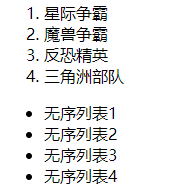
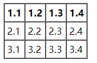

# HTML基础（后端）

## JavaWeb的路径问题


     JavaSE的路径分为相对路径和绝对路径
               相对路径    从工程名开始算
               绝对路径    盘符：/目录/文件名
        JavaWeb中的路径也分为相对路径和绝对路径
               相对路径
                  .        表示当前所在文件所属的目录
                  ..        表示当前文件所属的上一级目录
                  文件名      表示当前目录下/文件名   也相当于 ./文件名  ./可以
## 超链接  `<a href="target___"></a>`

**代码示例**

```html
<body>
   <a href="http://localhost:8080">百度</a> <br>
   <a href="http://localhost:8080" target="_self">百度_self</a> <br>
   <a href="http://localhost:8080" target="_blank">百度_blank</a><br>
</body>
```

属性说明：

-   href属性设置跳转的地址
-   target属性设置哪个目标对象进行跳转
    -   \_self     当前窗口
    -   _blank    打开新窗口跳转


## 列表标签



**代码演示**

```html
<ol>
   <li>星际争霸</li>
   <li>魔兽争霸</li>
   <li>反恐精英</li>
   <li>三角洲部队</li>
</ol>

<ul>
   <li>无序列表1</li>
   <li>无序列表2</li>
   <li>无序列表3</li>
   <li>无序列表4</li>
</ul>
```

`ol` 有序列表

`ul` 无序列表


## 表格

表格用于存放数据



**表格元素**

| 表格元素 | 说明                               | 属性                                                         |
| -------- | ---------------------------------- | ------------------------------------------------------------ |
| table    | 声明表格                           | border：边框 <br>cellspacing：单元格间距 <br/>cellpadding：单元格内间距 |
| tr       | 行元素，一个tr代表一行             |                                                              |
| td       | 行内单元格，可以表示一个具体的内容 |                                                              |
| thead    | 表示head，没有具体表现             |                                                              |
| tbody    | 表示body，没有具体表现             |                                                              |

**代码示例**

```html
<!-- 表格布局 -->

<table border="1" cellspacing="0" cellpadding="5">
   <thead> <!-- 表明这是个表头 -->
   <tr>
      <th>1.1</th>    <!-- 表头元素：自动居中，加粗 -->
      <th>1.2</th>
      <th>1.3</th>
      <th>1.4</th>
   </tr>
   </thead>
   <tbody> <!-- 表明这是个表格主体 -->
   <tr>
      <td>2.1</td>    <!-- 表格单位，放置普通内容 -->
      <td>2.2</td>
      <td>2.3</td>
      <td>2.4</td>
   </tr>
   <tr>
      <td>3.1</td>
      <td>3.2</td>
      <td>3.3</td>
      <td>3.4</td>
   </tr>
   </tbody>
</table>
```

**表格跨行跨列**

|属性|示例|说明|
|---|---|---|
|跨列：colspan|`<td colspan="2">1.1</td>`|说明: 跨到当前单元格的第二列单元格|
|跨行：rowspan|`<td rowspan="2">2.1</td>`|说明: 跨到当前单元格的第二行的单元格|

>   注意：在td中使用


## 表单

**表单元素介绍**
|表单元素|简介|属性|
|---|---|---|
|intpu     type="text"  |文本输入框value属性|	设置默认显示内容|
|input     type="password"   |是密码输入框|	value属性: 设置默认显示内容|
|input     type="radio"  |单选输入框| name属性: 可以分组 checked属性: 是否被选中 <br/>checked=checked表示默认选中 |
|input     type="checkbox"  |复选框| name属性: 可以分组 checked属性: 是否被选中 <br>checked=checked表示默认选中 |
|input     type="reset"  |重置按钮|	value属性: 设置按钮上的文本|
|input     type="submit"  |提交按钮|	value属性: 设置按钮上的文本|
|input     type="button"  |按钮|	value属性: 设置按钮上的文本|
|input     type="file"  |文件上传域||
|input     type="hidden" | 隐藏域||
|input    type="textarea"  |多行文本输入框(其实标签和结束标签之间的内容是默认值)	|rows属性: 设置可以显示的高度<br/>cols属性: 设置每行显示的字符宽度|
|\<select>|声明一个下拉菜单|name属性：指定参数名称|
|\<option>|下拉菜单的选项，在select标签体中使用|value属性：指定参数值<br>selected="selected"设置默认选中 <br>标签体为显示的内容|

**示例代码**

```html
<!-- 表单的格式化：使用表格 -->
<!--
将表单以如下形式进行格式化：
<form>
   <table>
      // ...
   </table>
</form>
-->
<body>
   <form action="http://localhost:8080" enctype="multipart/form-data">
      
      <table>
         <tr>
            <td></td>
            <td></td>
         </tr>
         <tr>
            <td>用户名：</td>
            <!-- text 文本框，value属性表示默认值 -->
            <td><input type="text" value="leonardo"></td>
         </tr>
         
         <tr>
            <td>密码：</td>
            <!-- password 密码框，value表示默认值，无法赋值 -->
            <td><input type="password" value="pwdpwdpwd"> <br></td>
         </tr>
         
         <tr>
            <td>性别：</td>
            <!-- radio 单选按钮，name属性指定分组，checked属性可以表示默认选中 -->
            <td><input type="radio" name="sex" checked="checked">男 <input type="radio" name="sex">女</td>
         </tr>
         <!-- hidden 隐藏域，用于保存非用户输入的数据 -->
         <input type="hidden" value="id">
         <tr>
            <td>兴趣爱好：</td>
            <td>
               <!-- checkbox 复选框 -->
               <input type="checkbox">Java
               <input type="checkbox">C++
               <input type="checkbox">Python
            </td>
         </tr>
         <tr>
            <td>请选择国籍</td>
            <td>
               <!-- select 下拉菜单，配合option标签使用 -->
               <select name="国籍" id="">
                  <!-- option 下拉菜单具体选项，value表示select的name对应的值（实际传给后台的值），标签体是显示的内容 -->
                  <option value="null">请选择国籍</option>
                  <option value="zg" selected="selected">中国</option>
                  <option value="rb">岛国</option>
                  <option value="mg">米国</option>
                  <option value="els">毛子国</option>
               </select>
            </td>
         </tr>
         <tr>
            <td>文件上传：</td>
            <!-- file 文件上传域，需要指定enctype为"multipart/form-data" -->
            <td><input type="file" value="点击选择"></td>
         </tr>
         <tr>
            <!-- reset 重置按钮 -->
            <td><input type="reset" value="重置"></td>
            <!-- submit 提交按钮 -->
            <td><input type="submit" value="提交"></td>
         </tr>
      
      
      </table>
      
      <button>这是一个没什么卵用的按钮</button>
   </form>

</body>
```

#### 表单提交的细节:

-   form中的action和method

	-   action：提交的地址
    -   method：提交的方式为GET(默认值为)或POST

-   表单提交时,数据没有发送给服务器的三种情况

	1.  表单项没有name属性
    2.  单选,复选(下拉列表中的option标签)都需要添加value属性,一遍发送给服务器
    3.  表单项不在form的标签中

-   method属性的细节

    -   GET请求的特点
        -   游览器地址栏中的地址: action属性[+?+请求参数]	`password=abc&username=tfr`
        -   不安全
        -   有最大长度
    -   POST请求的特点
        -   游览器地址栏只有url
        -   相对于GET请求安全
        -   没有数据长度限制（理论上）


## Iframe标签

iframe标签用于内嵌一个页面

```html
<iframe src="http://www.bilibili.com" frameborder="2" height="500" width="500" name="iframe"></iframe>
```


**小案例：使用超链接切换iframe的内容**

```html
<iframe src="" frameborder="2" height="300" width="500" name="iframe"></iframe><br>
<a href="http://www.bilibili.com" target="iframe">bilibili</a><br>
<a href="http://www.baidu.com" target="iframe">百度</a><br>
<a href="http://tfr971018.ys168.com" target="iframe">我的网盘</a><br>
```

1.  在iframe中指定name属性
2.  在超链接中指定target的值为iframe的name属性的值

