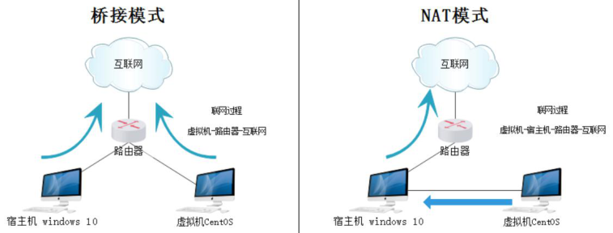
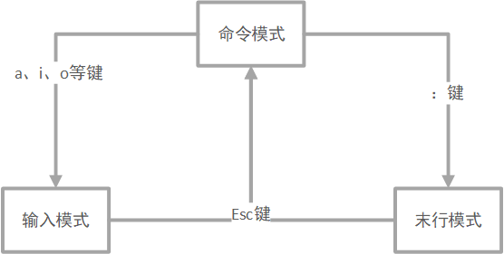
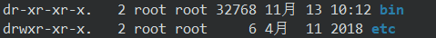
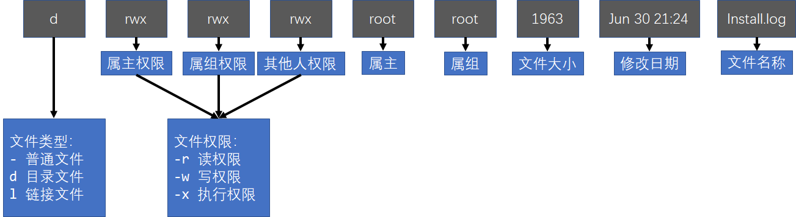
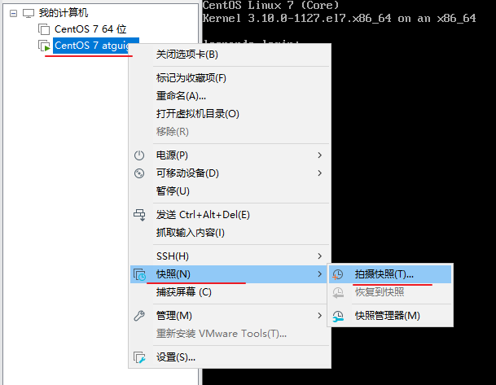

#     Linux 基础

## 目录结构

Linux的目录结构为树状结构，最顶级的目录为根目录 `/`。

-   **绝对路径：**路径的写法，由根目录 **/** 写起，例如： /usr/share/doc 这个目录。
-   **相对路径：**路径的写法，不是由 **/** 写起，例如由 /usr/share/doc 要到 /usr/share/man 底下时，可以写成： **cd ../man** 这就是相对路径的写法。

**Linux 目录结构**

| 目录    | 说明                           |
| ------- | ------------------------------ |
| `/dev`  | 存放抽象硬件                   |
| `/boot` | 存放内核与启动文件             |
| `/lib`  | 存放系统库文件                 |
| `/etc`  | 存放配置文件目录               |
| `/bin`  | 存放二进制文件（可执行命令）   |
| `/sbin` | 存放root用户的二进制文件       |
| `/home` | 普通用户目录                   |
| `/root` | root用户目录                   |
| `/var`  | 存放经常变化的文件             |
| `/usr`  | 存放安装程序（经过编译后安装） |
| `/opt`  | 大型软件存放目录（不需要编译） |
| `/mnt`  | 文件挂载目录（u盘、光驱等）    |
| `/tmp`  | 临时文件                       |

说明：

Linux 的软件安装目录是也是有讲究的，理解这一点，在对系统管理是有益的，例如

-   /usr：系统级的目录，可以理解为C:/Windows/，/usr/lib理解为C:/Windows/System32。
-   /usr/local：用户级的程序目录，可以理解为C:/Progrem Files/。用户自己编译的软件默认会安装到这个目录下。
-   /opt：用户级的程序目录，可以理解为D:/Software，opt有可选的意思， 这里可以放置第三方软件，当你不需要时，直接rm -rf掉即可。


## 网络配置

常见的虚拟机网络模式

-   桥接：虚拟机ip和物理机ip的地址会在同一个网段。
-   NAT模式： 虚拟机ip和物理机ip不在同一个网段,虚拟机访问外网的时候,是用物理机的ip地址去访问外网
-   Only Host:虚拟机和物理机可以通信，但是虚拟机不能访问外网。




## vi/vim 编辑器

介绍：vim 具有程序编辑的能力，可以主动的以字体颜色辨别语法的正确性，方便程序设计。

三种模式：基本上 vi/vim 共分为三种模式，分别是**命令模式（Command mode）**，**输入模式（Insert mode）**和**末行模式（Last line mode）**



常用快捷键：

-   命令模式

| 操作     | 命令                   | 说明                                                   |
| -------- | ---------------------- | ------------------------------------------------------ |
| 行内跳转 | ^<br />$<br />w<br />G | 跳到行首<br />跳到行尾<br />后一个单词<br />跳转到页尾 |
| 行间跳转 | #G<br />vim +#         | 跳转到#行（#代表的是数据）<br />打开文件时跳转到#行    |
| 行内删除 | d$<br />d^<br />dd     | 删除光标到行尾<br />删除光标到行首<br />删除整行       |
| 撤销     | u                      |                                                        |
| 行内复制 | y$<br />y^<br />yy     | 复制贯标到行尾<br />复制光标到行首<br />复制整行       |
| 多行复制 | #yy                    | 复制n行                                                |
| 粘贴     | p<br />P               | 粘贴在所在行之后<br />粘贴在所在行之前                 |
| 查找     | /<word>                | 查找指定单词，小n查找前一个，大N查找后面一个           |

-   末行模式

| 操作     | 命令                                                         | 说明                                                         |
| -------- | ------------------------------------------------------------ | ------------------------------------------------------------ |
| 行号操作 | set nu<br />set nonu                                         | 显示行号<br />取消行号                                       |
| 跳转     | #：                                                          | #表示数字，直接跳转到第#行                                   |
| 行间删除 | #1，#2d                                                      | 表示删除#1行到#2行的所有内容                                 |
| 复制     | #1，#2d                                                      | 表示复制#1行到#2行的所有内容                                 |
| 替换     | s/<old>/<new><br />s/<old>/<new>/g<br />#1,#2/<old>/<new>/g<br />%s/<old>/<new>/g | 当前行替换<br />当前行替换所有<br />行间替换所有<br />整个文件替换 |


## 长输出信息

长输出信息指的是通过 `ll` 指令查看文件详情：



举例说明：

```bash
drwxrwxrwx root root 1963 Jun 30 21:24 Install.log
```




>权限后面有个数字：对于文件，表示硬链接数，默认值是1，对于文件夹：表示该文件夹下的目录数，默认值为2，因为该文件夹下有两个隐藏的目录,.表示当前目录, ..表示上一级目录

**读写执行对于文件和文件夹的含义**
| 权限 | 简写 |对文件的作用|对目录的作用|
| ---- | ---- |------|
|读取|r|查看文件内容|列出文件夹中的文件(ls)|
|写入|W|修改文件内容|在文件夹中删除、添加或重命名文件(夹)|
|执行|X|文件可作为程序|执行cd 到文件夹|

>   注意: root 用户不受权限限制。

#### 文件权限设置

**更改文件权限**

```bash
chmod [ugoa][+-=][rwx] <file> 
# u(属主)/g(属组)/o(其它人)/a(所有人)
```

数字方法：每一位数字代表一个用户。r=4；w=2；x=1

```bash
chmod 751 <file>
```

**更改文件所有者**

```bash
chown <owner> <file>
```

**更改文件所属组**

```bash
chgrp <group> <file>
```

**同时更改所有者和所属组**

```bash
chown <owner:group> <file>
```


## rpm 

RPM（RedHat Package Manager）,Rethat软件包管理工具，类似windows里面的setup.exe。是Linux这系列操作系统里面的软件安装工具，它虽然是RedHat的标志，但理念是通用的。RPM包默认会自动配置环境变量。

-   RPM包查询

    ```bash
    # 查询所有已安装的RPM包
    rpm -qa
    
    # 查询是否有安装指定 name 的文件
    rpm -q <name>
    ```

-   RPM包安装

    ```bash
    # 安装rpm包
    rpm -ivh <package>
    ```

-   RPM包卸载

    ```bash
    # 卸载RPM包
    rpm -e <packageName>
    ```


## yum

yum（ Yellow dog Updater, Modified）是一个在 Fedora 和 RedHat 以及 SUSE 中的 Shell 前端软件包管理器。

基于 RPM 包管理，能够从指定的服务器自动下载 RPM 包并且安装，可以自动处理依赖性关系，并且一次安装所有依赖的软体包，无须繁琐地一次次下载、安装。

yum 提供了查找、安装、删除某一个、一组甚至全部软件包的命令，而且命令简洁而又好记。

### yum 语法

```
yum [options] [command] [package ...]
```

-   **options：**可选，选项包括-h（帮助），-y（当安装过程提示选择全部为 "yes"），-q（不显示安装的过程）等等。
-   **command：**要进行的操作。
-   **package：**安装的包名。

### 常用命令

1.  列出所有可更新的软件清单命令：**yum check-update**

2.  更新所有软件命令：**yum update**

3.  仅安装指定的软件命令：**yum install <package_name>**

4.  仅更新指定的软件命令：**yum update <package_name>**

5.  列出所有可安裝的软件清单命令：**yum list**

6.  删除软件包命令：**yum remove <package_name>**

7.  查找软件包命令：**yum search <keyword>**

8.  清除缓存命令:

    yum clean packages: 清除缓存目录下的软件包

    yum clean headers: 清除缓存目录下的 headers

    yum clean oldheaders: 清除缓存目录下旧的 headers

    yum clean, yum clean all (= yum clean packages; yum clean oldheaders) :清除缓存目录下的软件包及旧的 headers


## 常用命令

### 通用命令

| 命令 | 说明 |
| ---- | ---- |
|hostname|查看当前系统的主机名|
|whoami|查看当前登录的用户|
|ip a|查看虚拟机ip|
|shutdown -h now|关机|
|reboot| 重启|
|pwd|查看光标所在位置|
|clear|清屏|
|ls 目录|查看指定目录里面的文件或者文件夹|
|touch 文件名|创建一个指定的文件|
|mkdir abc|创建一个文件夹命令cd 目录：  进入指定的目录|
|poweroff|关闭电源|
|echo “字符串”|将字符串输出到控制台上。|

### 常用系统命令

| 命令                | 说明                                       |
| ------------------- | ------------------------------------------ |
| free -m             | 查看内存                                   |
| df -h               | 查看硬盘                                   |
| find / -name "da" | 在根目录下查找文件名含有da的文件或者文件夹 |
|sync关机之前，|最好将内存中的数据保存到磁盘上！|
|file |文件查看文件类型|
|yum -y install 软件名 | 安装软件                                   |
|grep|查找文本中的内容|
|cat aa.txt \| grep "hello"| 查看aa.txt文件中是否含有内容hello |
|history|查看历史命令|
|ps –ef \| grep XXX | 查看某个服务是否启动 |
|netstat -antp \| grep 端口号 | 查看某个端口号 |
|kill -9 pid|杀死某个进程|

### 文件与目录操作命令

| 命令  | 说明 | 参数 |
| --- | --- | --- |
| ls    | 列出目录                 | -a ：列出全部文件，连同隐藏文件（开头为 . 的文件）<br>-d ：仅列出目录本身，而不是列出目录内的文件数据 <br>-l ：列出详细信息（简写为 ll ） |
| cd <target> | 切换目录                 | `..` ：上级目录<br />`./` ：当前目录<br />`/` ：根目录<br />`~` ：家目录 |
| pwd   | 显示目前所在的目录       | -P ：显示出确实的路径，而非使用连结 (link) 路径。            |
| mkdir <target> | 创建新目录               | -m ：直接配置文件的权限 <br />-p ：递归创建指定目录          |
| rmdir <target> | 删除空的目录             | -p ：连同上一级『空的』目录也一起删除                        |
| cp <source> <target> | 复制文件或目录           | -r：递归持续复制<br />-i：若目标档(destination)已经存在时，在覆盖时会先询问动作的进行(常用)<br />-a：相当於 -pdr 的意思，至於 pdr 请参考下列说明；<br />-f：为强制(force)的意思，若目标文件已经存在且无法开启，则移除后再尝试一次；<br />-s：复制成为符号连结档 (symbolic link)，亦即『捷径』文件； |
| mv <source> <target> | 移动文件与目录、修改名称 | -f ：force 强制的意思，如果目标文件已经存在，不会询问而直接覆盖；<br />-i ：若目标文件 (destination) 已经存在时，就会询问是否覆盖！ <br />-u ：若目标文件已经存在，且 source 比较新，才会升级 (update) |
| rm <target> | 移除文件或目录           | -f ：就是 force 的意思，忽略不存在的文件，不会出现警告信息；<br /> -i ：互动模式，在删除前会询问使用者是否动作 <br />-r ：递归删除啊！最常用在目录的删除了！这是非常危险的选项！！！ |

### 文件内容查看

| 命令  | 说明 | 参数 |
| --- | --- | --- |
|cat <target> |由第一行开始显示文件内容|-A ：相当於 -vET 的整合选项，可列出一些特殊字符而不是空白而已； <br />-b ：列出行号，仅针对非空白行做行号显示，空白行不标行号！ <br />-E ：将结尾的断行字节 $ 显示出来； <br />-n ：列印出行号，连同空白行也会有行号，与 -b 的选项不同； <br />-T ：将 [tab] 按键以 ^I 显示出来； <br />-v ：列出一些看不出来的特殊字符|
|tac |从最后一行开始显，tac 是 cat 的倒着写！||
|nl  |显示的时候，顺道输出行号！||
|more <tareget> |一页一页的显示文件内容|空白键 (space)：代表向下翻一页； <br />Enter     ：代表向下翻『一行』； <br />/字串     ：代表在这个显示的内容当中，向下搜寻『字串』这个关键字； <br />:f ：立刻显示出档名以及目前显示的行数； <br />q ：代表立刻离开 more ，不再显示该文件内容。 <br />b 或 [ctrl]-b ：代表往回翻页，不过这动作只对文件有用，对管线无用。|
|less <tareget> |与 more 类似，可以往前翻页！|空白键  ：向下翻动一页； <br />[pagedown]：向下翻动一页； <br />[pageup] ：向上翻动一页； <br />/字串   ：向下搜寻『字串』的功能； <br />?字串   ：向上搜寻『字串』的功能；<br />n ：重复前一个搜寻 (与 / 或 ? 有关！) <br />N ：反向的重复前一个搜寻 (与 / 或 ? 有关！) <br />q ：离开 less 这个程序；|
|head <tareget> |只看头几行|-n ：后面接数字，代表显示几行的意思|
|tail <tareget> |只看尾巴几行|-n ：后面接数字，代表显示几行的意思 <br />-f ：表示持续侦测后面所接的档名，要等到按下[ctrl]-c才会结束tail的侦测|
|file <tareget> |查看文件类型||

### 文件归属修改
| 命令                     | 说明                                 | 参数                 |
| ------------------------ | ------------------------------------ | -------------------- |
| chgrp <groupName> <file> | 更改文件属组                         | -R：递归更改文件属组 |
| chown <groupName> <file> | 更改文件属主，也可以同时更改文件属组 | -R：递归更改文件属组 |

语法：

```bash
chgrp [-R] 属组名 文件名

chown [–R] 属主名 文件名
chown [-R] 属主名：属组名 文件名
```

### 文件权限修改

| 命令  | 说明                                 | 参数                 |
| ----- | ------------------------------------ | -------------------- |
|chmod <mode> <file>|更改拥有者、用户组、其他用户对此文件的权限|-R : 对目前目录下的所有文件与子目录（递归）|

说明：

有两种设置方法，一种是数字，一种是符号。Linux 文件的基本权限就有九个，分别是 **owner/group/others(拥有者/组/其他)** 三种身份各有自己的 **read/write/execute** 权限。

#### 数字方法

文件的权限字符为： `rwx rwx rwx` ，三个为一组，

-   r，read权限，4，二进制为 100
-   w，write权限，2，二进制为 010
-   x，execute权限，1，二进制为 001

每组所拥有的权限为 rwx 相加的结果。在二进制码上互不重叠。

语法：

```bash
chmod [-R] xyz 文件或目录
```

```bash
# 示例：[4+2+1][4+0+1][4+0+0]=754
chmod 754 test
# 上面表示文件拥有者拥有读、写、执行权限，组员拥有读、执行权限，其他人只有读权限。
```

#### 符号方法

可以通过 `+ - =` 对每组权限进行修改

语法：

```bash
chmod [ugoa][+-=][rwx] <file> 
```

说明：u(属主)/g(属组)/o(其它人)/a(所有人)

```bash
# 示例
chmod g+r file
# 上面表示给予属组的用户r read的权限。
```


### 用户管理

| 命令                    | 说明             | 参数                                                         |
| ----------------------- | ---------------- | ------------------------------------------------------------ |
| useradd [option] <user> | 添加新的用户账号 | -c ：comment 指定一段注释性描述。 <br/>-d ：目录 指定用户主目录，如果此目录不存在，则同时使用-m选项，可以创建主目录。 <br/>-g ：用户组，指定用户所属的用户组。 <br />-G ：用户组，指定用户所属的附加组。 <br />-s ：Shell文件 指定用户的登录Shell。 <br />-u ：用户号 指定用户的用户号，如果同时有-o选项，则可以重复使用其他用户的标识号。 |
| userdel [option] <user> | 删除帐号         | -r，它的作用是把用户的主目录一起删除。                       |
| usermod [option] <user> | 修改帐号         | 与useradd 参数一致                                           |
| passwd [option] <user>  | 修改用户口令     | -l ：锁定口令，即禁用账号。 <br />-u ：口令解锁。 <br />-d ：使账号无口令。 <br />-f ：强迫用户下次登录时修改口令。 |

语法：

```bash
# 新增用户
useradd 选项 用户名

# 删除账号
userdel 选项 用户名

# 修改帐号
usermod 选项 用户名

# 更改用户口令
passwd 选项 用户名
```

### 用户组管理

| 命令                      | 说明                 | 参数                                                         |
| ------------------------- | -------------------- | ------------------------------------------------------------ |
| groupadd [option] <group> | 增加一个新的用户组   | -g ：GID 指定新用户组的组标识号（GID）。 <br />-o ：一般与-g选项同时使用，表示新用户组的GID可以与系统已有用户组的GID相同。 |
| groupdel [option] <group> | 删除一个已有的用户组 |                                                              |
| groupmod [option] <group> | 修改用户组的属性     | -g GID 为用户组指定新的组标识号。 <br />-o 与-g选项同时使用，用户组的新GID可以与系统已有用户组的GID相同。 <br />-n新用户组 将用户组的名字改为新名字 |

语法：

```bash
# 增加一个新的用户组
groupadd 选项 用户组

# 删除一个已有的用户组
groupdel 用户组

# 修改用户组的属性
groupmod 选项 用户组
```

### 压缩命令

对于 tar.gz 格式，直接使用如下命令即可。

```bash
tar -zcvf <文件名> [-C <要解压到的文件夹>]
```

### 服务命令

centos7.x版本命令如下：

```bash
# 启动/停止/重启/重载/查看状态命令如下
systemctl start/stop/restart/reload/status <服务名>

# 查看服务是否开机自启
systemctl list-unit-files | grep <服务名>

# 设置开机自启(关闭)
systemctl enable|disable <服务名>
```

**示例：防火墙**

```bash
# 查看防火墙状态 : 
systemctl status firewalld

# 开启防火墙: 
systemctl start firewalld

# 关闭防火墙: 
systemctl stop firewalld

#开启防火墙: 
service firewalld start
```

>   注意：上面打开和关闭防火墙都是临时的，重启电脑后又会恢复到默认的状态。
>   如果是想重启后防火墙还是处于关闭的状态：systemctl disable firewalld
>   如果是想重启后防火墙还是处于开启的状态：systemctl enable firewalld

**列出防火墙状态**

```bash
firewall-cmd --list-all
```

### 端口命令

```bash
# 查询指定端口是否已开
firewall-cmd --query-port=<端口号>/tcp

# 开放指定端口
firewall-cmd --add-port=<端口号>/tcp --permanent

# 关闭指定的端口
firewall-cmd --remove-port=<端口号>/tcp --permanent
```

说明：

1.  `--permanent`：端口是否设置为永久开放/关闭。如果不加仅对本次开机有效
2.  `--zone=public`：表示作用域为公共的

>   设置完毕之后需要重载端口设置 `firewall-cmd --reload`


## 其他

### 配置环境变量

在 /etc/profile 中写入环境变量

```bash
export XXX_HOME=<具体目录>
export PATH=$PATH:$XXX_HOME
```

说明：

1.  `export` 可新增，修改或删除环境变量，供后续执行的程序使用。
2.  `$` 的作用是取出该名称代表的值
3.  `:` 的作用为分隔符，相当于windows环境变量中的 `;`
4.  这两句话的意思是：将PATH变量去除，同时加上指定目录，赋予PATH

>   注意：在配置完环境变量之后需要使用 `source profile` 来刷新profile文件，才可使环境变量生效。

### 快照

当机子上的软件安装的比较多的时候，快照可以将某个时间点的状态保存下来，以便在出问题的时候直接恢复到某个状态。

虚拟机保存快照的方法：



### 设置开机启动

#### 方式一：开机主动执行的脚本

Linux 在每一次开机启动的时候都会执行 `etc/rc.d/rc.local` 中写好的命令。（从上到下）因此可以将开机启动命令写在该文件中。

#### 方式二：设置服务的方式

使用服务的形式开机自启：

1、进入 `/lib/systemd/system` 写入 XXX.service，形势如下（以Nginx为例）：

```sh
[Unit]						#服务的说明
Description=nginx service	#描述
After=network.target		#在某项服务启动之后启动，这里为 网络服务

[Service]			#设置服务的参数
Type=forking		#设置后台运行
ExecStart=/usr/local/nginx/sbin/nginx				#设置启动命令
ExecReload=/usr/local/nginx/sbin/nginx -s reload	#设置重载命令
ExecStop=/usr/local/nginx/sbin/nginx -s quit		#设置结束命令
PrivateTmp=true		#是否分配独立的临时空间

[Install]	#用户运行级别相关 
WantedBy=multi-user.target
```

2、设置开机自启，在命令行中输入：

```bash
systemctl enable nginx.service
```

其他相关命令：

```sh
systemctl start nginx.service		启动nginx服务
systemctl stop nginx.service		停止服务
systemctl restart nginx.service		重新启动服务
systemctl list-units --type=service	查看所有已启动的服务
systemctl status nginx.service		查看服务当前状态
systemctl enable nginx.service		设置开机自启动
systemctl disable nginx.service		停止开机自启动
```

