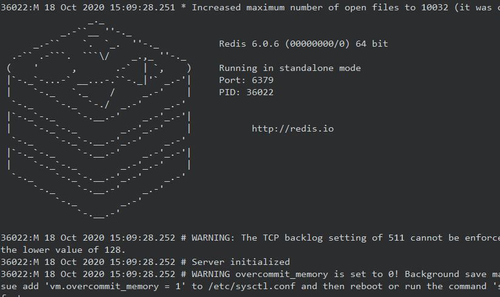
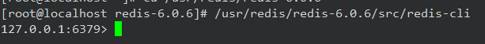
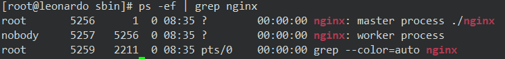
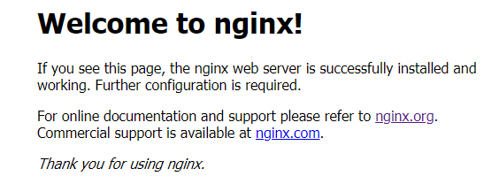
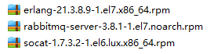
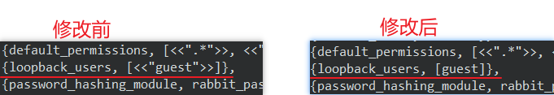

# Linux 安装部署

## JDK 安装部署


## Tomcat 安装部署

### 解压配置安装

1.  进入到 `/opt/software` 目录，然后解压文件

    ```bash
    tar -zxvf <压缩文件> -C <目标目录>
    ```

2.  配置环境变量

    ```bash
    # Java的环境变量
    export JAVA_HOME=<Java 目录>
    export PATH=$PATH:$JAVA_HOME/bin
    
    # tomcat的环境变量
    export CATALINA_HOME=<tomcat 目录>
    export PATH=$PATH:$CATALINA_HOME/bin
    ```

    配置完成后 `source /etc/profile` 刷新即可。

### 配置远程连接

开放Linux端口 8080

```bash
firewall-cmd --zone=public --add-port=8080/tcp --permanent
```


## MySql 安装部署

### 通过yum指令安装

1.  确认是否有wget指令，如果没有，则安装之

    ```bash
    yum install -y wget
    ```

2.  安装yum所需组件

    下载yum源

    ```bash
    wget https://dev.mysql.com/get/mysql57-community-release-el7-11.noarch.rpm
    ```

    安装yum源

    ```bash
    rpm -ivh mysql57-community-release-el7-11.noarch.rpm
    ```

3.  通过yum安装mysql

    ```bash
    yum install -y mysql-community-server
    ```

4.  设置 mysql 服务

    开启数据库

    ```bash
    systemctl start mysqld
    ```

    设置开机自启

    ```bash
    systemctl enable mysqld
    ```

5.  查看初始化密码（通过日志文件）

    ```bash
    vim /var/log/mysqld.log
    ```

    输入 `/password` 查看密码

6.  登录后修改密码：

    由于mysql5.7默认密码策略比较严格，可以通过一下两个指令来加简化密码设置

    ```bash
    # 设置默认策略为0
    set global validate_password_policy=0;
    # 设置密码长度至少大于1位
    set global validate_password_length=1;
    ```

    如果上述无法设置，则先设置一个长度为8位，带有大小写、数字与特殊字符的密码，再操作一遍。

    然后设置密码

    ```bash
    set password for root@localhost = password('root'); 
    ```

### 设置开放远程登陆

mysql中开放远程登陆，并刷新

```bash
# 开放远程登陆
GRANT ALL PRIVILEGES ON *.* TO 'root'@'%' IDENTIFIED BY 'root' WITH GRANT OPTION;

# 刷新授权
flush privileges;
```

Linux 开放端口

```bash
# 开放3306端口
firewall-cmd --add-port=3306/tcp --permanent

# 重载防火墙配置
firewall-cmd --reload
```

### 安装后目录结构

| 路径                                                       | 参数         | 解释                           | 备注                            |
| ---------------------------------------------------------- | ------------ | ------------------------------ | ------------------------------- |
| /usr/bin                                                   | --basedir    | 相关命令目录                   | mysqladmin<br/>mysqldump 等命令 |
| /var/lib/mysql/                                            | --datadir    | mysql 数据库文件的存放路径     |                                 |
| /usr/lib64/mysql/plugin                                    | --plugin-dir | mysql 插件存放路径             |                                 |
| /var/log/mysqld.log                                        | --log-error  | mysql 错误日志路径             |                                 |
| /var/run/mysqld/mysqld.pid                                 | --pid-file   | 进程 pid 文件                  |                                 |
| /var/lib/mysql/mysql.sock                                  | --socket     | 本地连接时用的 unix 套接字文件 |                                 |
| /usr/share/mysql                                           |              | 配置文件目录                   | mysql 脚本及配置文件            |
| /etc/systemd/system/multi-user.target.wants/mysqld.service |              | 服务启停相关脚本               |                                 |
| /etc/my.cnf                                                |              | mysql 配置文件                 |                                 |

### 常见问题

#### 中文乱码：

通过SHOW VARIABLES LIKE '%char%'查看数据库编码问题,会发现默认latin1字符编码，不支持中文。

结局方案：

1.  修改 my.cnf 文件并在 mysqld 字节最后添加编码设置，目录为 `vim/etc/my.cnf`

    ```bash
    #在[mysqld]节点最后加上中文字符集配置
    character_set_server=utf8
    ```

2.  重启 mysql 服务器

    ```bash
    systemctl restart mysqld
    ```

3.  修改已生成的库表字符集

    ```bash
    # 修改以前数据库的字符集
    alter database test character set 'utf8';
    # 修改以前数据表的字符集
    alter table book convert tocharacter set 'utf8';
    ```


## Redis 安装部署

### 安装步骤

1.  gcc 语言环境：

    ```bash
    yum install -y gcc
    ```

2.  解压 redis 的 gz 文件

    ```bash
    tar -zxvf redis-5.0.5.tar.gz -C <要解压的目录>
    ```

3.  进入解压好的文件夹，编译并安装redis文件

    ```bash
    make MALLOC=libc
    make install PREFIX=<要安装的目录>
    ```

4.  配置环境变量

    ```bash
    # 1. 编辑 环境变量
    vim /etc/profile
    
    # 2. 添加环境变量
    export REDIS_HOME=<redis的安装目录>
    export PATH=$PATH:$REDIS_HOME/bin
    
    # 3. 刷新profile文件
    source /etc/profile
    ```

5.  可以设置后台启动，更改其配置文件 `redis.conf`

    ```bash
    daemonize yes
    ```

    然后启动 `redis-server` 时以指定配置文件启动

    ```bash
    # 假设 redis.conf 在安装目录下
    /usr/local/redis/bin/redis-server /redis/local/redis/bin/redis.conf
    ```

### 使用 Redis

安装好redis后，发现redis的安装目录下多了一个src目录，该目录就是redis编译安装完成之后的目录，有关redis服务启动，客户端启动的文件都在此目录下。

#### 启动redis的服务端

进入src目录下，输入如下命令即可启动redis服务端

```markdown
./redis-server [配置文件目录]
```

-   配置文件目录可以指定（支持相对路径），默认使用redis-server中的shell脚本的配置



#### 启动redis客户端

进入src目录下，输入如下命令即可启动redis客户端

```
./redis-cli [-h hostname] [-p port]
```

-   -h：指定主机名，缺省值为本机ip
-   -p：指定端口号，缺省值为6379



**客户端显示中文**

```
./redis-cli  -p 7000 --raw
```

### 设置开放远程连接

开放连接：找到redis.conf 文件，更改如下配置；

```bash
# 绑定指定ip设为空
bind 0.0.0.0

# 关闭保护模式
protected-mode no
```

开放端口：防火墙开放redis的端口

```bash
firewall-cmd --zone=public --add-port=<redis端口号>/tcp --permanent
```

>   注意：需要重载防火墙配置 `firewall-cmd --reload`

### 设置开机启动

可以设置redis为开机启动，在 `/etc/rc.d/rc.local` 开机启动命令集中写入如下内容：

```bash
#让java环境变量在此执行文件执行之前生效。
source /etc/profile 

# 启动redis，指定配置文件，假设 redis.conf 在安装目录下
/usr/local/redis/bin/redis-server /usr/local/redis/redis.conf
```

然后给予该文件执行权限

```bash
chmod +x /etc/rc.d/rc.local
```


## Nginx 安装部署

### 环境准备

1、安装C++语言环境

```bash
yum install gcc-c++
```

编译依赖 gcc 环境，如果没有 gcc 环境，需要安装 gcc

2、安装PCRE

```bash
yum install -y pcre pcre-devel
```

PCRE(Perl Compatible Regular Expressions)是一个 Perl 库，包括 perl 兼容的正则表达式库。nginx 的 http 模块使用 pcre 来解析正则表达式，所以需要在 linux 上安装 pcre 库。pcre-devel 是使用 pcre 开发的一个二次开发库。nginx 也需要此库。

3、安装zlib

```bash
yum install -y zlib zlib-devel
```

zlib 库提供了很多种压缩和解压缩的方式，nginx 使用 zlib 对 http 包的内容进行 gzip，所以需要在 linux上安装 zlib 库。

4、安装openssl

```bash
yum install -y openssl openssl-devel
```

OpenSSL 是一个强大的安全套接字层密码库，囊括主要的密码算法、常用的密钥和证书封装管理功能及 SSL
协议，并提供丰富的应用程序供测试或其它目的使用。nginx 不仅支持 http 协议，还支持 https（即在 ssl 协议上传输 http），所以需要在 linux 安装 openssl库。

### 安装 Nginx

1、解压并进入Nginx目录

```bash
tar -zxvf nginx-1.12.2.tar.gz -C /opt/software
cd /opt/software/nginx-1.12.2
```

2、创建nginx临时文件目录

```bash
mkdir -p /var/temp/nginx
```

3、生成 makefile 文件，可用 `./configure --help` 查询详细参数

```bash
./configure \
--prefix=/usr/local/nginx \
--pid-path=/var/run/nginx/nginx.pid \
--lock-path=/var/lock/nginx.lock \
--error-log-path=/var/log/nginx/error.log \
--http-log-path=/var/log/nginx/access.log \
--with-http_gzip_static_module \
--http-client-body-temp-path=/var/temp/nginx/client \
--http-proxy-temp-path=/var/temp/nginx/proxy \
--http-fastcgi-temp-path=/var/temp/nginx/fastcgi \
--http-uwsgi-temp-path=/var/temp/nginx/uwsgi \
--http-scgi-temp-path=/var/temp/nginx/scgi
```

4、编译并安装

```bash
make & make install
```

5、服饰 nginx 命令为全局命令

```bash
cp /usr/local/nginx/sbin/nginx /usr/local/bin/
```

将 nginx 命令复制为全局命令之后，就可以在任意地方使用了。

6、启动 nginx 并测试

```bash
cd /usr/local/nginx/sbin/
./nginx
```

执行./nginx 启动 nginx，这里可以-c 指定加载的 nginx 配置文件，如下：

```bash
./nginx -c /usr/local/nginx/conf/nginx.conf
```

如果不指定-c-c，nginxnginx 在启动时默认加载 conf/nginx.conf 文件，此文件的地址也可以在编译安装 nginnginx 时指定./configure 的参数（--conf-path= 指向配置文件（nginx.confnginx.conf））



### 开放 Nginx 远程连接

开放80端口

```bash
# 开放端口号
firewall-cmd --add-port=80/tcp --permanent

# 重载防火墙
firewall-cmd --reload

# 查看防火墙状态
firewall-cmd --list-all
```

nginx 默认端口号为80，因此只需要开放80端口即可。

### 访问测试

在Windows上通过访问虚拟机的 ip:port 来测试nginx是否开启成功

测试成功界面：

### Bug解决

解决每次开机都缺少pid文件的小bug

1、打开nginx的配置文件，去掉 pid一行的注释。

```bash
# 打开Nginx配置文件
vim /usr/local/nginx/conf/nginx.conf
```

去掉pid目录的注释：

2、创建对应目录

```bash
mkdir /usr/local/nginx/logs
```

### 设置 Nginx 开机自启

使用服务的形式开机自启：

1、进入 `/lib/systemd/system` 写入 XXX.service，形势如下：

```sh
[Unit]						#服务的说明
Description=nginx service	#描述
After=network.target		#在某项服务启动之后启动，这里为 网络服务

[Service]			#设置服务的参数
Type=forking		#设置后台运行
ExecStart=/usr/local/nginx/sbin/nginx				#设置启动命令
ExecReload=/usr/local/nginx/sbin/nginx -s reload	#设置重载命令
ExecStop=/usr/local/nginx/sbin/nginx -s quit		#设置结束命令
PrivateTmp=true		#是否分配独立的临时空间

[Install]	#用户运行级别相关 
WantedBy=multi-user.target
```

2、设置开机自启，在命令行中输入：

```bash
systemctl enable nginx.service
```

其他相关命令：

```sh
systemctl start nginx.service		启动nginx服务
systemctl stop nginx.service		停止服务
systemctl restart nginx.service		重新启动服务
systemctl list-units --type=service	查看所有已启动的服务
systemctl status nginx.service		查看服务当前状态
systemctl enable nginx.service		设置开机自启动
systemctl disable nginx.service		停止开机自启动
```


## RabbitMQ 安装部署

rpm包安装RabbitMQ。

1、将三个rpm安装包放入Linux系统



2、先后执行安装命令：

```bash
# 安装erlang语言
rpm -ivh erlang-21.3.8.9-1.el7.x86_64.rpm
# 安装socat工具
rpm -ivh socat-1.7.3.2-1.el6.lux.x86_64.rpm
# 安装RabbitMQ
rpm -ivhrabbitmq-server-3.8.1-1.el7.noarch.rpm
```

解释：RabbitMQ依赖socat工具集，socat需要erlang语言环境。

>   如果rabbitmq安装报错，则使用yum安装 socat：
>
>   `yum install -y socat`

安装成功后rabbitmq命令存放在：`/usr/lib/rabbitmq/lib/rabbitmq_server-3.8.1/sbin/`

3、启用RabbitMQ 控制台管理插件

```bash
rabbitmq-plugins enable rabbitmq_management
```

4、启动RabbitMQ

```bash
# 启动RabbitMQ
systemctl start rabbitmq-server.service
# 其他命令
systemctl status rabbitmq-server.service
systemctl restart rabbitmq-server.service
systemctl stop rabbitmq-server.service
```

5、开放端口号

```bash
# 开放Rabbit控制台
firewall-cmd --add-port=15672/tcp --permanent
# 开放Rabbit消息端口
firewall-cmd --add-port=5672/tcp --permanent
# 重载防火墙
firewall-cmd --reload
```

6、开放外部guest登录权限：

```bash
# loopback_users 中的 <<"guest">>,只保留 guest
vim /usr/lib/rabbitmq/lib/rabbitmq_server-3.8.1/ebin/rabbit.app
```



然后重启RabbitMQ服务

```bash
systemctl restart rabbitmq-server
```

