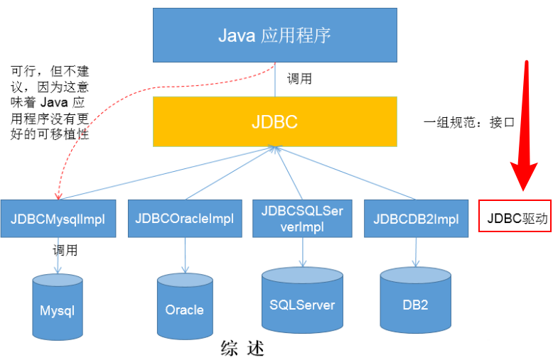

# 数据的持久化

持久化(persistence)：把数据保存到可掉电式存储设备中以供之后使用。

## JDBC的理解

JDBC(Java Database Connectivity)是一个独立于特定数据库管理系统、通用的SQL数据库存取和操作的公共接口（一组API）

简单理解为：JDBC，是SUN提供的一套 API，使用这套API可以实现对具体数据库的操作（获取连接、关闭连接、DML、DDL、DCL)

## 图示理解

好处：

>   从开发程序员的角度：不需要关注具体的数据库的细节
>
>   数据库厂商：只需要提供标准的具体实现。

## 数据库的驱动：

数据库厂商针对于JDBC这套接口，提供的具体实现类的集合。
类似：

## 面向接口编程的思想：

JDBC是sun公司提供一套用于数据库操作的接口，java程序员只需要面向这套接口编程即可。

不同的数据库厂商，需要针对这套接口，提供不同实现。不同的实现的集合，即为不同数据库的驱动。