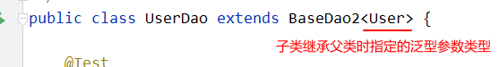

# 增删改查 Version 2.0

### 改进

将各种操作操作抽象,封装成DAO: data(base) access object基类, 封装了针对于数据表的通用的操作

#### 优点

通用的增删改查操作

##### 父类获取子类Class 对象类型的方法

子类继承的基类的形式：



```java
// 使用泛型占位符来确定clazz的类型（子类继承时指定）
private Class<T> clazz;
// 使用代码块，在子类实例化时进行调用（也可以放在构造器中）
{
    // 1. 获取带泛型的父类
    Type superClass = getClass().getGenericSuperclass();
    if( superClass instanceof ParameterizedType){
        
        // 2. 若父类带泛型，则获取泛型的参数化类型（强转）
        ParameterizedType parameterizedType = (ParameterizedType) superClass;
        
        // 3. 获取实际参数列表（数组形式）
        Type[] Arguments = parameterizedType.getActualTypeArguments();
        if(Arguments!=null && Arguments.length!=0){
            if(Arguments[0] instanceof Class){
                
                // 4. 将实际类型强转为Class类型
                clazz = (Class<T>)Arguments[0];
            }
        }

    }
}    
```

##### 增删改查具体代码

```java
public abstract class BaseDAO<T> {

    private Class<T> clazz = null;

    {   
        //获取当前BaseDAO的子类继承的父类中的泛型(这里的this实际上是子类对象)
        Type genericSuperclass = this.getClass().getGenericSuperclass();
        ParameterizedType paramType = (ParameterizedType) genericSuperclass;

        Type[] typeArguments = paramType.getActualTypeArguments();//获取了父类的泛型参数
        clazz = (Class<T>) typeArguments[0];//泛型的第一个参数
    }


    // 通用的增删改操作---version 2.0 (考虑上事务)
    public int update(Connection conn, String sql, Object... args) {// sql中占位符的个数与可变形参的长度相同！
        PreparedStatement ps = null;
        try {
            // 1.预编译sql语句，返回PreparedStatement的实例
            ps = conn.prepareStatement(sql);
            // 2.填充占位符
            for (int i = 0; i < args.length; i++) {
                ps.setObject(i + 1, args[i]);// 小心参数声明错误！！
            }
            // 3.执行
            return ps.executeUpdate();
        } catch (Exception e) {
            e.printStackTrace();
        } finally {
            // 4.资源的关闭
            JdbcUtils.closeResource(null, ps);

        }
        return 0;

    }


    // 通用的查询操作，用于返回数据表中的一条记录（version 2.0：考虑上事务
    public T getInstance(Connection conn, String sql, Object... args) {
        PreparedStatement ps = null;
        ResultSet rs = null;
        try {

            ps = conn.prepareStatement(sql);
            for (int i = 0; i < args.length; i++) {
                ps.setObject(i + 1, args[i]);
            }

            rs = ps.executeQuery();
            // 获取结果集的元数据 :ResultSetMetaData
            ResultSetMetaData rsmd = rs.getMetaData();
            // 通过ResultSetMetaData获取结果集中的列数
            int columnCount = rsmd.getColumnCount();

            if (rs.next()) {
                T t = clazz.newInstance();
                // 处理结果集一行数据中的每一个列
                for (int i = 0; i < columnCount; i++) {
                    // 获取列值
                    Object columValue = rs.getObject(i + 1);

                    // 获取每个列的列名
                    // String columnName = rsmd.getColumnName(i + 1);
                    String columnLabel = rsmd.getColumnLabel(i + 1);

                    // 给t对象指定的columnName属性，赋值为columValue：通过反射
                    Field field = clazz.getDeclaredField(columnLabel);
                    field.setAccessible(true);
                    field.set(t, columValue);
                }
                return t;
            }
        } catch (Exception e) {
            e.printStackTrace();
        } finally {
            JdbcUtils.closeResource(null, ps, rs);
        }
        return null;
    }


    // 通用的查询操作，用于返回数据表中的多条记录构成的集合（version 2.0：考虑上事务
    public List<T> getForList(Connection conn, String sql, Object... args) {
        PreparedStatement ps = null;
        ResultSet rs = null;
        try {

            ps = conn.prepareStatement(sql);
            for (int i = 0; i < args.length; i++) {
                ps.setObject(i + 1, args[i]);
            }

            rs = ps.executeQuery();
            // 获取结果集的元数据 :ResultSetMetaData
            ResultSetMetaData rsmd = rs.getMetaData();
            // 通过ResultSetMetaData获取结果集中的列数
            int columnCount = rsmd.getColumnCount();
            // 创建集合对象
            ArrayList<T> list = new ArrayList<T>();
            while (rs.next()) {
                T t = clazz.newInstance();
                // 处理结果集一行数据中的每一个列:给t对象指定的属性赋值
                for (int i = 0; i < columnCount; i++) {
                    // 获取列值
                    Object columValue = rs.getObject(i + 1);

                    // 获取每个列的列名
                    // String columnName = rsmd.getColumnName(i + 1);
                    String columnLabel = rsmd.getColumnLabel(i + 1);

                    // 给t对象指定的columnName属性，赋值为columValue：通过反射
                    Field field = clazz.getDeclaredField(columnLabel);
                    field.setAccessible(true);
                    field.set(t, columValue);
                }
                list.add(t);
            }

            return list;
        } catch (Exception e) {
            e.printStackTrace();
        } finally {
            JdbcUtils.closeResource(null, ps, rs);

        }

        return null;
    }

    
    //用于查询单一值的方法
    public <E> E getValue(Connection conn,String sql,Object...args){
        PreparedStatement ps = null;
        ResultSet rs = null;
        try {
            ps = conn.prepareStatement(sql);
            for(int i = 0;i < args.length;i++){
                ps.setObject(i + 1, args[i]);
            }

            rs = ps.executeQuery();
            if(rs.next()){
                return (E) rs.getObject(1);
            }
        } catch (SQLException e) {
            e.printStackTrace();
        }finally{
            JdbcUtils.closeResource(null, ps, rs);
        }
        return null;
    }   

    
    /**
   	 * 适用于没有实体类与结果集相对应，解决方法如下：
	 * 通过向 Map 中添加键值对（字段-->key，字段的值-->map的value），list中添加每一行记录来动态获取数据
	 * @param sql
	 * @param args
	 * @return
	 */
    public List<Map<String, Object>> getCommonResult(String sql, Object... args) {
        Connection connection = JdbcUtils.getConnection();

        PreparedStatement ps = null;
        ResultSet rs = null;
        ArrayList<Map<String, Object>> list = new ArrayList<>();
        HashMap<String, Object> map = null;
        try {
            ps = connection.prepareStatement(sql);

            for (int i = 0; i < args.length; i++) {
                ps.setObject(i + 1, args[i]);
            }
            
            rs = ps.executeQuery();

            ResultSetMetaData md = rs.getMetaData();

            while (rs.next()) {
                map = new HashMap<>();
                for (int i = 0; i < md.getColumnCount(); i++) {
                    String label = md.getColumnLabel(i + 1);
                    Object value = rs.getObject(i + 1);
                    // 将每个字段的键值对放入map
                    map.put(label, value);
                }
                // 将每条记录放入List
                list.add(map);
            }
        } catch (Exception e) {
            System.err.println(e.getMessage());
        } finally {

            JdbcUtils.closeResource(connection, ps, rs);
        }
        return list;
    }
}
```