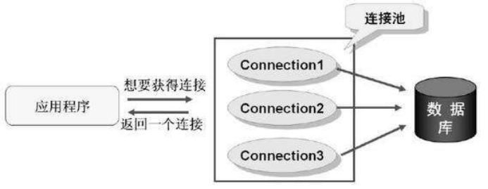
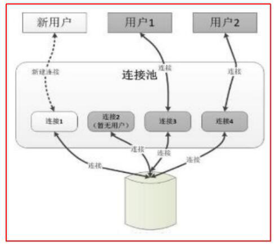

# 数据库连接池

## 什么是数据库连池

连接对象的缓冲区。负责申请，分配管理，释放连接的操作。


## 为什么要使用数据库连接池

Connection对象在每次执行DML和DQL的过程中都要创建一次,DML和DQL执行完毕后,connection对象都会被销毁. connection对象是可以反复使用的,没有必要每次都创建新的.该对象的创建和销毁都是比较消耗系统资源的,如何实现connection对象的反复使用呢?使用连接池技术实现。


## 连接池的优势

- 预先准备一些链接对象,放入连接池中,当多个线程并发执行时,可以避免短时间内一次性大量创建链接对象,减少计算机单位时间内的运算压力,提高程序的响应速度
- 实现链接对象的反复使用,可以大大减少链接对象的创建次数,减少资源的消耗






## 市面上有很多现成的数据库连接池技术：

* JDBC 的数据库连接池使用 javax.sql.DataSource 来表示，DataSource 只是一个接口（通常被称为数据源），该接口通常由服务器(Weblogic, WebSphere, Tomcat)提供实现，也有一些开源组织提供实现：
    * **DBCP** 是Apache提供的数据库连接池，**速度相对c3p0较快**，但因自身存在BUG，Hibernate3已不再提供支持
    * **C3P0** 是一个开源组织提供的一个数据库连接池，**速度相对较慢，稳定性还可以**
    * **Proxool** 是sourceforge下的一个开源项目数据库连接池，有监控连接池状态的功能，**稳定性较c3p0差一点**
    * **BoneCP** 是一个开源组织提供的数据库连接池，速度快
    * **Druid** 是阿里提供的数据库连接池，据说是集DBCP 、C3P0 、Proxool 优点于一身的数据库连接池


## 具体实现 数据库连接池

### Druid数据库连接池

##### 配置文件定义在src下：druid.properties

```properties
username=root
password=330781
driverClass=com.mysql.jdbc.Driver
url=jdbc:mysql://localhost:3306/test

# 初始线程数
initialSize=5
# 最大线程数
maxActive=10
# 无线程可用时等待时间（单位ms）
maxWait=1000
```

**测试连接的代码：**

```java
// 硬编码形式
@Test
public void test(){
    // 1. 添加jar包
    // 2. 创建连接池对象
    DruidDataSource dataSource = new DruidDataSource();

    // 3. 设置相关的属性
    // 设置基本信息
    dataSource.setUsername("root");
    dataSource.setPassword("330781");
    dataSource.setUrl("jdbc:mysql://localhost:3306/test");

    // 额外配置
    dataSource.setInitialSize(5);
    dataSource.setMaxActive(10);
    // 连接的最大等待时间（没有连接时）
    dataSource.setMaxWait(1000);

    // 4. 使用连接池对象获取连接
    for (int i = 0; i < 20; i++) {
        new Thread(() -> {
            try {
                DruidPooledConnection connection = dataSource.getConnection();
                System.out.println("connection = " + connection);
                TimeUnit.MILLISECONDS.sleep(500);
                connection.close();
            } catch (Exception e) {

            }
        }).start();
    }
}


// 读取配置文件形式
class testDruidDataSource{
    
    private static Properties prop = null;

    private static DataSource source = null;

    // 在静态代码块中完成连接池的配置
    static {

        try {
            prop = new Properties();
			// 读取同目录下的配置文件
            prop.load(PooledJdbcUtils.class.getResourceAsStream("druidConnection.properties"));
			// 加载配置文件
            source = DruidDataSourceFactory.createDataSource(prop);
        } catch (IOException e) {
            e.printStackTrace();
        } catch (Exception e) {
            e.printStackTrace();
        }
    }
    
	// 获取连接
	public static Connection getConnection() {
		Connection connection = null;
		try {
			
			connection = source.getConnection();
		} catch (SQLException throwables) {
			System.err.println(throwables.getMessage());
		}
		return connection;
	}
}
```

#### Druid数据库属性

| **配置**                      | **缺省** | **说明**                                                     |
| ----------------------------- | -------- | ------------------------------------------------------------ |
| name                          |          | 配置这个属性的意义在于，如果存在多个数据源，监控的时候可以通过名字来区分开来。 如果没有配置，将会生成一个名字，格式是：”DataSource-” + System.identityHashCode(this) |
| jdbcUrl                       |          | 连接数据库的url，不同数据库不一样。例如：mysql : jdbc:mysql://10.20.153.104:3306/druid2 oracle : jdbc:oracle:thin:@10.20.149.85:1521:ocnauto |
| username                      |          | 连接数据库的用户名                                           |
| password                      |          | 连接数据库的密码。如果你不希望密码直接写在配置文件中，可以使用ConfigFilter。详细看这里：<https://github.com/alibaba/druid/wiki/%E4%BD%BF%E7%94%A8ConfigFilter> |
| driverClassName               |          | 根据url自动识别 这一项可配可不配，如果不配置druid会根据url自动识别dbType，然后选择相应的driverClassName(建议配置下) |
| initialSize                   | 0        | 初始化时建立物理连接的个数。初始化发生在显示调用init方法，或者第一次getConnection时 |
| maxActive                     | 8        | 最大连接池数量                                               |
| maxIdle                       | 8        | 已经不再使用，配置了也没效果                                 |
| minIdle                       |          | 最小连接池数量                                               |
| maxWait                       |          | 获取连接时最大等待时间，单位毫秒。配置了maxWait之后，缺省启用公平锁，并发效率会有所下降，如果需要可以通过配置useUnfairLock属性为true使用非公平锁。 |
| poolPreparedStatements        | false    | 是否缓存preparedStatement，也就是PSCache。PSCache对支持游标的数据库性能提升巨大，比如说oracle。在mysql下建议关闭。 |
| maxOpenPreparedStatements     | -1       | 要启用PSCache，必须配置大于0，当大于0时，poolPreparedStatements自动触发修改为true。在Druid中，不会存在Oracle下PSCache占用内存过多的问题，可以把这个数值配置大一些，比如说100 |
| validationQuery               |          | 用来检测连接是否有效的sql，要求是一个查询语句。如果validationQuery为null，testOnBorrow、testOnReturn、testWhileIdle都不会其作用。 |
| testOnBorrow                  | true     | 申请连接时执行validationQuery检测连接是否有效，做了这个配置会降低性能。 |
| testOnReturn                  | false    | 归还连接时执行validationQuery检测连接是否有效，做了这个配置会降低性能 |
| testWhileIdle                 | false    | 建议配置为true，不影响性能，并且保证安全性。申请连接的时候检测，如果空闲时间大于timeBetweenEvictionRunsMillis，执行validationQuery检测连接是否有效。 |
| timeBetweenEvictionRunsMillis |          | 有两个含义： 1)Destroy线程会检测连接的间隔时间2)testWhileIdle的判断依据，详细看testWhileIdle属性的说明 |
| numTestsPerEvictionRun        |          | 不再使用，一个DruidDataSource只支持一个EvictionRun           |
| minEvictableIdleTimeMillis    |          |                                                              |
| connectionInitSqls            |          | 物理连接初始化的时候执行的sql                                |
| exceptionSorter               |          | 根据dbType自动识别 当数据库抛出一些不可恢复的异常时，抛弃连接 |
| filters                       |          | 属性类型是字符串，通过别名的方式配置扩展插件，常用的插件有： 监控统计用的filter:stat日志用的filter:log4j防御sql注入的filter:wall |
| proxyFilters                  |          | 类型是List，如果同时配置了filters和proxyFilters，是组合关系，并非替换关系 |

### C3P0

##### 配置文件: c3p0-config.xml

```xml
    <?xml version="1.0" encoding="UTF-8"?>
    <c3p0-config>
    
        <named-config name="hellc3p0">
            <!-- 提供获取连接的4个基本信息 -->
            <property name="driverClass">com.mysql.jdbc.Driver</property>
            <property name="jdbcUrl">jdbc:mysql:///test</property>
            <property name="user">root</property>
            <property name="password">abc123</property>
            
            <!-- 进行数据库连接池管理的基本信息 -->
            <!-- 当数据库连接池中的连接数不够时，c3p0一次性向数据库服务器申请的连接数 -->
            <property name="acquireIncrement">5</property>
            <!-- c3p0数据库连接池中初始化时的连接数 -->
            <property name="initialPoolSize">10</property>
            <!-- c3p0数据库连接池维护的最少连接数 -->
            <property name="minPoolSize">10</property>
            <!-- c3p0数据库连接池维护的最多的连接数 -->
            <property name="maxPoolSize">100</property>
            <!-- c3p0数据库连接池最多维护的Statement的个数 -->
            <property name="maxStatements">50</property>
            <!-- 每个连接中可以最多使用的Statement的个数 -->
            <property name="maxStatementsPerConnection">2</property>
    
        </named-config>
    </c3p0-config>
```

##### 测试链接代码:

```java
/**
         * 
         * @Description 使用C3P0的数据库连接池技术
         * @author shkstart
         * @date 下午3:01:25
         * @return
         * @throws SQLException
         */
//数据库连接池只需提供一个即可。
private static ComboPooledDataSource cpds = new ComboPooledDataSource("hellc3p0");
public static Connection getConnection1() throws SQLException{
    Connection conn = cpds.getConnection();

    return conn;
}
```

### DBCP

##### 配置文件定义在src下：dbcp.properties

```properties
driverClassName=com.mysql.jdbc.Driver
url=jdbc:mysql:///test
username=root
password=abc123

initialSize=10
```

##### 测试链接代码

```java
/**
         * 
         * @Description 使用DBCP数据库连接池技术获取数据库连接
         * @author shkstart
         * @date 下午3:35:25
         * @return
         * @throws Exception
         */
//创建一个DBCP数据库连接池
private static DataSource source;
static{
    try {
        Properties pros = new Properties();
        FileInputStream is = new FileInputStream(new File("src/dbcp.properties"));
        pros.load(is);
        source = BasicDataSourceFactory.createDataSource(pros);
    } catch (Exception e) {
        e.printStackTrace();
    }
}
public static Connection getConnection2() throws Exception{

    Connection conn = source.getConnection();

    return conn;
}
```
