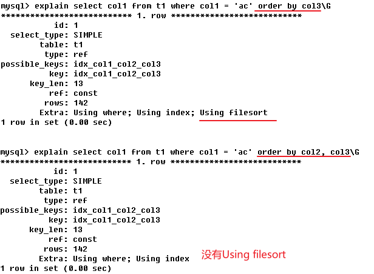

# MySQL 索引

## 索引简介

MySQL官方对索引的定义为：索引（Index）是帮助MySQL高效获取数据的**数据结构**。

索引的目的在于**提高查询效率**，可以类比字典：如果要查“mysql”这个单词，我们肯定需要定位到m字母，然后从上往下找到y字母，再找到剩下的s q l。如果没有索引，就需要从前到后翻字典，并对字典中的每一个字母一一对比过去，知道找到相同的。

在数据之外，数据库系统还维护着满足特定查找算法的数据结构，这些数据结构以某种方式引用（指向）数据，这样就可以在这些数据结构上实现高级查找算法。这种数据结构，就是索引。

**索引示意图**


为了加快Col2的查找，可以维护一个右边所示的二叉查找树（索引），每个节点分别包含索引键值和一个指向对应数据记录物理地址的指针，这样就可以运用二叉查找在一定的复杂度内获取到相应数据，从而快速的检索出符合条件的记录。

一般来说索引本身也很大，不可能全部存储在内存中，因此索引往往以索引文件的形式存储的磁盘上。

### 索引的优劣势

优势：

1. 类似大学图书馆建书目索引，提高数据检索的效率，降低数据库的IO成本。

2. 通过索引列对数据进行排序或分组，降低数据排序的成本，降低了CPU的消耗。

劣势：

1. 虽然索引大大提高了查询速度，同时却会降低更新表的速度，如对表进行INSERT、UPDATE和DELETE。因为更新表时，MySQL不仅要保存数据，还要保存一下索引文件。每次更新添加了索引列的字段，都会调整因为更新所带来的键值变化后的索引信息
2. 实际上索引也是一张表，该表保存了主键与索引字段，并指向实体表的记录，所以索引列也是要占用空间的

### 

## MySQL的索引结构

### 1、BTree索引


#### 初始化过程

一颗b树，浅蓝色的块我们称之为一个磁盘块(innodb默认16kb一个磁盘块)，可以看到每个磁盘块包含几个**数据项（深蓝色所示）、指向关键字具体信息的指针（红色）和指向其他磁盘块的指针（黄色所示）**

如磁盘块1包含数据项17和35，包含指针P1、P2、P3，P1表示小于17的磁盘块，P2表示在17和35之间的磁盘块，P3表示大于35的磁盘块。

#### 查找过程

如果要查找数据项29，那么首先会把磁盘块1由磁盘加载到内存，此时发生一次IO，在内存中用二分查找确定29在17和35之间，锁定磁盘块1的P2指针，内存时间因为非常短（相比磁盘的IO）可以忽略不计，通过磁盘块1的P2指针的磁盘地址把磁盘块3由磁盘加载到内存，发生第二次IO，29在26和30之间，锁定磁盘块3的P2指针，通过指针加载磁盘块8到内存，发生第三次IO，同时内存中做二分查找找到29，结束查询，总计三次IO。

真实的情况是，3层的b树可以表示上百万的数据，如果上百万的数据查找**只需要三次IO**，性能提高将是巨大的，如果没有索引，每个数据项都要发生一次IO，那么总共需要百万次的IO，显然成本非常非常高。

### 2、B+Tree


B+Tree的特点

1.  非叶子节点只存储下一级的指针，叶子节点只存储记录（数据）

2.  非叶子节点的指针指向的是下一个磁盘块的头，每个非叶子节点的磁盘块按顺序存储。

3.  B+树的叶子节点使用指针连接在一起，方便顺序遍历（例如查看一个目录下的所有文件，一个表中的所有记录等），这也是很多数据库和文件系统使用B+树的缘故。 
4.  叶子节点的记录按顺序存储

B+树中每个记录的查找时间基本是一样的，都需要从根节点走到叶子节点，而且在叶子节点中还要再比较关键字。从这个角度看B-树的性能好像要比B+树好，而在实际应用中却是B+树的性能要好些。**因为B+树的非叶子节点不存放实际的数据，这样每个节点可容纳的元素个数比B-树多，树高比B-树小，这样带来的好处是减少磁盘访问次数。**尽管B+树找到一个记录所需的比较次数要比B-树多，但是一次磁盘访问的时间相当于成百上千次内存比较的时间，因此实际中B+树的性能可能还会好些。

B+树比B-树更适合实际应用中操作系统的文件索引和数据库索引的原因：

-   **B+树的磁盘读写代价更低** 
    B+树的内部结点并没有指向关键字具体信息的指针。因此其内部结点相对B 树更小。如果把所有同一内部结点的关键字存放在同一盘块中，那么盘块所能容纳的关键字数量也越多。一次性读入内存中的需要查找的关键字也就越多。相对来说IO读写次数也就降低了。 
-   **B+树的查询效率更加稳定** 
    由于非终结点并不是最终指向文件内容的结点，而只是叶子结点中关键字的索引。所以任何关键字的查找必须走一条从根结点到叶子结点的路。所有关键字查询的路径长度相同，导致每一个数据的查询效率相当。

### 聚簇索引与非聚簇索引

**聚簇索引**：将数据存储与索引放到了一块，找到索引也就找到了数据

**非聚簇索引**：将数据存储于索引分开结构，索引结构的叶子节点指向了数据的对应行，myisam通过key_buffer把索引先缓存到内存中，当需要访问数据时（通过索引访问数据），在内存中直接搜索索引，然后通过索引找到磁盘相应数据，索引不在key buffer命中时，查询速度慢。在 innoDB中，非聚簇索引又称辅助索引（二级索引），辅助索引访问数据总是需要二次查找。辅助索引叶子节点存储的不再是行的物理位置，而是主键值。

在InnoDB中，主键索引为聚簇索引，将数据存在叶子节点上；非主键索引为非聚簇索引，将指向对应索引的指针存放在叶子节点上。因此通过非主键索引进行搜索时，一般流程如下：

1.  在辅助索引B+树中检索Name，到达其叶子节点获取对应的主键。
2.  使用主键在主索引B+树种再执行一次B+树检索操作，最终到达叶子节点即可获取整行数据。

聚簇索引的好处：

- 由于**行数据和叶子节点存储在一起，同一页中会有多条行数据，访问同一数据页不同行记录时，已经把页加载到了Buffer中，再次访问的时候，会在内存中完成访问**，不必访问磁盘。这样**主键和行数据是一起被载入内存的，找到叶子节点就可以立刻将行数据返回**了，**如果按照主键Id来组织数据，获得数据更快**。

- 聚簇索引适合用在排序的场合，非聚簇索引不适合

- 取出一定范围数据的时候，使用用聚簇索引

- 二级索引需要两次索引查找，而不是一次才能取到数据，因为存储引擎第一次需要通过二级索引找到索引的叶子节点，从而找到数据的主键，然后在聚簇索引中用主键再次查找索引，再找到数据

聚簇索引的限制：

- 对于mysql数据库目前只有innodb数据引擎支持聚簇索引，而Myisam并不支持聚簇索引。
- 由于数据物理存储排序方式只能有一种，所以每个Mysql的表只能有一个聚簇索引。
    - 一般情况下就是该表的主键。
    - 如果没有primary key,会以(not null unique key)非空的唯一索引保存数据
    - 内部自己生成一个字段保存数据
- 为了充分利用聚簇索引的聚簇的特性，所以innodb表的主键列尽量选用有序非空的字段，而不建议用无序的id，比如uuid这种。


## explain 索引分析

使用EXPLAIN关键字可以模拟优化器执行SQL查询语句，返回查询的各种信息。

### 语法：

```mysql
EXPLAIN <查询语句>
# 如：
explain select * from emp
```

### 返回格式：

```
+----+-------------+-------+------+---------------+-----+---------+-----+------+----------+-------+
| id | select_type | table | type | possible_keys | key | key_len | ref | rows | filtered | Extra |
+----+-------------+-------+------+---------------+-----+---------+-----+------+----------+-------+
```

### 字段解释：

#### 1、id：查询的顺序（趟数）

说明：select查询的序列号,包含一组数字,表示查询中执行的select字句或操作表的顺序,取值有三种情况：

1.  id相同的情况下,表的执行顺序是自上而下的（在explain表中的顺序）
2.  id不同时，如果时递增，id代表的时优先级。**id越大，越先执行**
3.  id相同/不同。同时存在时，先执行id大的；到相同id时，从上到下顺序执行。

每个id号码，表示一趟独立的查询。一个sql 的查询趟数越少越好。

#### 2、select_type：查询类型

常见的有如下六种：

1.  SIMPLE: 简单的select查询,查询中不包含子查询或UNION（单表查询）

2.  PRIMARY：查询中若包含任何复杂的字部份（子查询等），最外层的查询则被标记为PRIMARY。

3.  SUBQUERY: 在SELECT或WHERE列表中包含的子查询

    

4.  DERVED（衍生）： 在FROM列表中包含了的子查询被标记为衍生，MySql会递归执行这些子查询，并把他们放在**临时表**中

    

5.  UNION：若第二个SELECT出现在UNION之后，则被标记为UNION；若UNION包含在FROM自居的子查询中，外层SELECT被标记为DERIVED

6.  UNION RESULT：从UNION表获取结果的select（两种UNION结果的合并），一般情况下与UNION同时出现。

#### 3、table：显示这一行数据的表的来源

#### 4、type：查询类型

常见的有：All、index、range、ref、eq_ref、const、system、NULL

衡量查询性能的重要指标。性能从最好到最差的排行：

```bash
system > const > eq_ref > ref > range > index > ALL
```

**一般来说，得保证查询至少达到range级别，最好能达到ref。**

-    null:   MySQL不访问任何表或索引，直接返回结果

-   system：**表只有一行记录**（等于系统表），这是const类型的特列，平时不会出现，这个也可以忽略不计。

-   const：表示通过索引一次就找到了，const用于比较primary key或者unique索引。因为只匹配一行数据，所以很快。如将主键置于where列表中，MySQL就能将该查询转换为一个常量。（select * from t1 where t1.id=1）

-   eq_ref：唯一性索引扫描，对于每个索引键，表中只有一条记录与之匹配。常见于**主键或唯一索引扫描**。（select * from t1,t2 where t1.id=t2.id）

-   ref:  **使用非唯一索引扫描或唯一索引前缀扫描**，返回单条记录，常出现在关联查询中

-   range：只检索给定范围的行，**使用一个索引来选择行**。key 列显示使用了哪个索引，一般就是在你的where语句中出现了 `between、<、>、in` 等的查询。这种范围扫描索引扫描比全表扫描要好，因为它只需要开始于索引的某一点，而结束语另一点，不用扫描全部索引。（select * from t1 where t1.id<10）

-   index：出现index是sql使用了索引但是没用通过索引进行过滤（索引全表扫描），一般是使用了覆盖索引或者是利用索引进行了排序分组。（explain select id from t1）

-   all：Full Table Scan，将遍历全表以找到匹配的行。未使用索引。（explain select * from t1）

-   index_merge：在查询过程中需要多个索引组合使用，通常出现在有 or 的关键字的sql中。

-   ref_or_null：对于某个字段既需要关联条件，也需要null值得情况下。查询优化器会选择用ref_or_null连接查询。

-   index_subquery：利用索引来关联子查询，不再全表扫描。

-   unique_subquery：该联接类型类似于index_subquery。 子查询中的唯一索引。

#### 5、possible_key：显示可能应用在这张表中的索引

查询涉及到的字段上若存在索引，则该索引将被列出，但不一定被查询实际使用。

#### 6、key：实际使用的索引。

如果为NULL，则没有使用索引。查询中若使用了覆盖索引，则该索引和查询的select字段重叠（覆盖索引: 若select查询的字段与索引的顺序一致,则会出现覆盖索引）

#### 8、key_len：表示索引中使用的字节数

key_len字段能够帮你检查是否充分的利用上了索引。可通过该列计算查询中使用的索引的长度。 

计算步骤：

1.  先看索引上字段的类型+长度比如 int=4 ;  varchar(20) =20 ; char(20) =20  
2.  如果是varchar或者char这种字符串字段，视字符集要乘不同的值，比如utf-8占3个字节。GBK占两个字节。
3.  varchar这种动态字符串要加2个字节，用于保存字节长度的信息。
4.  允许为空的字段要加1个字节  。

注意：索引字段最好不要为NULL，因为NULL让统计更加复杂，并且需要额外一个字节的存储空间。

#### 9、ref：显示索引被使用的列

可能的话，最好是一个常数。显示哪些列或常量被用于查找索引列上的值。


显示规则: 库.表.字段

#### 10、rows：估算查询所需的行数

根据表统计信息及索引选用情况，**大致估算出**查询的记录所需要读取的行数。有索引和没有索引的对比：


#### 11、filtered：过滤行数的百分比

这个字段表示存储引擎返回的数据在server层过滤后，剩下多少满足查询的记录数量的百分比。

#### 12、Extra：额外信息

一般有如下几种情况：

-   Using filesort：文件外索引，而不是按照表内索引读取，**性能极差（需要磁盘IO）**（MySQL中无法利用索引完成的排序操作称为“文件排序”）。一般来说出现此现象为复合索引断层所导致。如下图，建好了3个索引，第一个sql用了col1之后直接使用col3，出现此现象；而第二个sql依次使用三个索引，没有出现Using filesort。

    

-   Using temporary：使用了临时表保存中间结果（使用中间表都会降低性能）。MySql在对查询结果排序时使用临时表，常见于排序Order By 与分组查询 Group By

    

-   Using Index：表示响应的select 操作中使用了覆盖索引（Covering Index），避免访问了表的数据行，效率不错。

    -   如果同时出现了using where，表明索引被用来执行索引键值的查找；
    -   如果没有出现 using where，表明索引用来读取数据而非执行查找动作
    -   覆盖索引：select的数据只需要从索引中就可以获取，不必读取数据表的数据行。表示查询的字段刚好是索引，个数顺序都匹配。

-   Using where：使用了where查询条件

-   impossible where：where字句的值总是false，不可能获取任何组元

-   Using join buffer：使用了连接缓存，非主键关联（可以优化）

-   select tables optimized away：在没有groupBy自居的情况下，基于索引优化 Min/Max或对于MyISAM优化count(*)，在查询阶段完成优化。

-   distinct：优化distinct操作，在找到第一匹配的组员后立刻停止查找相同值的操作

