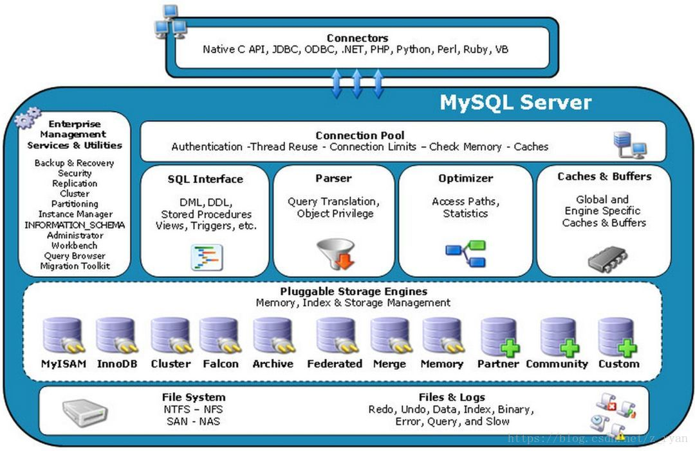
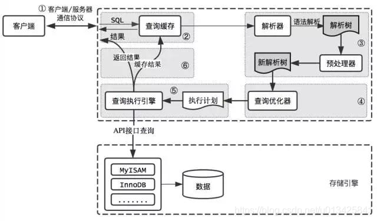
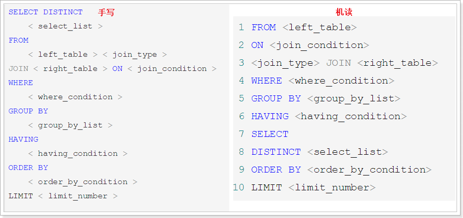
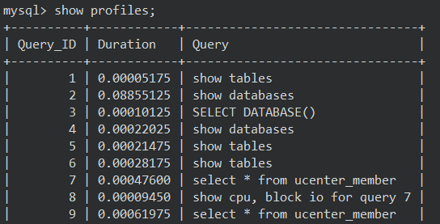
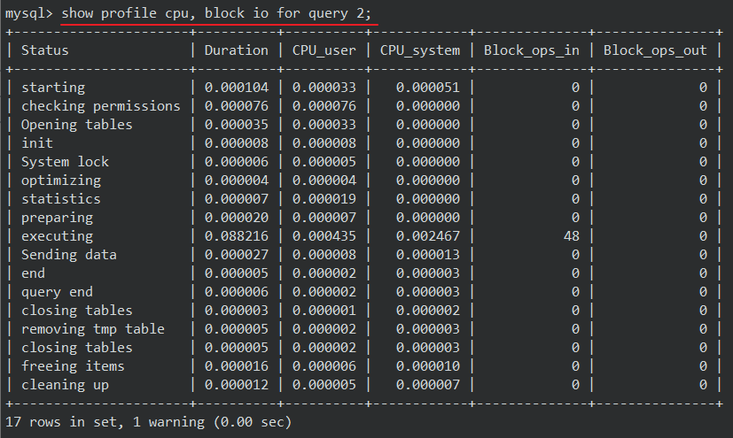
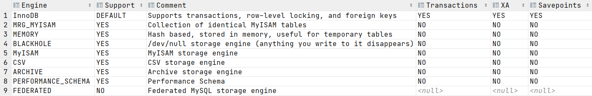

# MySQL 逻辑架构

## mysql逻辑架构



-   Connectors

    指的是不同语言中与SQL的交互。

-   Connection Pool

    管理缓冲用户连接，线程处理等需要缓存的需求。负责监听对 MySQL Server 的各种请求，接收连接请求，转发所有连接请求到线程管理模块。每一个连接上 MySQL Server 的客户端请求都会被分配（或创建）一个连接线程为其单独服务。而连接线程的主要工作就是负责 MySQL Server 与客户端的通信，接受客户端的命令请求，传递 Server 端的结果信息等。线程管理模块则负责管理维护这些连接线程。包括线程的创建，线程的 cache 等。

-    Management Serveices & Utilities

    系统管理和控制工具。

-   SQL Interface

    接受用户的SQL命令，并且返回用户需要查询的结果。

-   Parser

    SQL命令传递到解析器的时候会被解析器验证和解析。解析器是由Lex和YACC实现的，是一个很长的脚本。在 MySQL中我们习惯将所有 Client 端发送给 Server 端的命令都称为 query ，在 MySQL Server 里面，连接线程接收到客户端的一个 Query 后，会直接将该 query 传递给专门负责将各种 Query 进行分类然后转发给各个对应的处理模块。

    主要功能：

    -   将SQL语句进行语义和语法的分析，分解成数据结构，然后按照不同的操作类型进行分类，然后做出针对性的转发到后续步骤，以后SQL语句的传递和处理就是基于这个结构的；
    -   如果在分解构成中遇到错误，那么就说明这个sql语句是不合理的。

-   Optimizer 查询优化器

    SQL语句在查询之前会使用查询优化器对查询进行优化。就是优化客户端请求query，根据客户端请求的 query 语句，和数据库中的一些统计信息，在一系列算法的基础上进行分析，得出一个最优的策略，告诉后面的程序如何取得这个 query 语句的结果。

    使用的是“选取-投影-联接”策略进行查询。用一个例子就可以理解： select uid,name from user where gender = 1;这个select 查询先根据where 语句进行选取，而不是先将表全部查询出来以后再进行gender过滤；然后根据uid和name进行属性投影，而不是将属性全部取出以后再进行过滤。最后将这两个查询条件联接起来生成最终查询结果。

-   Cache和Buffer

    查询缓存：主要功能是将客户端提交 给MySQL 的 Select 类 query 请求的返回结果集 cache 到内存中，与该 query 的一个 hash 值 做一个对应。该 query 所取数据的基表发生任何数据的变化之后， MySQL 会自动使该 query 的Cache 失效。在读写比例非常高的应用系统中， Query Cache 对性能的提高是非常显著的。当然它对内存的消耗也是非常大的。

    如果查询缓存有命中的查询结果，查询语句就可以直接去查询缓存中取数据。这个缓存机制是由一系列小缓存组成的。比如表缓存，记录缓存，key缓存，权限缓存等。

-   存储引擎接口

    MySQL区别于其他数据库的最重要的特点就是其插件式的表存储引擎。MySQL插件式的存储引擎架构提供了一系列标准的管理和服务支持，这些标准与存储引擎本身无关，可能是每个数据库系统本身都必需的，如SQL分析器和优化器等，而存储引擎是底层物理结构的实现，每个存储引擎开发者都可以按照自己的意愿来进行开发。

    注意：存储引擎是基于表的，而不是数据库。


## 查询流程



1.  mysql客户端通过协议与mysql服务器建连接，发送查询语句，先检查查询缓存，如果命中，直接返回结果
2.  语法解析器和预处理：首先mysql通过关键字将SQL语句进行解析，并生成一颗对应的“解析树”。mysql解析器将使用mysql语法规则验证和解析查询；预处理器则根据一些mysql规则进一步检查解析树是否合法。

3.  当解析树被认为是合法的了，<font color='red'>查询优化器将其转化成执行计划</font>。可以有多种执行计划。优化器的作用就是找到最好的执行计划并执行。注意：最终返回的结果相同。

### SQL 语法顺序



SQL机读顺序：From -> join -> on -> where -> group by -> having -> select -> distinct -> order by -> limit

个人理解：

1.  先有表，再有条件及分组。
2.  where：对分组前的单条数据进行条件筛选
3.  然后进行分组 group by。
4.  having：对分组后的分组数据进行条件筛选
5.  然后查出了记录，对所有记录进行排序及限制。这样可以防止数据丢失。

### Profile命令，查看执行周期

利用`show profiles` 可以查看sql的执行周期。需要先开启该功能：

1. 开启查询缓存功能。

    查询缓存是否开启：show variables like '%query_cache%';

    修改配置文件/etc/my.cnf，新增一行：query_cache_type=1，重启mysql

2. 查看参数表中profiling(性能分析工具)：`show variables  like '%profiling%';`

    开启：`set profiling=1;`

#### 分析流程

1、展示最近几次的查询：`show profiles;`



-   Query_ID：查询的id号
-   Duration：耗时
-   Query：查询的SQL语句

2、展示具体步骤： `show profile [查询参数] for query <查询ID>` 来显示具体执行的步骤。查询参数如下：

-   ALL：显示所有的开销信息。
-   BLOCK IO：显示块IO开销。
-   CONTEXT SWITCHES：上下文切换开销。
-   CPU：显示CPU开销信息。
-   IPC：显示发送和接收开销信息。
-   MEMORY：显示内存开销信息。
-   PAGE FAULTS：显示页面错误开销信息。
-   SOURCE：显示和Source_function，Source_file，Source_line相关的开销信息。
-   SWAPS：显示交换次数开销信息。

一般使用 `show profile cpu,block io for query <查询ID>` 即可



每一步的说明：

-   starting：开启查询耗时

-   checking permissions：检查权限   

-   Opening tables：打开表

-   init ： 初始化

-   System lock ：系统锁

-   optimizing ： 优化sql

-   statistics ： 统计

-   preparing ：准备执行

-   executing ：执行sql

-   Sending data ：发送数据

-   Sorting result ：排序

-   end ：结束

-   query end ：查询 结束

-   closing tables ： 关闭表 ／去除TMP 表

-   freeing items ： 释放物品

-   cleaning up ：清理


## MySQL存储引擎

如何用命令查看：`show engines;`



也可以通过`show variables like '%storage_engine%';`查看默认的存储引擎。

### 各引擎简介

1. InnoDB存储引擎

    InnoDB是MySQL的默认事务型引擎，它被设计用来处理大量的短期(short-lived)事务。除非有非常特别的原因需要使用其他的存储引擎，否则应该优先考虑InnoDB引擎。

2. MyISAM存储引擎

    MyISAM提供了大量的特性，包括全文索引、压缩、空间函数(GIS)等，但MyISAM不支持事务和行级锁，有一个毫无疑问的缺陷就是崩溃后无法安全恢复。

3. Archive引擎

    Archive档案存储引擎只支持INSERT和SELECT操作，在MySQL5.1之前不支持索引。

    Archive表适合日志和数据采集类应用。

    根据英文的测试结论来看，Archive表比MyISAM表要小大约75%，比支持事务处理的InnoDB表小大约83%。

4. Blackhole引擎

    Blackhole引擎没有实现任何存储机制，它会丢弃所有插入的数据，不做任何保存。但服务器会记录Blackhole表的日志，所以可以用于复制数据到备库，或者简单地记录到日志。但这种应用方式会碰到很多问题，因此并不推荐。 

5. CSV引擎 

    CSV引擎可以将普通的CSV文件作为MySQL的表来处理，但不支持索引。

    CSV引擎可以作为一种数据交换的机制，非常有用。

    CSV存储的数据直接可以在操作系统里，用文本编辑器，或者excel读取。

6. Memory引擎

    如果需要快速地访问数据，并且这些数据不会被修改，重启以后丢失也没有关系，那么使用Memory表是非常有用。Memory表至少比MyISAM表要快一个数量级。

7. Federated引擎

    Federated引擎是访问其他MySQL服务器的一个代理，尽管该引擎看起来提供了一种很好的跨服务器的灵活性，但也经常带来问题，因此默认是禁用的。

重点关照的两个存储引擎：**InnoDB** 与 **MyISAM**

| **对比项**         | **MyISAM**                                                   | **InnoDB**                                                   |
| ------------------ | ------------------------------------------------------------ | ------------------------------------------------------------ |
| **外键**           | 不支持                                                       | 支持                                                         |
| **事务**           | 不支持                                                       | 支持                                                         |
| **行表锁**         | 表锁，即使操作一条记录也会锁住整个表   <font color='red'>不适合高并发的操作  </font> | 行锁,操作时只锁某一行，不对其它行有影响   <font color='red'>适合高并发的操作 </font> |
| **缓存**           | 只缓存索引，不缓存真实数据                                   | 不仅缓存索引还要缓存真实数据，对内存要求较高，而且内存大小对性能有决定性的影响 |
| **关注点**         | 节省资源、消耗少、简单业务                                   | 并发写、事务、更大资源                                       |
| **默认安装**       | Y                                                            | Y                                                            |
| **用户表默认使用** | N                                                            | Y                                                            |
| **自带系统表使用** | Y                                                            | N                                                            |


## sql_mode

sql_mode是个很容易被忽视的变量，默认值是空值（mysql5.5），在这种设置下是可以允许一些非法操作的，比如允许一些非法数据的插入。在生产环境必须将这个值设置为严格模式，所以开发、测试环境的数据库也必须要设置，这样在开发测试阶段就可以发现问题。

查看开启的 sql_mode ：

```sql
show variables like 'sql_mode';
```

暂时修改

```mysql
set sql_mode='ONLY_FULL_GROUP_BY';	# 设置多个需要使用 `,`分割
```

永久修改：修改配置文件

| 配置名称                   | 说明                                                         |
| -------------------------- | ------------------------------------------------------------ |
| ONLY_FULL_GROUP_BY         | 对于GROUP BY聚合操作，如果在SELECT中的列，没有在GROUP BY中出现，那么这个SQL是不合法的，因为列不在GROUP BY从句中 |
| NO_AUTO_VALUE_ON_ZERO      | 该值影响自增长列的插入。默认设置下，插入0或NULL代表生成下一个自增长值。如果用户 希望插入的值为0，而该列又是自增长的，那么这个选项就有用了。 |
| STRICT_TRANS_TABLES        | 在该模式下，如果一个值不能插入到一个事务表中，则中断当前的操作，对非事务表不做限制。提高性能。 |
| NO_ZERO_IN_DATE            | 在严格模式下，不允许日期和月份为零。                         |
| NO_ZERO_DATE               | 设置该值，mysql数据库不允许插入零日期，插入零日期会抛出错误而不是警告。 |
| ERROR_FOR_DIVISION_BY_ZERO | 在INSERT或UPDATE过程中，如果数据被零除，则产生错误而非警告。如果未给出该模式，那么数据被零除时MySQL返回NULL。 |
| NO_AUTO_CREATE_USER        | 禁止GRANT创建密码为空的用户。                                |
| NO_ENGINE_SUBSTITUTION     | 如果需要的存储引擎被禁用或未编译，那么抛出错误。不设置此值时，用默认的存储引擎替代，并抛出一个异常。 |
| PIPES_AS_CONCAT            | 将"\|\|"视为字符串的连接操作符而非或运算符，这和Oracle数据库是一样的，也和字符串的拼接函数Concat相类似。 |
| ANSI_QUOTES                | 启用ANSI_QUOTES后，不能用双引号来引用字符串，因为它被解释为识别符。 |
| ORACLE                     | 设置等同：PIPES_AS_CONCAT, ANSI_QUOTES, IGNORE_SPACE, NO_KEY_OPTIONS, NO_TABLE_OPTIONS, NO_FIELD_OPTIONS, NO_AUTO_CREATE_USER。 |