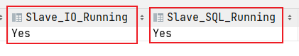

# 主从复制

## 概念

一般应用对数据库而言都是“读多写少”，也就说对数据库读取数据的压力比较大，有一个思路就是采用数据库集群的方案：

-   写库：负责写入数据

-   读库：其它都是从库，负责读取数据

要求：

1、 读库和写库的数据一致(最终一致)；

2、 写数据必须写到写库；

3、 读数据必须到读库(不一定)；


## 主从复制实操

#### 前提条件：

每个master可以有多个slave，每个slave只属于一个master。

1、 主DB server和从DB server数据库的版本一致，都是5.5或者都是5.7

2、 主DB server和从DB server数据库数据一致 [这里就会可以把主的备份在从上还原，也可以直接将主的数据目录拷贝到从的相应数据目录]

3、 主DB server开启二进制日志，主 DB server 和从 DB server 的 server_id 都必须唯一。主从都配置在[mysqld]结点下，都是小写

#### 1、准备两个机子（虚拟机），并互相ping。若能ping通，则说明网络连接可用。

```bash
ping 192.168.xx.xxx
```

#### 2、两个机子分别关闭防火墙 或 开放3306端口。

```bash
# 关闭防火墙
systemctl stop firewalld

# 开放端口
firewall-cmd --add-port=3306/tcp --permanent
```

#### 3、修改主机与从机的配置文件

-   主机的配置文件：

    ```sh
    # 主服务器唯一ID
    server-id=1
     # 启用二进制日志，路径中不要有中文和空格
    log-bin=master-bin
     # 可选，出错日志。出错之后可查看
    #log-error=/opt/log
     # 设置不要复制的数据库
    binlog-ignore-db=mysql
     # 设置需要复制的数据库
    binlog-do-db=mydb2
     # 设置logbin格式，默认就是statement，row/mixed(5.8以上支持)  
     # - statement： 此格式，日志记录的是主机数据库的写指令   默认  性能 高，但是now()之类的获取系统参数的操# 作会出现主从数据不同步的问题
     # - row： 此格式，日志记录的是主机数据库的写后的数据  批量操作时性能较差  解决now()或者  user()或者  #@@hostname 等操作获取系统参数时 由于延迟导致  主从获取的参数值不同步出现的问题
     # - mixed： 会按照statement保存写操作，但是now()等获取系统参数的操作会自动转为参数值保存 5.8 以后支持
    binlog_format=STATEMENT
    ```

-   从机的配置文件：

    ```sh
    server-id=2
    # mysql中继日志
    relay-log=mysql-relay
    ```

#### 4、主机执行配置同步的SQL

```mysql
-- 修改密码设置的等级
SET GLOBAL validate_password_policy = 0;
-- 修改密码设置的长度
SET GLOBAL validate_password_length = 1;

-- 给从机创建账号
GRANT REPLICATION SLAVE ON *.* TO '<从机的用户名>'@'<从机的ip>' IDENTIFIED BY '<从机的密码>';
-- 刷新权限
FLUSH PRIVILEGES;
```

接着，执行SQL语句可以查看主机状态

```mysql
SHOW MASTER STATUS
```


-   File：主机日志文件，用于同步。
-   Position：日志的行数，用于从机连接到主机时确定同步开始的位置。

#### 5、从机连接同步的主机，并开始同步

配置Master信息：

```mysql
CHANGE MASTER TO 
 master_host = '192.168.72.132',# 主机地址
 master_port = 3306,	# 主机端口
 master_user = 'slave01',	# 作为从机，连接到主机的账号
 master_password = '123456',	# 作为从机，连接到主机的密码
 master_log_file = 'logbin.000001',	# 主机日志文件
 master_log_pos = 605;	# 主机的记录行数
```

开始同步：

```mysql
# 启动slave同步
START SLAVE;
# 查看同步状态
SHOW SLAVE STATUS;
```

如果Slave_SQL_Running 与 Slave_IO_Running都为 YES，则说明连接至主机，开启同步



>   重置主从关系：
>
>   -   主机：RESET MASTER;
>   -   从机：STOP SLAVE;然后 Change Master To 新的master信息，接着 START SLAVE;