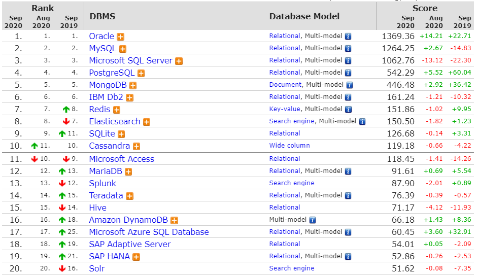

# 数据库概述

DBMS：数据库管理系统（Database Management System）是一种操纵和管理数据库的大型软件，例如建立、使用和维护数据库。

DB：数据库（Database）

SQL：结构化查询语言，（Structure Query Language），专门用来操作/访问数据库的通用语言。

 如果把`数据库`比作`盘子`，那数据就是盘子里的`菜`，`SQL`则是你的`筷子`。

数据库类型：数据库经过几十年的发展，出现了多种类型。目前最常见的数据库模型主要是：关系型数据库和（noSQL）非关系型数据库。

MySQL：其中的一款关系型数据库管理系统

以下是2020年**DB-Engines Ranking** 对各数据库受欢迎程度进行调查后的统计结果：（查看数据库最新排名:https://db-engines.com/en/ranking）

关系型数据库模型是将复杂的数据结构用较为简单的二元关系（二维表）来表示，如图所示。在该类型数据库中，对数据的操作基本上都建立在一个或多个表格上，我们可以采用结构化查询语言（SQL）对数据库进行操作。关系型数据库是目前主流的数据库技术，其中具有代表性的数据库管理系统有：Oracle、DB2、SQL Server、MySQL等。

非关系型数据库：

 随着互联网[web2.0](https://baike.baidu.com/item/web2.0/97695)网站的兴起，传统的关系数据库在处理web2.0网站，特别是超大规模和高并发的[SNS](https://baike.baidu.com/item/SNS/10242)（ 社交网络服务 ）类型的web2.0纯[动态网](https://baike.baidu.com/item/动态网)站已经显得力不从心，出现了很多难以克服的问题，而非关系型的数据库则由于其本身的特点得到了非常迅速的发展。NoSQL数据库的产生就是为了解决大规模数据集合多重数据种类带来的挑战，尤其是大数据应用难题。 redis  MongoDB

### 关系型数据库设计规则

* **遵循ER模型**

    * E    entity   代表实体的意思      对应到数据库当中的一张表          
    * R    relationship 代表关系的意思  

* **具体体现**

    * 将数据放到表中，表再放到库中。
    * 一个数据库中可以有多个表，每个表都有一个名字，用来标识自己。表名具有唯一性。
    * 表具有一些特性，这些特性定义了数据在表中如何存储，类似java和python中 “类”的设计。
    * 表由列组成，我们也称为**字段**。每个字段描述了它所含有的数据的意义，**数据表的设计实际上就是对字段的设计**。创建数据表时，为每个字段分配一个数据类型，定义它们的数据长度和字段名。每个字段类似java 或者python中的“实例属性”。
    * 表中的数据是按行存储的，一行即为一条记录。每一行类似于java或python中的“对象”。

    

## MySQL概述

MySQL数据库最初是由瑞典MySQL AB公司开发，2008年1月16号被Sun公司收购。2009年，SUN又被Oracle收购。MySQL是目前IT行业最流行的开放源代码的数据库管理系统，同时它也是一个支持多线程高并发多用户的关系型数据库管理系统。MySQL之所以受到业界人士的青睐，主要是因为其具有以下几方面优点： 

#### 1. 开放源代码 

MySQL最强大的优势之一在于它是一个开放源代码的数据库管理系统。开源的特点是给予了用户根据自己需要修改DBMS的自由。MySQL采用了General Public License，这意味着授予用户阅读、修改和优化源代码的权利，这样即使是免费版的MySQL的功能也足够强大，这也是为什么MySQL越来越受欢迎的主要原因。 

####  2. 跨平台

MySQL可以在不同的操作系统下运行，简单地说，MySQL可以支持Windows系统、UNIX系统、Linux系统等多种操作系统平台。这意味着在一个操作系统中实现的应用程序可以很方便地移植到其他的操作系统下。 

#### 3. 轻量级 

MySQL的核心程序完全采用多线程编程，这些线程都是轻量级的进程，它在灵活地为用户提供服务的同时，又不会占用过多的系统资源。因此MySQL能够更快速、高效的处理数据。 

#### 4. 成本低 

MySQL分为社区版和企业版，社区版是完全免费的，而企业版是收费的。即使在开发中需要用到一些付费的附加功能，价格相对于昂贵的Oracle、DB2等也是有很大优势的。其实免费的社区版也支持多种数据类型和正规的SQL查询语言，能够对数据进行各种查询、增加、删除、修改等操作，所以一般情况下社区版就可以满足开发需求了，而对数据库可靠性要求比较高的企业可以选择企业版。 

