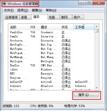
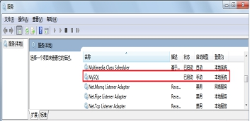

# MySQL的使用

## MySQL服务的启动

“我的电脑/计算机”-->右键-->“管理”-->“服务”-->启动和关闭MySQL服务

“开始菜单”-->“控制面板”-->“管理工具”-->“服务”-->启动和关闭MySQL

“任务管理器”-->“服务”-->启动和关闭MySQL

    

或者

命令行（使用命令行的前提需要配置mysql的环境变量）

```cmd
net  start  MySQL服务名
net  stop  MySQL服务名
```

## 2.2 客户端连接MySQL

1、命令行客户端：

```cmd
mysql -h 主机IP地址 -P 端口号	-u 用户名	-p回车
Enter Password:密码
```

> 如果访问本机，-h localhost可以省略
>
> 如果端口号没有修改，-P 3306可以省略
>
> 除了-p与密码之间不要空格外，其他的-h,-P,-u与后面的参数值之间可以有空格
>
> 想要连接成功，必须保证服务开启的

2、其他客户端，例如：可视化工具Navicat或SQLyog等

