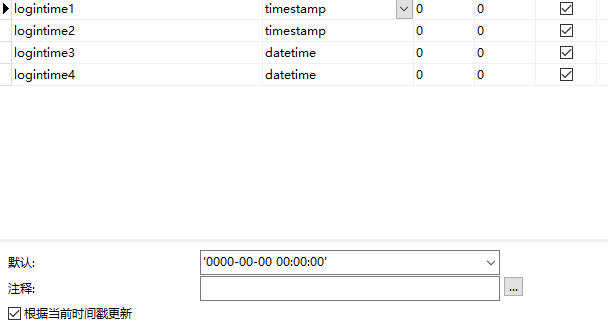
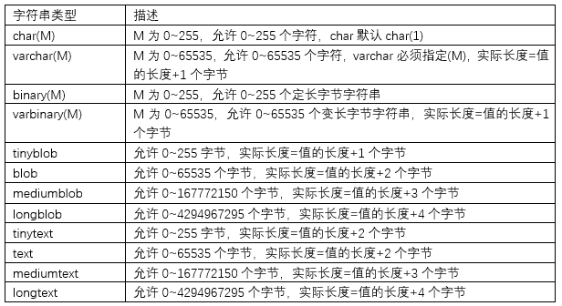

# MySQL数据类型和运算符

## MySQL数据类型

### 数值类型

- 整型系列：xxxInt

    >   int(M)，必须和unsigned zerofill一起使用才有意义


- 浮点型系列：float,double（或real)

    >   double(M,D)：表示最长为M位，其中小数点后D位
    >
    >   例如：double(5,2)表示的数据范围[-999.99,999.99]，如果超过这个范围会报错。

- 定点型系列：decimal（底层实际上是使用字符串进行存储）

    >   decimal(M,D)：表示最长为M位，其中小数点后D位

- 位类型：bit

字节范围是：1-8，值范围是：bit(1)~bit(64)，默认bit(1) 将传入的数值转为二进制存入

用来存储二进制数。对于位字段，直接使用select命令将不会看到结果。可以使用bit()函数进行插入。插入bit类型字段时，使用bit()函数转为二进制值再插入，使用bin()函数进行读取。

### 日期时间类型

日期时间类型：year, date, datetime, timestamp

> 注意一下每一种日期时间的表示范围


**timestamp和datetime的区别：**

- timestamp范围比较小

- timestamp和时区有关

    ```sql
    show variables like 'time_zone'; # 查看时区
    set time_zone = '+9:00';	# 设置时区 （默认为SYSTEM）
    ```

- 表中的第一个非空的timestamp字段如果插入和更新为NULL则会自动设置为系统时间




-   插入null值时，datetime插入的是null，timestamp插入的是当前时间。

### 字符串类型

MySQL中提供了多种对字符数据的存储类型，不同的版本可能有所差异。常见的有：

char,varchar，xxtext，binary，varbinary，xxblob，enum，set等等



- 字符串类型char,varchar(M)

    - varchar可以根据具体存入数据的长度进行分配（存入字符串长度+1个字节，该字节位存储字符串的长度）
    - char定长，存入多长是多长

    >   char如果没有指定宽度，默认为1个字符
    >
    >   varchar(M)，必须指定宽度

- binary和varbinary类似于char和varchar，不同的是它们包含二进制字符串，不支持模糊查询之类的。

- 一般在保存少量字符串的时候，我们会选择char和varchar；而在保存较大文本时，通常会选择使用text或blob系列。blob和text值会引起一些性能问题，特别是在执行了大量的删除操作时，会在数据表中留下很大的“空洞”，为了提高性能，建议定期时候用optimize table功能对这类表进行碎片整理。可以使用合成的(Synthetic)索引来提高大文本字段的查询性能，如果需要对大文本字段进行模糊查询，MySql提供了前缀索引。但是仍然要在不必要的时候避免检索大型的blob或text值。

- enum枚举类型，它的值范围需要在创建表时通过枚举方式显式指定，对于1~255个成员的枚举需要1个字节存储；对于255`65535个成员需要2个字节存储。例如：gender enum('男','女')。一次只能从枚举值中选择一个。

- set集合类型，可以包含0~64个成员。一次可以从集合中选择多个成员。如果选择了1-8个成员的集合，占1个字节，依次占2个，3个。。8个字节。例如：hoppy  set('吃饭','睡觉','玩游戏','旅游')，选择时'吃饭,睡觉'或'睡觉,玩游戏,旅游'

```sql
create table test2(
	sex enum('男','女'),	# 枚举enum()
	hobby set('俯卧撑','游泳','跑步','健身')	# 集合set()
);
```

### 查看表结构： desc 表名

执行结果如下：

```mysql
+----------------+--------------+------+-----+---------+----------------+
| Field          | Type         | Null | Key | Default | Extra          |
+----------------+--------------+------+-----+---------+----------------+
| eid            | int(11)      | NO   | PRI | NULL    | auto_increment |
| ename          | varchar(20)  | NO   |     | NULL    |                |
| tel            | char(11)     | NO   |     | NULL    |                |
| gender         | char(1)      | YES  |     | 男       |                |
| salary         | double       | YES  |     | NULL    |                |
| commission_pct | double(3,2)  | YES  |     | NULL    |                |
| birthday       | date         | YES  |     | NULL    |                |
| hiredate       | date         | YES  |     | NULL    |                |
| job_id         | int(11)      | YES  |     | NULL    |                |
| email          | varchar(32)  | YES  |     | NULL    |                |
| mid            | int(11)      | YES  |     | NULL    |                |
| address        | varchar(150) | YES  |     | NULL    |                |
| native_place   | varchar(10)  | YES  |     | NULL    |                |
| did            | int(11)      | YES  |     | NULL    |                |
+----------------+--------------+------+-----+---------+----------------+
```

