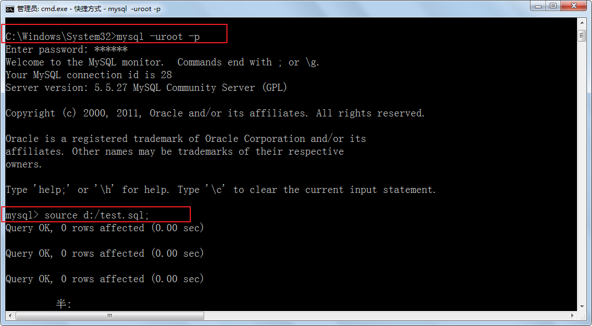

# 基础SQL语句

## MySQL的语法规范和要求

1.  mysql的sql语法不区分大小写

    查看数据库是否区分大小写 `show variables like 'collation%';`

    ci 不区分大小写		cs 区分大小写

    >   MySQL的关键字和函数名等不区分大小写，但是对于数据值是否区分大小写，和字符集与校对规则有关。

    \_ci（大小写不敏感），\_cs（大小写敏感），_bin（二元，即比较是基于字符编码的值而与language无关，区分大小写）

2.  命名时：尽量使用26个英文字母大小写，数字0-9，下划线，不要使用其他符号

3.  建议不要使用mysql的关键字等来作为表名、字段名等，如果不小心使用，请在SQL语句中使用`（飘号）引起来

4.  数据库和表名、字段名等对象名中间不要包含空格

5.  同一个mysql软件中，数据库不能同名，同一个库中，表不能重名，同一个表中，字段不能重名

6.  标点符号： `

    > 必须成对
    >
    > 必须英文状态下半角输入方式
    >
    > 字符串和日期类型可以使用单引号''
    >
    > 列的别名可以使用双引号""，给表名取别名不要使用双引号。取别名时as可以省略
    >
    > 如果列的别名没有包含空格，可以省略双引号，如果有空格双引号不能省略。

7.  SQL脚本中如何加注释

    > 单行注释：#注释内容
    >
    > 单行注释：--空格注释内容    其中--后面的空格必须有
    >
    > 多行注释：/* 注释内容 */

```mysql
#以下两句是一样的，不区分大小写
show databases;
SHOW DATABASES;

#创建表格
#create table student info(...); #表名错误，因为表名有空格
create table student_info(...); 

#其中name使用``飘号，因为name和系统关键字或系统函数名等预定义标识符重名了。
CREATE TABLE t_stu(
    id INT,
    `name` VARCHAR(20)
);

select id as "编号", `name` as "姓名" from t_stu; #起别名时，as都可以省略
select id as 编号, `name` as 姓名 from t_stu; #如果字段别名中没有空格，那么可以省略""
select id as 编 号, `name` as 姓 名 from t_stu; #错误，如果字段别名中有空格，那么不能省略""
```


## 常用语句

查看建表语句

```
 show create table 表名
```


## SQL分类

DDL (Data Definition Language) ：数据定义语言，定义库，表结构等，包括create,drop,alter等

-   常见词：create、alter、rename

DML (Data Manipulation Language) ：数据操作语言，增删改查数据，包括insert,delete,update,select等

DCL（Data Control Language） ：数据控制语言，权限，事务等管理。


## DDL(v1.0) Data Definition Language 数据定义语言

1、查看所有数据库

```mysql
show databases;
```

2、指定使用某个数据库

```mysql
use 数据库名;
```

3、创建数据库

```mysql
create database 数据库名;

create database if not exists 数据库名;

create database 数据库名 charset 'utf8'; #在mysql中字符集名称不要使用utf-8
```

4、删除数据库

```mysql
drop database 数据库名;
```

5、查看某个库下的所有表格

```mysql
show tables ;  #前提是已选择数据库
show tables from 数据库名;
```

6、创建表格

```mysql
create table 【数据名.】表名(
	字段名1 数据类型,
	字段名2 数据类型,
	....
);

```

7、删除表格

```mysql
drop table 【数据库名.]表名称;
```

8、查看某个表结构

```mysql
describe 【数据库名.]表名称;
desc 【数据库名.]表名称;
```

9、增加一列

```mysql
# 添加字段（最后一行）
alter table 【数据库名.]表名称 add 【column】 字段名 数据类型;

# 添加字段到第一列
alter table 【数据库名.]表名称 add 【column】 字段名 数据类型 first;

# 添加字段到另一个字段之后
alter table 【数据库名.]表名称 add 【column】 字段名 数据类型 after 另一个字段;
```

10、删除一列

```mysql
alter table 【数据库名.]表名称 drop 【column】 字段名;
```

11、修改列数据类型

```mysql
alter table 【数据库名.]表名称 modify 【column】 字段名 新数据类型;
```

12、修改列名与数据类新

```mysql
alter table 【数据库名.]表名称 change【column】 旧字段名 新字段名 新数据类型;
```

13、修改列的位置

```mysql
alter table 【数据库名.]表名称 modify 【column】字段名 数据类型 first;
alter table 【数据库名.]表名称 modify 【column】字段名 数据类型 after 另一个字段;
```

14、修改表名称

```mysql
alter table 旧表名 rename 新表名;
rename table 旧表名 to 新表名;
```


## DML(v1.0) Data Manipulation Language 数据操作语言

1、添加数据

```mysql
insert into 【数据库名.]表名称 values(值列表)； 
#要求值列表的顺序、个数、类型，要与表格中的字段的顺序、个数、类型一一匹配

insert into 【数据库名.]表名称(部分字段列表) values(值列表)；
#要求列表的顺序、个数、类型，要与前面的(部分字段列表)的顺序、个数、类型一一匹配

insert into 【数据库名.]表名称 values(值列表1)，(值列表2)。。。;

insert into 【数据库名.]表名称(部分字段列表) values(值列表1)，(值列表2)。。。;

insert into [数据库名.]表名 set 字段名=值, 字段名=值......;
```

2、修改数据

```mysql
update 【数据库名.]表名称 set 字段名1 = 值1, 字段名2 = 值2 。。。 【where 条件】;
```

> 如果没有加where条件，表示修改所有行，这个字段的值

3、删除数据

```mysql
delete from 【数据库名.]表名称 【where 条件】;
```

> 如果没有where条件，表示删除整张表的数据;

```mysql
truncate 【数据库名.]表名称;#删除整张表的数据，还可以使用这个语句，效率更高，但是它不能回滚
```

用delete删除整张表和用truncate删除整张表的数据的区别？

（1）truncate速度快

（2）truncate无法回滚

>   truncate底层是把表drop掉，然后新建了一张空表。
>
>   delete因为底层是一行一行删数据。

4、简单查询数据

```mysql
select * from 【数据库名.]表名称; #查询整张表的所有数据

select 字段列表  from 【数据库名.]表名称;  #查询部分列表

select * from 【数据库名.]表名称 【where 条件】;

select 字段列表  from 【数据库名.]表名称 【where 条件】;
```

> 使用distinct可以对查询结果进行去重

## 导入和导出数据

### 导出数据库（退出状态）

mysql5.5

```sql
C:\Windows\System32> mysqldump -h主机地址 -P端口号 -u用户名 -p密码 --database  数据名 > 文件路径/文件名.sql
```

例如：

```sql
C:\Windows\System32>mysqldump -hlocalhost -P3306 -uroot -p123456 --database  test > d:/test.sql
```


mysql5.7版

```cmd
C:\Windows\System32> mysqldump -h主机地址 -P端口号 -u用户名 -p 数据库名 > 文件路径/文件名.sql
```

本机操作可以省略主机名和端口号

```cmd
C:\Users\Administrator>mysqldump -uroot -p book >d:/dump.sql
Enter password: ****
```

> 不要再写--database

### 导入执行备份的sql脚本（登陆状态，且已选择数据库）

先登录mysql，然后执行如下命令：

```sql
mysql> source  sql脚本路径名.sql
```

例如：

```sql
mysql>source d:/test.sql;
```




## MySQL运算符

1、算术运算符

```sql
加：+
减：-
乘：*
除：/   div（只保留整数部分）
模：%   mod
```

2、比较运算符

```
大于：>
小于：<
大于等于：>=
小于等于：>=
等于：=   不能用于null判断
不等于：!=  或 <>
安全等于：<=>  可以用于null值判断
```

3、逻辑运算符（建议用单词，可读性来说）

```
逻辑与：&& 或 and
逻辑或：|| 或 or
逻辑非：! 或 not
逻辑异或：^ 或 xor
```

4、范围

```mysql
区间范围：between x  and  y
	    not between x  and  y
集合范围：in (x,x,x)
	    not  in(x,x,x)
```

5、模糊查询和正则匹配（只针对字符串类型，日期类型）

```
like 'xxx'
如果想要表示0~n个字符，用%
如果想要表示确定的1个字符，用_
```

6、位运算符（很少使用）

```
左移：<<
右移：>>
按位与：&
按位或：|
按位异或：^
按位取反：~
```

7、特殊的null值处理

```sql
#（1）判断时
xx is null
xx is not null
xx <=> null
```

```sql
/*一、运算符
1、算术运算符
+：加
-：减
*：乘
/：除 可以保留小数部分
div：除  如果整数与整数相除只保留整数部分
%：求余数
mod：求余数
*/
select 1+1;
select 1/2; #0.5
select 1 div 2; #0

/*
2、比较运算符
>：大于
<：小于
=：等于  注意区别，Java中是==,mysql中是=
>=：大于等于
<=：小于等于
!=：不等于
<>：不等于
<=>：安全等于  用于判断null值的比较运算符
		null值的判断，习惯上我们用is null 和is not null
*/
#查询薪资大于20000元的员工
select * from t_employee where salary > 20000;

#查询所有男员工
select * from t_employee where gender = '男';
select * from t_employee where gender != '女';
select * from t_employee where gender <> '女';

#查询奖金比例commision_pct是null的员工
select  * from t_employee where commission_pct <=> null;
select  * from t_employee where commission_pct is null;

/*
3、逻辑运算符
&&和and：逻辑与
	两个条件同时满足
||和or：逻辑或
	两个条件满足任意一个
^和xor：逻辑异或
	两个条件只能满足其中一个
!和not：
	不满足xx条件
	*/
#查询薪资大于20000元的女员工	
select * from t_employee where salary > 20000 && gender = '女';
select * from t_employee where salary > 20000 and gender = '女';

#查询男员工
select * from t_employee where not gender = '女';
select * from t_employee where !(gender = '女');

#查询薪资大于10000  异或 性别是男的，即它俩只能满足一个
#即查询薪资大于10000的女的或薪资低于10000的男的
select * from t_employee where salary>10000 ^ gender ='男';
select * from t_employee where salary>10000 xor gender ='男';
/*
4、范围
（1）区间范围：
	在[a,b]之间，between a and b
	不在[a,b]之间，not between a and b
（2）集合范围
	in(...)
	not in(...)
*/
#查询薪资在[15000,20000]之间的员工
select * from t_employee where salary between 15000 and 20000;
select * from t_employee where salary >= 15000 and salary <=20000;

#查询薪资在9000,10000,12000
select * from t_employee where salary in(9000,10000,12000);
select * from t_employee where salary =9000 || salary =10000 || salary =12000;
 /*
5、模糊查询
like '%x%' x代表确定的字符 %表示不确定的0~n个字符
     '_x%'  x代表确定的字符 _表示确定的1个字符
   
*/
#查询，名字ename中包含“冰”这个字的员工
select * from t_employee where ename like '%冰%';

#查询，名字ename是张xx，三个字
select * from t_employee where ename like '张__';

#查询，名字ename是第二个字是'冰'
select * from t_employee where ename like '_冰%';

```

