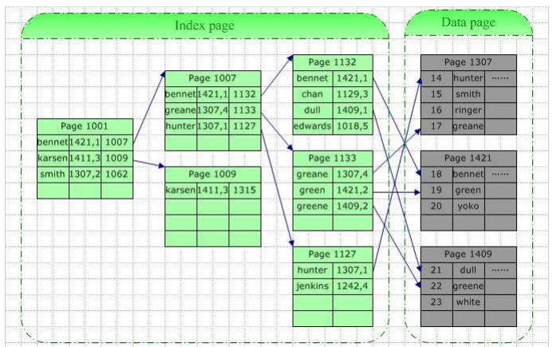
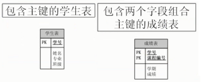
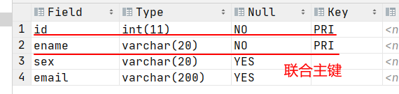
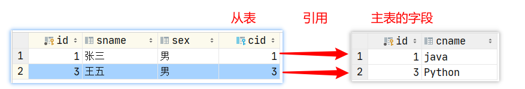
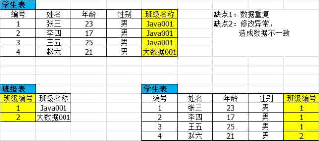

# 约束与索引

## 约束与索引的概念

约束是用来对数据业务规则和数据完整性进行实施、维护。约束的作用范围仅限在当前数据库，约束可以被当做**数据库对象**来处理，它们具有名称和关联模式，是逻辑约束，不会因为设置约束而额外占用空间。


1、数据完整性（Data Integrity）是指数据的精确性（Accuracy）和可靠性（Reliability）。它是应防止数据库中存在不符合语义规定的数据和防止因错误信息的输入输出造成无效操作或错误信息而提出的。

数据的完整性要从以下四个方面考虑：

* 实体完整性（Entity Integrity）：例如，同一个表中，不能存在两条完全相同无法区分的记录
* 域完整性（Domain Integrity）：例如：年龄范围0-120，性别范围“男/女”
* 引用完整性（Referential Integrity）：例如：员工所在部门，在部门表中要能找到这个部门
* 用户自定义完整性（User-defined Integrity）：例如：用户名唯一、密码不能为空等，本部门经理的工资不得高于本部门职工的平均工资的5倍。

2、根据约束的特点，分为几种：

* 键约束：主键约束、外键约束、唯一键约束
* Not NULL约束：非空约束
* Check约束：检查约束
* Default约束：默认值约束
* 自增约束

3、约束（CONSTRAINTS）与索引（INDEX）


**索引**是一个单独、物理的存储在数据页上的数据库结构，它是表中**一列或若干列值的集合**和相应的指向表中数据值的物理标识数据页的**逻辑指针清单**（类似于新华字典的目录索引页）。索引的存在会增加数据库的存储空间，也会使插入、修改数据的时间开销变多(因为插入和修改数据时，索引也要随之变动），但是可以大大提高查询速度。因此应该在键列、或其他经常要查询、排序、按范围查找的列上建立索引，而对于在查询中很少使用和参考的列、修改非常频繁的列，值很少的列（例如性别只有男和女）等列上不应该创建索引。



>Mysql会在主键、唯一键、外键列上自动创建索引，其他列需要建立索引的话，需要手动创建。
>
>其中主键删除，对应的索引也会删除
>
>删除唯一键的方式是通过删除对应的索引来实现的
>
>删除外键，外键列上的索引还在，如果需要删除，需要单独删除索引


## DDL(v2.0)

### 查看某个表的约束

```mysql
SELECT * FROM information_schema.table_constraints WHERE table_name = '表名称';
或
SHOW CREATE TABLE 表名;
```

### 查看某个表的索引

```mysql
SHOW INDEX FROM 表名称;
```

### 主键约束（索引）：primary key 

表级约束

主键分为单列主键和复合主键：



主键的特点：

（1）唯一并且非空

（2）一个表只能有一个主键约束

（3）主键约束名就叫做PRIMARY

（4）创建主键会自动创建对应的索引，同样删除主键对应的索引也会删除。

1、建表时指定主键约束

```mysql
create table 【数据名.】表名(
	字段名1 数据类型  primary key ,
	....
);
或
create table 【数据名.】表名(
	字段名1 数据类型,
	....,
    primary key(字段名1)
);
或
create table 【数据名.】表名(
    字段名1 数据类型,
    字段名2 数据类型,
	....,
    primary key(复合主键字段列表)#如果是复合主键，那么就需要在所有字段列表后面使用这种形式指定，不能在字段后面直接加primary key
);
```

2、建表后指定主键约束

```mysql
alter table 表名称 add primary key (主键字段列表);
```

3、删除主键约束

```mysql
alter table 表名称 drop primary key;
```

#### 联合主键

添加多个元素为主键，当字段的值，顺序与主键元素的值，顺序完全一致时，才认为时主键重复

```mysql
# 可以添加联合主键
alter table emp
    add primary key (id, ename);

create table emp(
    id    int,
    ename varchar(20),
    sex   varchar(20),
    email varchar(200),
    # 添加联合主键
    primary key (id, ename)
);
```



### 唯一键约束（索引）：unique key

表级约束

1、唯一键约束特点

-   唯一键约束列允许为null（null可以多个）。
-   同一个表可以有多个唯一约束。
-   唯一约束可以是某一个列的值唯一，也可以多个列组合值的唯一。
-   MySQL会给唯一约束的列上默认创建一个唯一索引。
-   删除唯一键只能通过删除对应索引的方式删除，删除时需要指定唯一键索引名

2、如何在建表时指定唯一键约束

```mysql
create table 【数据名.】表名(
	字段名1 数据类型  primary key ,
	字段名2 数据类型 unique key,
	....
);

create table 【数据名.】表名(
    字段名1 数据类型  primary key ,
    字段名2 数据类型,
    字段名3 数据类型,
	....,
    unique key(复合唯一字段列表)#如果是复合唯一键，那么就需要在所有字段列表后面使用这种形式指定，不能在字段后面直接加unique key
);
```

3、建表后增加唯一键约束

```mysql
alter table 表名称 add 【constraint 约束名】 unique 【key】 (字段名列表);
#如果没有指定约束名，(字段名列表)中只有一个字段的，默认是该字段名，如果是多个字段的默认是字段名列表的第1个字段名。也可以通过show index from 表名;来查看
```

4、删除唯一键约束（删除索引即可）

```mysql
ALTER TABLE 表名称 DROP INDEX 唯一性约束名;
#注意：如果忘记名称，可以通过“show index from 表名称;”查看
```

### 非空约束（非索引）：not null

列级约束

NOT NULL 非空约束，规定某个字段不能为空

1、建表时给某个字段指定非空约束

```mysql
create table 【数据名.】表名(
	字段名1 数据类型  primary key ,
	字段名2 数据类型 【unique key】 【not null】,
	....
);

create table 【数据名.】表名(
    字段名1 数据类型 【not null】,
    字段名2 数据类型 【not null】,
	....
);
```

2、建表后指定某个字段非空

```mysql
ALTER TABLE 表名称 MODIFY 字段名 数据类型 【NOT NULL】 【default 默认值】;
#如果该字段原来设置了默认值约束，要跟着一起再写一遍，否则默认值约束会丢失
```

3、建表后取消某个字段非空

```mysql
ALTER TABLE 表名称 MODIFY 字段名 数据类型 【default 默认值】;
#如果该字段原来设置了默认值约束，要跟着一起再写一遍，否则默认值约束会丢失
```

### 默认值约束（非索引）：default

列级约束

可以为null，未给该字段赋值时，则采用默认值。

1、建表时给某个字段指定默认约束

```mysql
create table 【数据名.】表名(
	字段名1 数据类型  primary key ,
	字段名2 数据类型 【unique key】  【default 默认值】,
	....
);

create table 【数据名.】表名(
    字段名1 数据类型 【not null】 【default 默认值】,
    字段名2 数据类型 【not null】 【default 默认值】,
	....
);
```

2、建表后指定某个字段的默认值约束

```mysql
ALTER TABLE 表名称 MODIFY 字段名 数据类型  【default 默认值】 【NOT NULL】;
#如果该字段原来设置了非空约束，要跟着一起再写一遍，否则非空约束会丢失
```

3、建表后取消某个字段的默认值约束

```mysql
ALTER TABLE 表名称 MODIFY 字段名 数据类型 【NOT NULL】;
#如果该字段原来设置了非空约束，要跟着一起再写一遍，否则非空约束会丢失
```

### 检查约束：check 

检查约束，mysql暂不支持

```mysql
create table stu(
	sid int primary key,
	sname varchar(20),
	gender char check ('男'or'女')
);
insert into stu values(1,'张三','男');
insert into stu values(2,'李四','妖');

使用枚举类型解决如上问题：
create table stu(
	sid int primary key,
	sname varchar(20),
	gender enum ('男','女')
);
```

### 自增约束（非索引）：auto_increment

列级约束

1、关于自增长auto_increment：

* 一个表最多只能有一个自增长列
* 自增长列必须是键列（主键列，唯一键列，外键列），并且要求非空。
* 自增列必须是整数类型
* InnoDB表的自动增长列可以手动插入，但是插入的值如果是null或者0，则实际插入的将是自动增长后的值。
* 使用 `delete` 清空表之后，延续之前序号；使用 `truncate` 重置表之后，序号从1开始。

2、建表时指定自增长列

```mysql
create table 【数据名.】表名(
	字段名1 数据类型  primary key auto_increment,
	字段名2 数据类型 【unique key】 【not null】 【default 默认值】,
	....
);

或
create table 【数据名.】表名(
	字段名1 数据类型  primary key ,
	字段名2 数据类型 【unique key  not null】 auto_increment,
	....
);
```

3、建表后指定自增长列

```mysql
alter table 【数据名.】表名 modify 自增字段名 数据类型 auto_increment;
```

4、删除自增约束

```mysql
alter table 【数据名.】表名 modify 自增字段名 数据类型;
```

### 外键约束：foreign key

外键约束（FOREIGN KEY，缩写FK）是用来实现数据库表的参照完整性的。外键约束可以使两张表紧密的结合起来，特别是针对修改或者删除的级联操作时，会保证数据的完整性。

外键是指表中某个字段的值依赖于另一张表中某个字段的值，而***被依赖的字段必须具有主键约束或者唯一约束***。被依赖的表我们通常称之为父表或者主表，设置外键约束的表称为子表或者从表。



举个例子：如果想要表示学生和班级的关系，首先要有学生表和班级表两张表，然后学生表中有个字段为stu_clazz（该字段表示学生所在的班级），而该字段的取值范围由班级表中的主键cla_no字段（该字段表示班级编号）的取值决定。那么班级表为主表，学生表为从表，且stu_clazz字段是学生表的外键。通过stu_clazz字段就建立了学生表和班级表的关系。



1、外键特点

* 外键约束是保证一个或两个表之间的参照完整性,外键是构建于一个表的两个字段或是两个表的两个字段之间的参照关系。

* 在创建外键约束时，如果不给外键约束名称，默认名不是列名，而是自动产生一个外键名（例如 student_ibfk_1;），也可以指定外键约束名。

* 当创建外键约束时，系统默认会在所在的列上建立对应的普通索引。但是索引名是列名，不是外键的约束名。

* 删除外键时，关于外键列上的普通索引需要单独删除。

2、要求

* 在从表上建立外键，而且主表要先存在。

* 一个表可以建立多个外键约束

* 从表的外键列，在主表中引用的只能是键列（主键，唯一键，外键），推荐引用主表的主键。

* 从表的外键列与主表被参照的列名字可以不相同，但是数据类型必须一样

3、约束关系：约束是针对双方的

* 添加了外键约束后，主表的修改和删除数据受约束

* 添加了外键约束后，从表的添加和修改数据受约束
* 在从表上建立外键，要求主表必须存在
* 删除主表时，要求从表从表先删除，或将从表中外键引用该主表的关系先删除

4、5个约束等级

* Cascade方式：在父表上update/delete记录时，同步update/delete掉子表的匹配记录 

* Set null方式：在父表上update/delete记录时，将子表上匹配记录的列设为null，但是要注意子表的外键列不能为not null  

* No action方式：如果子表中有匹配的记录,则不允许对父表对应候选键进行update/delete操作  

* Restrict方式：同no action, 都是立即检查外键约束

* Set default方式（在可视化工具SQLyog中可能显示空白）：父表有变更时,子表将外键列设置成一个默认的值，但Innodb不能识别

如果没有指定等级，就相当于Restrict方式

5、建表时指定外键约束

```mysql
create table 【数据名.】从表名(
	字段名1 数据类型  primary key ,
	字段名2 数据类型 【unique key】,
	....,
    【constraint 外键约束名】 foreign key (从表字段) references 主表名(主表字段) 【on update 外键约束等级】【on delete 外键约束等级】
    #外键只能在所有字段列表后面单独指定
    #如果要自己命名外键约束名，建议 主表名_从表名_关联字段名_fk
);

create table 【数据名.】表名(
    字段名1 数据类型,
    字段名2 数据类型,
	....
    foreign key (从表字段) references 主表名(主表字段) 【on update 外键约束等级】【on delete 外键约束等级】
    #外键只能在所有字段列表后面单独指定
);
```

6、建表后指定外键约束

```mysql
alter table 从表名称 add 【constraint 外键约束名】 foreign key (从表字段名) references 主表名(主表被参照字段名) 【on update xx】[on delete xx];
```

7、删除外键约束

```mysql
ALTER TABLE 表名称 DROP FOREIGN KEY 外键约束名;
#删除外键约束不会删除对应的索引，如果需要删除索引，需要用 ALTER TABLE 表名称 DROP INDEX 索引名;
#查看索引名 show index from 表名称;
```

>注意：若外键创建后没有使用 constraint [外键名] 指定外键名称，一般会被重新命名
查看约束名 ：
	
	-   SELECT * FROM information_schema.table_constraints WHERE table_name = '表名称';
	-   SHOW CREATE TABLE tbl_name;


## DML(v2.0)

1、如果某列有自增约束，怎么添加该字段的值

添加数据时，对于自增列

```mysql
insert into 【数据库名.】表名称 values(值列表)；#在值列表中，对应自增列可以赋值为null和0

insert into 【数据库名.】表名称(部分字段列表) values(值列表)；#自增列在(部分字段列表)中不写就可以
```

2、如果某列有默认值约束，怎么添加、修改该字段的值

添加数据时，对于有默认值列

```mysql
insert into 【数据库名.】表名称 values(值列表)；#在值列表中，对应默认值列，如果想用默认值，用default

insert into 【数据库名.】表名称(部分字段列表) values(值列表)；#对应默认值列，如果想用默认值，在(部分字段列表)中不写就可以
```

修改数据

```mysql
update 【数据库名.】表名称 set 字段名1 = 值1, 字段名2 = 值2 。。。 【where 条件】; #对应默认值列，如果想用默认值，写字段名 = default就可以
```

