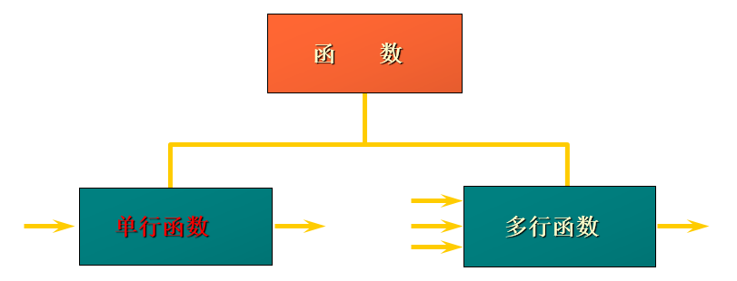

# 函数

MySQL的函数可分为两种函数

-   单行函数：输入一个记录，输出一个结果
-   多行函数：输入多条记录，输出一条结果



## 单行函数

* **只对一行进行变换，每行返回一个结果**
* 可以嵌套
* 参数可以是一字段或一个表达式或一个值

### 字符串函数

| 函数                            | 用法                                                         |
| ------------------------------- | ------------------------------------------------------------ |
| CONCAT(S1,S2,......,Sn)         | 连接S1,S2,......,Sn为一个字符串                              |
| CONCAT_WS(s, S1,S2,......,Sn)   | 同CONCAT(s1,s2,...)函数，但是每个字符串之间要加上s           |
| CHAR_LENGTH(s)                  | 返回字符串s的字符数                                          |
| LENGTH(s)                       | 返回字符串s的字节数，和字符集有关                            |
| INSERT(str, index , len, instr) | 将字符串str从第index位置开始，len个字符长的子串替换为字符串instr |
| UPPER(s) 或 UCASE(s)            | 将字符串s的所有字母转成大写字母                              |
| LOWER(s)  或LCASE(s)            | 将字符串s的所有字母转成小写字母                              |
| LEFT(s,n)                       | 返回字符串s最左边的n个字符                                   |
| RIGHT(s,n)                      | 返回字符串s最右边的n个字符                                   |
| LPAD(str, len, pad)             | 用字符串pad对str最左边进行填充，直到str的长度为len个字符     |
| RPAD(str ,len, pad)             | 用字符串pad对str最右边进行填充，直到str的长度为len个字符     |
| LTRIM(s)                        | 去掉字符串s左侧的空格                                        |
| RTRIM(s)                        | 去掉字符串s右侧的空格                                        |
| TRIM(s)                         | 去掉字符串s开始与结尾的空格                                  |
| TRIM(【BOTH 】s1 FROM s)        | 去掉字符串s开始与结尾的s1                                    |
| TRIM(【LEADING】s1 FROM s)      | 去掉字符串s开始处的s1                                        |
| TRIM(【TRAILING】s1 FROM s)     | 去掉字符串s结尾处的s1                                        |
| REPEAT(str, n)                  | 返回str重复n次的结果                                         |
| REPLACE（str, a, b）            | 用字符串b替换字符串str中所有出现的字符串a                    |
| STRCMP(s1,s2)                   | 比较字符串s1,s2                                              |
| SUBSTRING(s,index,len)          | 返回从字符串s的index位置其len个字符                          |

**举例1：大小写控制函数**

| 函数                    | 结果           |
| ----------------------- | -------------- |
| **LOWER('SQL Course')** | **sql course** |
| **UPPER('SQL Course')** | **SQL COURSE** |

> 这类函数改变字符的大小写。

**举例2：字符控制函数**

| 函数                            | 结果                  |
| ------------------------------- | --------------------- |
| **CONCAT('Hello','World')**     | **HelloWorld**        |
| **SUBSTR('HelloWorld',1,5)**    | **Hello**             |
| **LENGTH('HelloWorld')**        | **10**                |
| **INSTR('HelloWorld','W')**     | **6**                 |
| **LPAD(salary,10,'\*')**        | **\*\*\*\*\*24000**   |
| **RPAD(salary,10, '\*')**       | **24000\**\**\*\*\*** |
| **TRIM('H' FROM 'HelloWorld')** | **elloWorld**         |
| **REPLACE('abcd','b','m')**     | **amcd**              |

### 数值函数/数学函数

| 函数          | 用法                                 |
| ------------- | ------------------------------------ |
| ABS(x)        | 返回x的绝对值                        |
| CEIL(x)       | 返回大于x的最小整数值                |
| FLOOR(x)      | 返回小于x的最大整数值                |
| MOD(x,y)      | 返回x/y的模                          |
| RAND()        | 返回0~1的随机值                      |
| ROUND(x,y)    | 返回参数x的四舍五入的有y位的小数的值 |
| TRUNCATE(x,y) | 返回数字x截断为y位小数的结果         |
| SQRT(x)       | 返回x的平方根                        |
| POW(x,y)      | 返回x的y次方                         |

* **举例1：ROUND:四舍五入**

```
ROUND(45.926, 2)     -->  45.93
```

* **举例2：TRUNCATE:截断**

```
TRUNCATE(45.926)      --> 45
```

* **举例3：MOD:求余**

```sql
MOD(1600, 300)	 --> 100
```

### 日期函数

| 函数                                                         | 用法                                                      |
| ------------------------------------------------------------ | --------------------------------------------------------- |
| **CURDATE()** 或 CURRENT_DATE()                              | 返回当前日期                                              |
| **CURTIME()** 或 CURRENT_TIME()                              | 返回当前时间                                              |
| **NOW()** / SYSDATE() / CURRENT_TIMESTAMP() / LOCALTIME() / LOCALTIMESTAMP() | 返回当前系统日期时间                                      |
| **YEAR(date) / MONTH(date) / DAY(date) / HOUR(time) / MINUTE(time) / SECOND(time)** | 返回具体的时间值                                          |
| WEEK(date) / WEEKOFYEAR(date)                                | 返回一年中的第几周                                        |
| DAYOFWEEK()                                                  | 返回周几，注意：周日是1，周一是2，。。。周六是7           |
| WEEKDAY(date)                                                | 返回周几，注意，周1是0，周2是1，。。。周日是6             |
| DAYNAME(date)                                                | 返回星期：MONDAY,TUESDAY.....SUNDAY                       |
| MONTHNAME(date)                                              | 返回月份：January，。。。。。                             |
| DATEDIFF(date1,date2) / TIMEDIFF(time1, time2)               | 返回date1 - date2的日期间隔 / 返回time1 - time2的时间间隔 |
| DATE_ADD(datetime, INTERVAL  expr type)                      | 返回与给定日期时间相差INTERVAL时间段的日期时间            |
| DATE_FORMAT(datetime ,fmt)                                   | 按照字符串fmt格式化日期datetime值                         |
| STR_TO_DATE(str, fmt)                                        | 按照字符串fmt对str进行解析，解析为一个日期                |

其中：

**DATE_ADD(datetime,INTERVAL  expr type)**

表达式类型：

| 参数类型 | 参数类型      |
| -------- | ------------- |
| YEAR     | YEAR_MONTH    |
| MONTH    | DAY_HOUR      |
| DAY      | DAY_MINUTE    |
| HOUR     | DAY_SECOND    |
| MINUTE   | HOUR_MINUTE   |
| SECOND   | HOUR_SECOND   |
|          | MINUTE_SECOND |

举例：

```sql
SELECT DATE_ADD(NOW(), INTERVAL 1 YEAR);
SELECT DATE_ADD(NOW(), INTERVAL -1 YEAR);   #可以是负数
SELECT DATE_ADD(NOW(), INTERVAL '1_1' YEAR_MONTH);   #需要单引号

-- 查看入职年份大于5的员工的姓名与 入职时长
select ename, year(now()) - year(hiredate) 入职时长
from t_employee
where year(now()) - year(hiredate) > 5;
```

**DATE_FORMAT(datetime,fmt) 和 STR_TO_DATE(str, fmt)**

| 格式符 | 说明                                                        | 格式符 | 说明                                                        |
| ------ | ----------------------------------------------------------- | ------ | ----------------------------------------------------------- |
| %Y     | 4位数字表示年份                                             | %y     | 表示两位数字表示年份                                        |
| %M     | 月名表示月份（January,....）                                | %m     | 两位数字表示月份（01,02,03。。。）                          |
| %b     | 缩写的月名（Jan.，Feb.，....）                              | %c     | 数字表示月份（1,2,3,...）                                   |
| %D     | 英文后缀表示月中的天数（1st,2nd,3rd,...）                   | %d     | 两位数字表示月中的天数(01,02...)                            |
| %e     | 数字形式表示月中的天数（1,2,3,4,5.....）                    |        |                                                             |
| %H     | 两位数字表示小数，24小时制（01,02..）                       | %h/%I  | 两位数字表示小时，12小时制（01,02..）                       |
| %k     | 数字形式的小时，24小时制(1,2,3)                             | %l     | 数字形式表示小时，12小时制（1,2,3,4....）                   |
| %i     | 两位数字表示分钟（00,01,02）                                | %S/%s  | 两位数字表示秒(00,01,02...)                                 |
| %W     | 一周中的星期名称（Sunday...）                               | %a     | 一周中的星期缩写（Sun.，Mon.,Tues.，..）                    |
| %w     | 以数字表示周中的天数(0=Sunday,1=Monday....)                 |        |                                                             |
| %j     | 以3位数字表示年中的天数(001,002...)                         | %U     | 以数字表示年中的第几周，（1,2,3。。）其中Sunday为周中第一天 |
| %u     | 以数字表示年中的第几周，（1,2,3。。）其中Monday为周中第一天 |        |                                                             |
| %T     | 24小时制                                                    | %r     | 12小时制                                                    |
| %p     | AM或PM                                                      | %%     | 表示%                                                       |

```sql
select date_format(now(),'%Y %m %D %H %i %s')
                         2020 09 8th 13 56 51
```

```sql
select str_to_date('2020-9-9', "%Y-%m-%D")
2020-09-09
```

### 流程函数

| 函数                                                         | 用法                                         |
| ------------------------------------------------------------ | -------------------------------------------- |
| IF(value,t ,f)                                               | 如果value是真，返回t，否则返回f              |
| IFNULL(value1, value2)                                       | 如果value1不为空，返回value1，否则返回value2 |
| CASE  expr WHEN 常量值1 THEN 值1 WHEN 常量值1 THEN 值1 .... [ELSE 值n] END | 相当于Java的switch...case...                 |
| CASE WHEN 条件1 THEN result1 WHEN 条件2 THEN result2 .... [ELSE resultn] END | 相当于Java的if...else if...else...           |

* `IF(value,t ,f)` 举例：

```mysql
-- 案例：如果薪资高于10000，则输出“高薪” 否则显示“平均工资”
select ename, salary, if(salary > 10000, '高薪', '平均工资') 工资水平
from t_employee;
```

* `IFNULL(value1, value2)` 举例：

```sql
-- 获取员工的年薪
SELECT employee_id,12 * salary * (1 + IFNULL(commission_pct,0)) as "年薪"
FROM employees;
```

* `CASE expr WHEN 常量值1 THEN 值1 WHEN 常量值1 THEN 值1 .... [ELSE 值n] END` 举例：

```sql
-- 根据不同的部门，发不同的工资
SELECT last_name, job_id, salary,
       CASE job_id WHEN 'IT_PROG'  THEN  1.10*salary
                   WHEN 'ST_CLERK' THEN  1.15*salary
                   WHEN 'SA_REP'   THEN  1.20*salary
       ELSE      salary END as "实发工资"
FROM employees;
```

* `CASE WHEN expr1 THEN 值1 WHEN expr2 THEN 值1 .... [ELSE 值n] END` 举例：

```mysql
/* 案例：判断薪资水平
 若薪资高于10000 则   A
 若薪资高于9000 则    B
 若薪资高于8000 则    C
 否则为              D
 */

select ename,
       salary,
       case
           when salary > 10000 then 'A'
           when salary > 9000 then 'B'
           when salary > 8000 then 'C'
           else 'D'
       end as 薪资等级
from t_employee
```

### 其他函数

| 函数          | 用法                                    |
| ------------- | --------------------------------------- |
| database()    | 返回当前数据库名                        |
| version()     | 返回当前数据库版本                      |
| user()        | 返回当前登录用户名                      |
| password(str) | 返回字符串str的加密版本，41位长的字符串 |
| md5(str)      | 返回字符串str的md5值，也是一种加密方式  |


## 多行（分组）函数

* **分组函数**

对一组数据进行运算，针对一组数据（多行记录）只返回一个结果，也称分组函数。


* **组函数类型**

    | 函数名称 | 函数类型 |
    | -------- | -------- |
    | AVG()    | 平均值   |
    | SUM()    | 总和     |
    | MAX()    | 最大值   |
    | MIN()    | 最小值   |
    | COUNT()  | 数量     |

>   多行函数 与 单行函数 可以互相嵌套，执行顺序：从内到外
>
>   **多行函数会忽略null值**

可以对**数值型数据**使用AVG 和 SUM 函数。

```sql
SELECT AVG(salary), MAX(salary),MIN(salary), SUM(salary)
FROM   employees
WHERE  job_id LIKE '%REP%';
```

可以对**任意数据类型**的数据使用 MIN 和 MAX 函数。

```sql
SELECT MIN(hire_date), MAX(hire_date)
FROM	  employees;
```

COUNT(*)/count(1)返回表中记录总数,适用于**任意数据类型**。

```sql
SELECT COUNT(*)
FROM	  employees
WHERE  department_id = 50;
```

COUNT(expr) 返回**expr不为空**的记录总数。

```sql
SELECT COUNT(commission_pct)
FROM   employees
WHERE  department_id = 50;
```

* 问题：用count(*)，count(1)谁好呢?

    其实，对于myisam引擎的表是没有区别的。这种引擎内部有一计数器在维护着行数。

    Innodb引擎的表用count(*)直接读行数，效率很低，因为innodb真的要去数一遍，这种情况下，count(1) 比较好