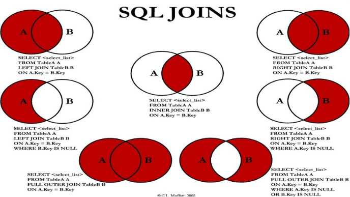

# 关联查询（联合查询,多表联查）

## 关联查询的七种结果



（1）A∩B

（2）A

（3）A -  A∩B

（4）B

（5）B - A∩B

（6）A ∪ B

（7）A∪B- A∩B    或者   (A -  A∩B) ∪ （B - A∩B）


### 内连接：实现A∩B

```mysql
select 字段列表
from A表 inner join B表
on 关联条件
where 等其他子句;

或

select 字段列表
from A表 , B表
where 关联条件 and 等其他子句;
```

代码示例：

```mysql
#查询员工的姓名和他所在的部门的名称
#员工的姓名在t_employee
#部门的名称在t_department
SELECT ename "员工的姓名",dname "部门名称"
FROM t_employee INNER JOIN t_department
ON t_employee.did = t_department.did

SELECT ename "员工的姓名",dname "部门名称"
FROM t_employee , t_department
WHERE t_employee.did = t_department.did


#查询薪资高于20000的男员工的姓名和他所在的部门的名称
SELECT ename "员工的姓名",dname "部门名称"
FROM t_employee INNER JOIN t_department
ON t_employee.did = t_department.did
WHERE salary>20000 AND gender = '男'
```


### 左外连接

```mysql
#实现查询结果是A
select 字段列表
from A表 left join B表
on 关联条件
where 等其他子句;

#实现A -  A∩B
select 字段列表
from A表 left join B表
on 关联条件
where 从表关联字段 is null and 等其他子句;
```

代码示例：

```mysql
#查询所有员工的姓名和他所在的部门的名称
SELECT ename "员工的姓名",dname "部门名称"
FROM t_employee LEFT JOIN t_department
ON t_employee.did = t_department.did


#查询所有没有部门的员工
SELECT ename "员工的姓名",dname "部门名称"
FROM t_employee LEFT JOIN t_department
ON t_employee.did = t_department.did
WHERE t_employee.did IS NULL
```


### 右外连接

```mysql
#实现查询结果是B
select 字段列表
from A表 right join B表
on 关联条件
where 等其他子句;

#实现B -  A∩B
select 字段列表
from A表 right join B表
on 关联条件
where 从表关联字段 is null and 等其他子句;
```

代码示例：

```mysql
#查询所有部门，以及所有部门下的员工信息
SELECT * 
FROM t_employee RIGHT JOIN t_department
ON t_employee.did = t_department.did

#查询那些没有员工属于它的部门
SELECT * 
FROM t_employee RIGHT JOIN t_department
ON t_employee.did = t_department.did
WHERE t_employee.did IS NULL
```


### 用union代替全外连接

将两张表左外连接与右外连接用 `union` 关键字连接起来即可

```mysql
#实现查询结果是A∪B
#用左外的A，union 右外的B
select 字段列表
from A表 left join B表
on 关联条件
where 等其他子句

union 

select 字段列表
from A表 right join B表
on 关联条件
where 等其他子句;


#实现A∪B -  A∩B  或   (A -  A∩B) ∪ （B - A∩B）
#使用左外的 (A -  A∩B)  union 右外的（B - A∩B）
select 字段列表
from A表 left join B表
on 关联条件
where 从表关联字段 is null and 等其他子句

union

select 字段列表
from A表 right join B表
on 关联条件
where 从表关联字段 is null and 等其他子句
```

代码示例：

```mysql
#查询所有员工，所有部门，包括没有员工的部门，和没有部门的员工
SELECT *
FROM t_employee LEFT JOIN t_department
ON t_employee.did = t_department.did

UNION

SELECT *
FROM t_employee RIGHT JOIN t_department
ON t_employee.did = t_department.did


#查询那些没有部门的员工和所有没有员工的部门

#没有部门的员工
SELECT *
FROM t_employee LEFT JOIN t_department
ON t_employee.did = t_department.did
WHERE t_employee.did IS NULL

UNION 

#所有没有员工的部门
SELECT *
FROM t_employee RIGHT JOIN t_department
ON t_employee.did = t_department.did
WHERE t_employee.did IS NULL

```


## 特殊的关联查询：自连接

两个关联查询的表是同一张表，通过取别名的方式来虚拟成两张表

```mysql
select 字段列表
from 表名 别名1 inner/left/right join 表名 别名2
on 别名1.关联字段 = 别名2的关联字段
where 其他条件
```

代码示例：

```mysql
#查询员工的编号，姓名，薪资和他领导的编号，姓名，薪资
#这些数据全部在员工表中
#把t_employee表，即当做员工表，又当做领导表
#领导表是虚拟的概念，我们可以通过取别名的方式虚拟
SELECT emp.eid "员工的编号",emp.ename "员工的姓名" ,emp.salary "员工的薪资",
	mgr.eid "领导的编号" ,mgr.ename "领导的姓名",mgr.salary "领导的薪资"
FROM t_employee emp INNER JOIN t_employee mgr
#t_employee emp：如果用emp.，表示的是员工表的
#t_employee mgr：如果用mgr.，表示的是领导表的
ON emp.mid = mgr.eid

#表的别名不要加""，给列取别名，可以用""，列的别名不使用""也可以，但是要避免包含空格等特殊符号。

```

