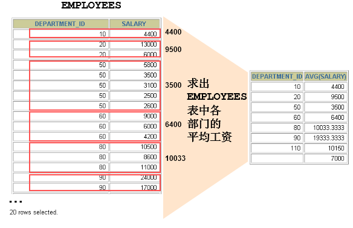

# select的子句

## 7大子句书写顺序

（1）from：从哪些表中筛选

（2）on：关联多表查询时，去除笛卡尔积

（3）where：从原始表中筛选的条件

（4）group by：分组依据

（5）having：在统计结果表中再次筛选

（6）order by：排序

（7）limit：分页

必须按照（1）-（7）的顺序【编写】子句。

```mysql
#查询每个部门的男生的人数，并且显示人数超过5人的，按照人数降序排列，
#每页只能显示10条，我要第2页
SELECT did,COUNT(*) "人数"
FROM t_employee
WHERE gender = '男'
GROUP BY did
HAVING COUNT(*)>5
ORDER BY 人数 DESC
LIMIT 10,10
```


## group by与分组函数



**可以使用GROUP BY子句将表中的数据分成若干组**

```sql
SELECT column, group_function(column)
FROM table
[WHERE	condition]
[GROUP BY	group_by_expression];
```

> **明确：WHERE一定放在FROM后面GROUP BY 前面**

**在SELECT列表中所有未包含在分组函数中的列都应该包含在 GROUP BY子句中**

```sql
SELECT   department_id, AVG(salary)
FROM     employees
GROUP BY department_id ;
```

>   不满足该条件，则会使查询的字段无意义

包含在 GROUP BY 子句中的列不必包含在SELECT 列表中

```sql
SELECT   AVG(salary)
FROM     employees
GROUP BY department_id ;
```

**使用多个列分组**


```sql
SELECT   department_id dept_id, job_id, SUM(salary)
FROM     employees
GROUP BY department_id, job_id ;
```


## having与分组函数


- 统计各个部门的平均工资(只显示平均工资2000以上的)

```mysql
select avg(salary) from emp   -- 1 -- 不是各个部门的，是所有部门的  
select deptno from emp  -- 14    
 --   14?  1?  字段不能和分组函数共存，除非该字段是分组group by字段  
select deptno,avg(salary) from emp    
select deptno, avg(salary) --   
from  emp  
group by  deptno;
```

- 获取最小工资小于2000的职位

```mysql
  -- min(sal)  job   min(sal)<2000    
  -- 获取各个职位的最小工资    
  select job,min(sal)    
  from emp    
  group by job    
  order by min(sal)    
  
  -- 获取各个职位的最小工资,筛选出小于2000的    
  select job,min(sal)    
  from emp    
  group by job    
  having min(sal)<2000    
  order by min(sal)    
  
-- 统计[人数小于4的]部门的平均工资。    
   select deptno,count(1),avg(sal)    
   from emp    
   group by deptno    
   having count(1)<4    
-- 统计各部门的最高工资，排除最高工资小于3000的部门。    
   select deptno,max(sal)    
   from  emp    
   group by deptno    
   having max(sal) >=3000 
```


#### having与where的区别？

（1）where是从原始表中筛选的条件，而having是分组（统计）结果中再次筛选

（2）where后面不能加“分组/聚合函数”，而having后面可以跟分组函数

```mysql
#统计部门平均工资高于8000的部门和平均工资
SELECT   department_id, AVG(salary)
FROM     employees
WHERE    AVG(salary) > 8000 #错误
GROUP BY department_id;
```


```mysql
#统计每一个部门，薪资高于10000元的女员工的数量，显示人数超过1人
SELECT did,COUNT(*)
FROM t_employee
WHERE gender ='女' AND salary>10000
GROUP BY did
HAVING COUNT(*) > 1;
```


## order by

order by：

降序：desc

升序：要么默认，要么加asc


## limit

limit：

limit offset,pageSize 

m = （第几页 - 1）*每页的数量

n = 每页的数量

limit (pageNo-1)*pageSize, pageSize

代码示例：

```mysql
/*
每页显示2条 展示第三页
*/
select * from emp limit 4,2;
```

- 求员工的姓名，薪水，部门编号，部门名称，工作编号，工作名称，按照薪水排序，每页显示3条显示第4页

```sql
SELECT
	emp.`ename`,
	emp.`salary`,
	emp.`department_id`,
	dept.`dname`,
	dept.`did`,
	job.`job_name` 
FROM
	t_employee emp
	JOIN t_department dept ON emp.`department_id` = dept.`did`
	JOIN t_job job ON emp.`job_id` = job.`job_id` 
ORDER BY
	emp.`salary` 
	LIMIT 9,
	3;
```

