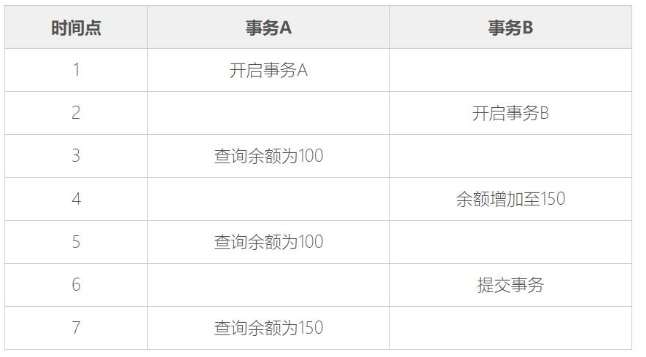

# 事务

## 事务概述

**1、事务处理**（事务操作）：**保证所有事务都作为一个工作单元来执行，即使出现了故障，都不能改变这种执行方式。当在一个事务中执行多个操作时，要么所有的事务都被提交(commit)，那么这些修改就永久地保存下来；要么数据库管理系统将放弃所作的所有修改，整个事务回滚(rollback)到最初状态。**

​     例如转账操作：A账户要转账给B账户，那么A账户上减少的钱数和B账户上增加的钱数必须一致，也就是说A账户的转出操作和B账户的转入操作要么全部执行，要么全不执行；如果其中一个操作出现异常而没有执行的话，就会导致账户A和账户B的转入转出金额不一致的情况，为而事实上这种情况是不允许发生的，所以为了防止这种情况的发生，需要使用事务处理。

2、事务的ACID属性：

（1）**原子性（Atomicity）**
	原子性是指事务是一个不可分割的工作单位，事务中的操作要么都发生，要么都不发生。 

（2）**一致性（Consistency）**
	事务必须使数据库从一个一致性状态变换到另外一个一致性状态。

（3）**隔离性（Isolation）**
	事务的隔离性是指一个事务的执行不能被其他事务干扰，即一个事务内部的操作及使用的数据对并发的其他事务是隔离的，并发执行的各个事务之间不能互相干扰。

（4）**持久性（Durability）**
	持久性是指一个事务一旦被提交，它对数据库中数据的改变就是永久性的，接下来的其他操作和数据库故障不应该对其有任何影响。


## 10.2 开启和结束事务

1、mysql默认是自动提交，执行一句就提交一句。

​	即默认情况下，每一条sql都是一个独立的sql。

2、我想要手动提交事务：

（1）set autocommit=false; 

​	接下来所有语句都必须手动提交，否则就不会永久生效

（2）start transaction; 

​	.....

​	commit; 或 rollback; 此次事务结束 想要事务保证数据安全需要再次进行开启

3、注意：

​	事务的回滚只对DML语句有效，对于DDL语句无效。


## 事务隔离级别

### 事务并发问题

对于同时运行的多个事务, 当这些事务访问数据库中相同的数据时, 如果没有采取必要的隔离机制, 就会导致各种并发问题:

* **脏读**: 对于两个事务 T1, T2, T1 读取了已经被 T2 更新但还**没有被提交**的字段。 之后, 若 T2 回滚, T1读取的内容就是临时且无效的。

    >   读取到其他事务未提交的数据。


* **不可重复读**: 对于两个事务T1, T2, T1 读取了一个字段, 然后 T2 **更新/修改**了该字段。 之后, T1再次读取同一个字段, 值就不同了。

    >   在同一个事务内多次读取，发现单个字段有两种数据。
    >
    >   至于为什么叫做不可重复读，因为同一个事物读取到的数据都变了，当然重复读就错了，因此不可以重复读取，简称不可重复读



* **幻读**: 对于两个事务T1, T2, T1 从一个表中读取了一个字段, 然后 T2 在该表中**插入/删除**了一些新的行。 之后, 如果 T1 再次读取同一个表, 就会多/少几行。

    >   同一个事务内，多次读取，发现了数据新增或减少。


#### 不可重复度和幻读区别：

不可重复读的重点是修改，幻读的重点在于新增或者删除。 

***解决不可重复读的问题只需锁住满足条件的行，解决幻读需要锁表*** 

-   例1（同样的条件, 你读取过的数据, 再次读取出来发现值不一样了 ）：事务1中的A先生读取自己的工资为 1000的操作还没完成，事务2中的B先生就修改了A的工资为2000，导致A再读自己的工资时工资变为 2000；这就是不可重复读。 

-   例2（同样的条件, 第1次和第2次读出来的记录数不一样 ）：假某工资单表中工资大于3000的有4人，事务1读取了所有工资大于3000的人，共查到4条记录，这时事务2 又插入了一条工资大于3000的记录，事务1再次读取时查到的记录就变为了5条，这样就导致了幻读 

### 事务隔离级别

**数据库事务的隔离性**：数据库系统必须具有隔离并发运行各个事务的能力, 使它们不会相互影响, 避免各种并发问题。**一个事务与其他事务隔离的程度称为隔离级别。**数据库规定了多种事务隔离级别, 不同隔离级别对应不同的干扰程度, 隔离级别越高, 数据一致性就越好, 但并发性越弱。

**数据库提供的 4 种事务隔离级别：**

| 隔离级别         | 描述                                                         |
| ---------------- | ------------------------------------------------------------ |
| read-uncommitted | 允许A事务读取其他事务未提交和已提交的数据。会出现***脏读、不可重复读、幻读***问题 |
| read-committed   | 只允许A事务读取其他事务已提交的数据。可以避免脏读，但仍然会出现***不可重复读、幻读***问题 |
| repeatable-read  | 确保事务可以多次从一个字段中读取相同的值。在这个事务持续期间，禁止其他事务对这个字段进行更新。可以避免脏读和不可重复读。但是幻读问题仍然存在。 |
| serializable     | 确保事务可以从一个表中读取相同的行，相同的记录。在这个事务持续期间，禁止其他事务对该表执行插入、更新、删除操作。所有并发问题都可以避免，但性能十分低下。 |

* Oracle 支持的 2 种事务隔离级别：**READ-COMMITED**, SERIALIZABLE。 Oracle 默认的事务隔离级别为: READ COMMITED 。

* Mysql 支持 4 种事务隔离级别。 Mysql 默认的事务隔离级别为: **REPEATABLE-READ**。在mysql中REPEATABLE READ的隔离级别也可以避免幻读了。

    >   若在其他事务修改该字段的过程中，本事务对该字段进行修改，则会进入阻塞状态

### 设置和查看隔离级别

每启动一个 mysql 程序, 就会获得一个单独的数据库连接。每个数据库连接都有一个变量 @@tx_isolation, 表示当前连接的事务隔离级别。mysql服务也有一个全局变量@@global.tx_isolation，表示所有连接的默认事务隔离级别。

* 查看当前mysql连接的隔离级别: 

```
select @@tx_isolation;
```

* 查看全局的隔离级别：

```
select @@global.tx_isolation;
```

* 设置当前 mysql连接的隔离级别:  

```sql
set tx_isolation ='repeatable-read';
```

* 设置数据库系统的全局的隔离级别:

```sql
set global tx_isolation ='read-committed';
```

> 注意：这里的隔离级别中间是减号，不是下划线。