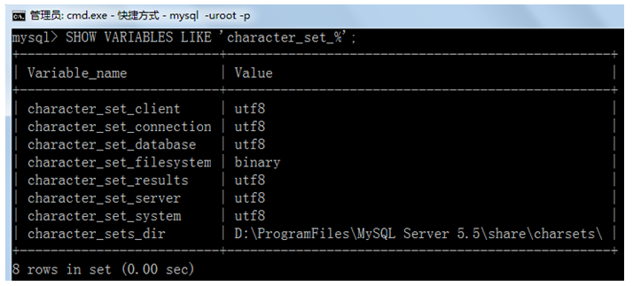
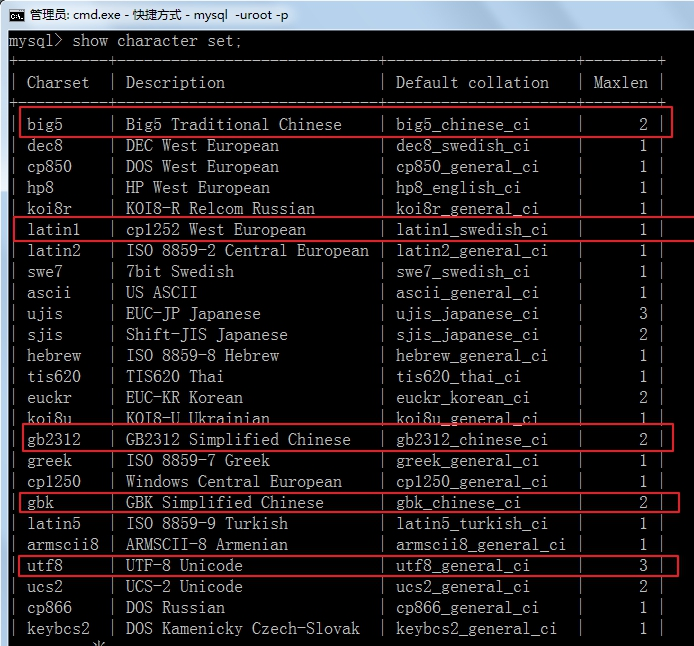

MySQL配置与启动时会遇到的一些比较常见的问题

## 1、编码问题

### 命令行操作sql乱码问题

```mysql
mysql> INSERT INTO t_stu VALUES(1,'张三','男');
ERROR 1366 (HY000): Incorrect string value: '\xD5\xC5\xC8\xFD' for column 'sname' at row 1
```

### 修改my.ini配置文件

```ini
在路径：C:\ProgramData\MySQL\MySQL Server 5.7\my.ini 找到my.ini文件

修改内容1：
	找到[mysql]命令，大概在63行左右，在其下一行添加 
		default-character-set=utf8
修改内容2:
	找到[mysqld]命令，大概在76行左右，在其下一行添加
		character-set-server=utf8
		collation-server=utf8_general_ci

修改完毕后，重启MySQL57服务
```

查看编码命令

```sql
show variables like 'character_%';
show variables like 'collation_%';
```


* 如果是以上配置就说明对了

### 命令行操作sql仍然乱码问题

```mysql
mysql> INSERT INTO t_stu VALUES(1,'张三','男');
ERROR 1366 (HY000): Incorrect string value: '\xD5\xC5\xC8\xFD' for column 'sname' at row 1
```

原因：按照刚才的配置，服务器端认为你的客户端的字符集是utf-8，而实际上你的客户端的字符集是GBK。


查看所有字符集：**SHOW VARIABLES LIKE 'character_set_%';**



解决方案，设置当前连接的客户端字符集 **“SET NAMES GBK;”**

set names gbk;是为了告诉服务器,客户端用的GBK编码,防止乱码。


有的时候，这样还不能解决，例如，某些win10操作系统环境下，那么修改命令行的属性-》选项-》勾选使用旧版控制台，然后重启电脑


## 2、忘记root用户密码问题

1:通过任务管理器或者服务管理,关掉mysqld(服务进程)

2:通过命令行+特殊参数开启mysqld

mysql5.5

```cmd
mysqld --skip-grant-tables
```

mysql5.7版

```cmd
mysqld --defaults-file="D:\ProgramFiles\mysql\MySQLServer5.7Data\my.ini" --skip-grant-tables
```

> 此处路径以你自己的世界路径为准

3:此时,mysqld服务进程已经打开,并且,不需要权限检查.

4:mysql -uroot  无密码登陆服务器.另启动一个客户端进行

5: 修改权限表

 （1） use mysql;

（2）

mysql5.5版

```
update user set Password = password('123456') where User = 'root';
```

mysql5.7版

```
update user set authentication_string=password('新密码') where user='root' and Host='localhost'; 
```

​           

  （3）flush privileges;

6:通过任务管理器,关掉mysqld服务进程.

7:再次通过服务管理,打mysql服务。

8:即可用修改后的新密码登陆.


## 3、查看字符集和校对规则

关于SQL的关键字和函数名等不区分大小写，但是对于数据值是否区分大小写，和字符集与校对规则有关。

_ci（大小写不敏感），_cs（大小写敏感），_bin（二元，即比较是基于字符编码的值而与language无关）

（1）查看所有字符集和校对规则

 

（2）查看GBK和UTF-8字符集的校对规则

show collation like 'gbk%';

 

show collation like 'utf8%';

 

utf8_unicode_ci和utf8_general_ci对中、英文来说没有实质的差别。
utf8_general_ci 校对速度快，但准确度稍差。
utf8_unicode_ci 准确度高，但校对速度稍慢。

如果你的应用有德语、法语或者俄语，请一定使用utf8_unicode_ci。一般用utf8_general_ci就够了。

（3）查看服务器的字符集和校对规则

 

（4）查看和修改某个数据库的字符集和校对规则

 

或

 

修改数据库的字符集和校对规则：

ALTER DATABASE 数据库名称 DEFAULT CHARACTER SET 字符集名称 【COLLATE 校对规则名称】;

例如：

ALTER DATABASE ceshi_db DEFAULT CHARACTER SET utf8 collate utf8_general_ci;

 

注意：修改了数据库的默认字符集和校对规则后，原来已经创建的表格的字符集和校对规则并不会改变，如果需要，那么需要单独修改。

（5）查看某个表格的字符集和校对规则

查看字符集：show create table users;

 

如果要查看校对规则：show table status from bookstore like '%users%' ;

 

修改某个表格的字符集和校对规则：

修改表的默认字符集：

ALTER TABLE 表名称 DEFAULT CHARACTER SET 字符集名称 【COLLATE 校对规则名称】;

把表默认的字符集和所有字符列（CHAR,VARCHAR,TEXT）改为新的字符集：

ALTER TABLE 表名称 CONVERT TO CHARACTER SET 字符集名称 【COLLATE 校对规则名称】;

 

例如：ALTER TABLE ceshi_table DEFAULT CHARACTER SET gbk collate gbk_chinese_ci;

