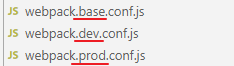

## NPM 包管理器

NPM全称Node Package Manager，是Node.js包管理工具，是全球最大的模块生态系统，里面所有的模块都是开源免费的；也是Node.js的包管理工具，相当于后端的Maven 。

新版的nodejs以及集成了npm，能解决NodeJS代码部署上的很多问题，常见的使用场景有以下几种：

-   允许用户从NPM服务器下载别人编写的第三方包到本地使用。

-   允许用户从NPM服务器下载并安装别人编写的命令行程序到本地使用。
-   允许用户将自己编写的包或命令行程序上传到NPM服务器供别人使用。

在命令提示符输入 npm -v 可查看当前npm版本

```bash
npm -v
```

### 使用npm管理项目

#### 1、项目初始化

```bash
npm init [-y]
```

`-y`：直接按照默认方式生成。如果没有 `-y` 按照提示输入相关信息，如果是用默认值则直接回车即可。

执行结果：

```bash
PS > npm init -y
Wrote to E:\..\package.json (在当前目录下生成一个 package.json 文件，内容如下):
{
  "name": "6-npm",
  "version": "1.0.0",
  "description": "",
  "main": "index.js",
  "scripts": {
    "test": "echo \"Error: no test specified\" && exit 1"
  },
  "keywords": [],
  "author": "",
  "license": "ISC"
}
```

节点说明：

-   name: 项目名称
-   version: 项目版本号
-   description: 项目描述
-   author:项目的作者姓名
-   contributors：项目的其他贡献者姓名。
-   keywords: {Array}关键词，便于用户搜索到我们的项目
-   repository:项目代码存放的地方的类型，可以是 git 或 svn，git 可在 Github 上。

最后会生成package.json文件，这个是包的配置文件，相当于maven的pom.xml。

>   额外参数说明：在下载包依赖后，依赖的包会被添加到dependencies节点下，默认初始化的dependencies节点不存在。

#### 2、修改npm镜像

NPM官方的管理的包都是从 http://npmjs.com下载的，但是这个网站在国内速度很慢。

这里推荐使用淘宝 NPM 镜像 http://npm.taobao.org/ ，淘宝 NPM 镜像是一个完整 npmjs.com 镜像，同步频率目前为 10分钟一次，以保证尽量与官方服务同步。

设置淘宝 NPM 镜像地址：

```bash
npm config set registry https://registry.npm.taobao.org 
```

查看 npm 配置信息

```bash
npm config list
```

#### 3、包安装命令 npm install

下载依赖

```bash
npm install <依赖名称>

# 下载指定依赖，如jquery
npm install jquery

# 指定版本：指定到某个版本，则会下载该版本下最新子版本。
npm install jquery@1.7
```

##### 下载开发依赖

devDependencies节点：开发时的依赖包，项目打包到生产环境的时候不包含的依赖，语法如下：

```bash
# 命令：
npm install --save-dev <依赖名称>
# 简写：
npm install i -D <依赖名称>
```

常用的开发时依赖 eslint：ESLint 是一个用来识别 ECMAScript/JavaScript 并且按照规则给出报告的代码检测工具。

```bash
npm install --save-dev eslint
# 或
npm i -D eslint
```

##### 下载全局依赖

全局安装的依赖，开发中一般不使用全局依赖。Node.js全局安装的npm包和工具的位置：`C:\\<User>\AppData\Roaming\npm\node_modules`，语法如下：

```bash
# 命令：
npm install --global <依赖名称>
# 简写：
npm i -g <依赖名称>
```

常用的打包工具 Webpack 适用于全局依赖：Webpack 是一个前端资源加载/打包工具。它将根据模块的依赖关系进行静态分析，然后将这些模块按照指定的规则生成对应的静态资源。

```bash
npm install --global webpack
# 或
npm i -g webpack
```

##### 根据依赖下载安装包

npm管理的项目在备份和传输的时候一般不携带node_modules文件夹。install 命令会自动在项目目录下添加 package-lock.json文件，这个文件帮助锁定安装包的版本。

根据package.json中的配置下载依赖，初始化项目：

```bash
npm install
```

#### 4、npm 更新与卸载依赖

```bash
#更新包（更新到最新版本）
npm update 包名
#全局更新
npm update -g 包名

#卸载包
npm uninstall 包名
#全局卸载
npm uninstall -g 包名
```


## 模块化

模块化是指将相同的代码抽取出来，放在同一个文件中。在其他文件需要使用到这段代码时导入即可，类似于设计模式中的单一职责原则。js模块化是高内聚、低耦合的尝试。

模块化规范：

-   CommonJS模块化规范（基于ES6语法之前）
-   ES6模块化规范（使用ES6语法）

一个模块就是一个独立的文件。该文件内部的所有变量，外部无法获取。如果外部想要够读取模块内部的某个变量，就必须使用`export`关键字输出该变量。

### CommonJS模块化规范

1、导出模块，使用 `exports.XXX` 导出代码

```js
exports.info = function (str) {
    document.write(str)
}
```

2、导入模块并使用，使用 `require("<路径>")` 导入代码

```js
# 导入模块
const common = require('./common')

# 使用模块
common.info('Hello world!')
```

### ES6模块化规范

ES6 module功能主要由两个命令构成：`export`和`import`。

-   `export`命令用于规定模块的对外接口

-   `import`命令用于输入其他模块提供的功能。

#### 1、导出模块

单独的 `mjs` 文件中到处模块，相当于暴露某段代码，使用 export default （json串）标识暴露的代码。

```js
export default {
    key1: value1,
    getList() {
        console.log('获取讲师列表')
    },
    save() {
        console.log('保存讲师')
    }
}
```

#### 2、导入模块

在另外的 `mjs` 文件中导入其他js导出的代码：

```js
# 相当于将其他js导出的代码赋予 teacher对象
import teacher from "./teacherApi.mjs"

#通过teacher 对象调用导入的方法或变量
teacher.getList()
teacher.save()
```

### 使用Babel转码 

ES6的某些高级语法在很多浏览器环境甚至是Node.js环境中无法执行。`Babel` 是一个广泛使用的转码器，可以将ES6代码转为ES5代码，从而在现有环境执行执行。

#### 1、安装 babel-cli工具

```bash
npm install -g babel-cli

#查看是否安装成功
babel --version
```

#### 2、配置 `.babelrc`

Babel的配置文件是 .babelrc，存放在项目的根目录下，该文件用来设置转码规则和插件，presets字段设定转码规则

在项目根目录下创建.babelrc文件

```json
{
    "presets": ["es2015"],
    "plugins": []
}
```

#### 3、安装转码器

在根目录下执行安装命令

```bash
npm install -D babel-preset-es2015
```

#### 4、执行转码

整个目录转码

```bash
# --out-dir 或 -d 参数指定输出目录
babel src -d dist
```


## Webpack

Webpack 是一个前端资源加载/打包工具。它将根据模块的依赖关系进行静态分析，然后将这些模块按照指定的规则生成对应的静态资源。

### Webpack安装

#### 1、全局安装

使用npm命令安装

```bash
npm install -g webpack webpack-cli
# 或
npm install -g webpack
npm install -g webpack-cli
```

查看版本号：

```bash
webpack -v
```

#### 2、创建webpack 配置文件

webpack_pro 目录下创建配置文件 webpack.config.js

```js
const path = require("path") //Node.js内置模块
module.exports = {
    entry: './src/main.js', //配置入口文件
    output: {
        path: path.resolve(__dirname, './dist'), //输出路径，__dirname：当前文件所在路径
        filename: 'bundle.js' //输出文件
    }
}
```

配置的意思是：

-   读取当前项目目录下src文件夹中的main.js（入口文件）内容，分析资源依赖，把相关的js文件打包
-   打包后的文件放入当前目录的dist文件夹下
-   打包后的js文件名为bundle.js

#### 3、执行打包命令

方式一：直接使用命令行执行 webpack 命令

```bash
webpack --mode=[开发环境]
```

配置文件环境的定义类似于springboot的环境，语法格式为 `webpack.<开发环境>.conf.js` 

方式二：将命令写入 `package.json` 文件的scripts块，并使用 `npm run [开发环境]` 来执行脚本

```json
"scripts": {
    //...,
    "dev": "webpack --mode=development",
    "prod": "webpack --mode=production"
}
```

命令行输入：

```bash
npm run dev #开发打包
或
npm run prod #生产打包
```