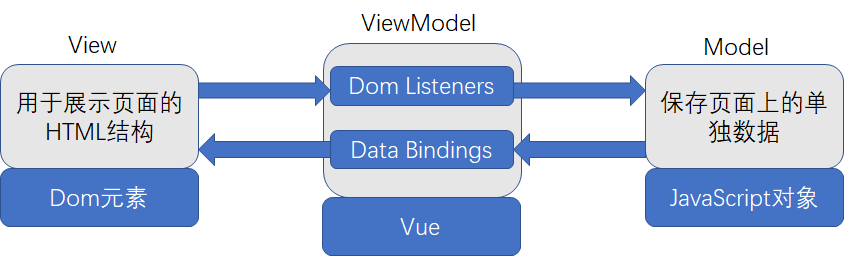
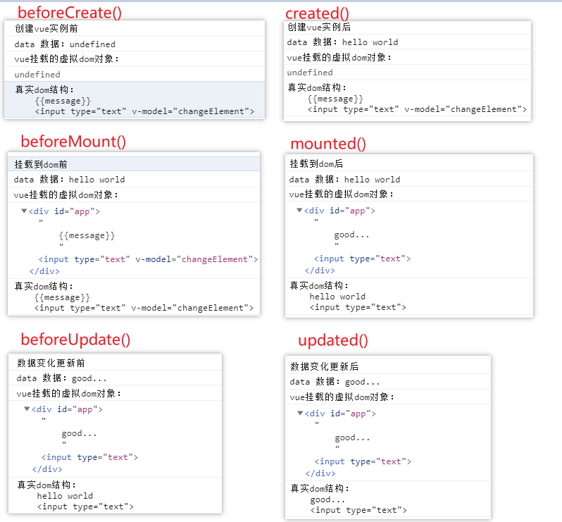
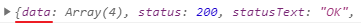

# Vue

Vue 是一套用于构建用户界面的**渐进式框架**。与其它大型框架不同的是，Vue 被设计为可以自底向上逐层应用。Vue 的核心库只关注视图层，不仅易于上手，还便于与第三方库或既有项目整合。


Vue官网：https://cn.vuejs.org/

Vue引入：

```html
<!-- 开发环境版本，包含了有帮助的命令行警告 -->
<script src="https://cdn.jsdelivr.net/npm/vue/dist/vue.js"></script>

<!-- 生产环境版本，优化了尺寸和速度 -->
<script src="https://cdn.jsdelivr.net/npm/vue"></script>
```


## MVVM 模式简介

 **MVVM是Model-View-ViewModel的简写**。它本质上就是MVC 的改进版。MVVM 就是将其中的View 的状态和行为抽象化，让我们将视图 UI 和业务逻辑分开。

MVVM模式和MVC模式一样，主要目的是分离视图（View）和模型（Model）

MVVM是前端视图层的分层开发思想，主要是把每个页面，分成了M , V 和 VM 其中，VM是 MVVM 思想核心；



Vue.js 是一个提供了 MVVM 风格的双向数据绑定的 Javascript 库，专注于View 层。它的核心是 MVVM 中的 VM，也就是 ViewModel。 ViewModel负责连接 View 和 Model，保证视图和数据的一致性，这种轻量级的架构让前端开发更加高效、便捷

>   MVVM模式是视图和模型的双向数据绑定，通过ViewModel实现，当View发生变化，Model变化；当Model变化，View也相应的变化


## Quick Start

```html
<body>
    <div id="app">
        Hello Vue <br>
        姓名：<input type="text" v-model="name">
        <!-- {{  }} 为插值表达式，表示取出该Vue实例的data中的数据 -->
        {{name}}<br>
        密码为：<span v-text="password"></span><br>
        <!-- v-on:click
				v-on 指令表示绑定Vue的函数
				click 表示触发单击事件时调用
		-->
        <input type="button" v-bind:value="btn" v-on:click="submitInput('参数')">
    </div>
</body>

<script>
    // Vue 构造器传入一个Json对象，用于构造Vue实例
    var app = new Vue({
        // el元素定义Vue实例的作用范围，CSS选择器语法
        el: "#app",
        // 定义Vue实例的数据，再控制台可以直接由 app.XXX 获取
        data: {
            name: "leonardo",
            password: "123456",
            btn: "点我提交"
        },
        // 定义Vue实例的可调用方法，可以通过 app.XXX() 调用
        methods: {
            submitInput: function (e) {
                alert(e + "已提交！")
            }
        }
    })
</script>
```

此处用到了插值表达式，指令，定义Vue实例结构

-   插值表达式：`{{  }}` ，用于输出Vue实例的数据（在data中规定）
-   系统指令：`v-<XXX>` 用于为当前元素绑定上各种事件
-   定义Vue实例：使用Json对象构造一个Vue实例，格式固定，不可随意更改。


## Vue 实例的构建

Vue构造的格式如下：

```js
var app = new Vue({
    el: "#app",
    data: {
        k1:"v1",
        k2:true,
        k3:123
    },
    methods: {
        method1: function(){},
        method2(){}
    }
})
```
-   el：表示当前选中的作用范围，使用CSS选择器
-   data：表示当前Vue对象实例加入的数据，可以为json字符串，数组，键值对等。
-   method：加入当前Vue对象的方法，可在Vue作用范围内被调用。


## Vue 属性

### el 属性

### data 属性

### methods 属性

### router 属性

### computed 计算属性

计算属性可以将值动态计算之后绑定输出到指定位置。使用 `computed` 属性来实现属性的计算。格式如下：

```js
new Vue({
    // 标识计算方法的集合
    computed: {
        <方法名>() {
            return <计算结果>
        }
    }
})
```

代码示例：对p1进行计算，将计算结果缓存到key方法的返回值中，最后在页面渲染输出

```html
<body>
    ...
    <div id="app">
        <!-- 调用方法，则直接输出计算的结果 -->
		{{key()}}
    </div>
    ...
</body>
<script>
    new Vue({
        data: {
			p1: 20;
        },
        computed: {
            // 对p1属性进行计算，将结果缓存到key()方法中。
            key() {
                return p1*2
            }
        }
    })
</script>
```

>   **计算属性基于缓存：**在相关依赖发生改变时它们才会重新求值。因此**方法将总会再次执行**

### watch 属性

watch属性用于监听网页中的元素变化，一般与 `v-model` 配合使用：当v-model绑定的属性值改变后，就会回调watch属性中定义的方法。


## Vue 指令（v-<XXX>）

Vue 的指令用于给当前Dom标签添加各种关联，如给当前Dom元素绑定事件，绑定Vue的某个值等。

常用的Vue指令如下：

-   `v-text`：用于向标签体内输出文本内容
-   `v-html`：用于向标签体内渲染html内容
-   `v-show`：用于决定是否展示该标签（由display:none控制）
-   `v-if`：用于决定是否加载该标签
-   `v-else`：用于决定是否加载该标签（前一兄弟元素必须有 `v-if` 或 `v-else-if`）
-   `v-else-if`：用于决定是否加载该标签（前一兄弟元素必须有 `v-if` 或 `v-else-if`）
-   `v-for`：用于循环遍历内容
-   `v-on`：用于绑定事件监听器。
-   `v-bind`：动态地绑定一个或多个Vue中的属性，将Vue的属性值的值赋予标签中的属性
-   `v-model`：双向绑定。

### 输出内容：v-text 与 v-html

`v-text` 与 `v-html` 都可以输出内容到浏览器，区别在于：

-   `v-text`：只输出文本
-   `v-html`：输出经过html渲染后的内容

```xml
<div id="app" class="aa">
    <span>{{message}}</span>
    <br>
    <span v-text="message"></span>
    <br>
    <span v-html="message"></span>
</div>
<!--引入vue.js-->
<script src="https://cdn.jsdelivr.net/npm/vue/dist/vue.js"></script>
<script>
    const app = new Vue({
        el:"#app",
        data:{
            message:"<a href=''>我是内容哦~</a>"
        }
    })
</script>
```

>   注意：`v-text` 与 `v-html` 会覆盖标签体内的内容

### 标签展示与隐藏：v-if 与 v-show

`v-if` 与 `v-show` 都可以展示或隐藏标签，区别在于：

-   `v-if`：控制是否加载此Dom标签
-   `v-show`：通过 display 样式来控制此标签的加载与否

```html
<div id="app">
    v-if <br>
    true: <span v-if="testFalse"> 我是v-if，我显示出来了吗？ </span><br>
    false: <span v-if="testTrue"> 我是v-if，我显示出来了吗？ </span><br>
    <hr>
    v-show <br>
    true: <span v-show="testFalse"> 我是v-show，我显示出来了吗？ </span><br>
    false: <span v-show="testTrue"> 我是v-show，我显示出来了吗？ </span><br>
</div>

</body>
<script>
    var app = new Vue({
        el: "#app",
        data: {
            testFalse:false,
            testTrue:true
        }
    })
</script>
```

>   关于两者的选择：
>
>   -   侧重于减少用户等待时间：v-if
>   -   侧重于加快用户单击响应：v-show

### 分支选择：v-if、v-else、v-if-else

可以做简单的分支判断，与Java中的分支判断一致，满足条件的加载，不满足的不加载。

```html
<body>
    <div id="app">
        <div v-if="type == 'A'"> A </div>
        <div v-else-if="type == 'B'"> B </div>
        <div v-else-if="type == 'C'"> C </div>
        <div v-else> Not A/B/C </div>
    </div>
</body>
<script>
    var app = new Vue({
        el: "#app",
        data: {
            type: "A"
        }
    })
</script>
```

### 循环遍历：v-for

可以遍历普通数组、对象数组、对象、迭代数字。语法表达式为：`<item> in <items>` 格式，其中 `items` 是源数据数组，而 `item` 则是被迭代的数组元素的**别名**。

在被遍历的标签体中，可以使用插值表达式 `{{ }}` 输出，也可以用 `v-text` 或 `v-html` 输出。

**遍历普通数组**

```html
<ul>
    <li v-for="item in commonArr">{{item}}</li>
</ul>
```

**遍历对象数组**

```html
<ur>
    <!--  -->
    <!--  -->
    <li v-for="(p,index) in objArr" :key="p.player">编号【{{index}}】 玩家为：{{p.player}} -- 武器为：{{p.weapon}}</li>
</ur>
```

说明：

-   括号最后一个为索引（名称不一定用index，也可以用i等字符串）

-   将 `:key` 作为唯一索引，以便它能跟踪每个节点的身份，从而重用和重新排序现有元素。

**遍历对象**

```html
<ul>
    <li v-for="(v,k,i) in obj">【{{i}}】{{k}} --> {{v}}</li>
</ul>
```

说明：遍历对象中，第一个为 value，第二个为 key，第三个为 index

**迭代数字**

```html
<ul>
    <li v-for="i in 5">输出数字：{{i}}</li>
</ul>
```

### 绑定事件监听器：v-on

简写：`@`

`v-on`用于绑定事件监听器。事件类型由参数指定。表达式可以是一个方法的名字或一个内联语句，如果没有修饰符也可以省略。在监听原生 DOM 事件时，可以传递 `$event` 用来将当前发生的事件传给目标函数（当然也可以传递普通参数）

常用的事件有：

-   @click：鼠标单击事件
-   @dblclick：鼠标双击事件
-   @mouseover：鼠标覆盖事件
-   @mouseenter：鼠标进入事件
-   @blur：失去焦点事件
-   @focus：获取焦点事件
-   @change：发生改变事件
-   @submit：提交表单事件

**一般用法**

```html
<body>
<div id="app">
    <!-- 模拟回车，当按下回车是调用目标函数 -->
    回车校验内容（仅提示）：<input type="text" @keydown.enter="checkContent($event)">
</div>
</body>

<script>
    var app = new Vue({
        el: "#app",
        data: {},
        methods: {
            checkContent(event){
                // target | currentTarget 获取当前事件响应的 Dom元素
                console.log(event.target);
                // 获取值
                console.log(event.currentTarget.value);
            }
        }
    })
</script>
```

#### 事件修饰符

作用：用来和事件连用，用来决定事件触发条件或者是阻止事件的触发机制

使用方法：在事件类型后加上事件修饰符，`事件类型.修饰符`

-   `.stop` - 调用 `event.stopPropagation()`，阻止事件传播给下一个元素。
-   `.prevent` - 调用 `event.preventDefault()`，阻止默认行为。
-   `.self` - 只当事件是从侦听器绑定的元素本身触发时才触发回调，例如：可以使自身不受事件传播的影响。
-   `.once` - 只触发一次回调。
-   `.left` - (2.2.0) 只当点击鼠标左键时触发。
-   `.right` - (2.2.0) 只当点击鼠标右键时触发。
-   `.middle` - (2.2.0) 只当点击鼠标中键时触发。
-   `.capture` - 添加事件侦听器时使用 capture 模式。
-   `.{keyCode | keyAlias}` - 只当事件是从特定键触发时才触发回调。
-   `.native` - 监听组件根元素的原生事件。

#### 按键修饰符

作用：用来与键盘中按键事件绑定在一起（如 `@keydown`、`@keyup`），用来修饰特定的按键事件的修饰符。

按键码的别名：

-   `.enter`
-   `.tab`
-   `.delete (捕获“删除”和“退格”键)`
-   `.esc`
-   `.space`
-   `.up`
-   `.down`
-   `.left`
-   `.right`

### 动态绑定：v-bind

缩写：`:`

将标签内的属性值动态地绑定一个或多个Vue实例中的属性，将获取的Vue实例属性值赋予Vue实例。实际上可以是通过简单的表达式将值输出，因此可以使用Json或三元表达式判断。

```html
<!-- 绑定一个 attribute -->


<!-- json判断，如果isRed=true则输出red -->
<p :class="{red:isRed,big:isBig}">尚硅谷</p>

<!-- 使用三元表达式输出，这里ok为Vue实例的属性，值为true，输出的是red -->
<p :class="ok?'red':''">尚硅谷</p>
```

>   简单说就是：插值表达式是将值输出到页面，v-bind是将值输出到标签属性内。

### 双向数据绑定：v-model

`v-model` 可以实现双向数据绑定，原理是将**表单项的值**传递给Vue实例中的属性，再由 `v-text` 、`v-html` 或插值表达式实时输出到页面。

**代码示例**

```html
<body>
    <!-- vue控制的区域 -->
    <div id="app">

        <!-- 文本框：将value与 v-model 绑定 -->
        文本框：<input type="text" v-model="textInput"><br>
        文本框输入的内容为：{{textInput}}
        <hr>

        <!-- 选择框：将option中的value与select中的 v-model 绑定 -->
        选择框：选择你喜欢的课程 <br>
        <select v-model="selectInput">
            <option value="java">Java程序设计</option>
            <option value="c">C语言程序设计</option>
            <option value="python">Python从入门到精通</option>
        </select>
        <br>
        选择框输入的内容为：{{selectInput}}
        <hr>

        <!-- 单选：将value与 v-model 绑定 -->
        单选：选择你喜欢的枪
        <input type="radio" v-model="radioInput" value="AK-47"> AK-47 <br>
        <input type="radio" v-model="radioInput" value="M4A1"> M4A1 <br>
        <input type="radio" v-model="radioInput" value="Deagle"> Deagle <br>
        <input type="radio" v-model="radioInput" value="AWP"> AWP <br>
        单选框的内容为：{{radioInput}}
        <hr>

        <!-- 多选：将value与 v-model绑定，需要数组类型 -->
        复选框：选择你要带的装备
        <input type="checkbox" value="高爆手雷" v-model="checkboxInput">高爆手雷 <br>
        <input type="checkbox" value="燃烧弹" v-model="checkboxInput">燃烧弹 <br>
        <input type="checkbox" value="闪光弹" v-model="checkboxInput">闪光弹 <br>
        <input type="checkbox" value="烟雾弹" v-model="checkboxInput">烟雾弹 <br>
        复选框的内容：{{checkboxInput}}

    </div>

</body>
<script>
    var app = new Vue({
        el: "#app",
        data: {
            textInput: "[default]",
            selectInput: "java",
            radioInput: "AK-47",
            checkboxInput: [],
            areaInput: ""
        },
        methods: {}
    })
</script>
```

可以发现，其实双向数据绑定就是使用 `v-model` 将表单项的 `value` 值传递给Vue实例，然后及时渲染到页面。

>   v-model可以理解为：name


## Vue 生命周期

Vue的生命周期主要有以下五个部分

1.  init：创建Vue对象结束，初始化了data中的值，没有获取到虚拟Dom
2.  获取虚拟Dom：编译el作为模板
3.  mount：data中的数据挂载虚拟Dom，并将虚拟Dom的数据输出到真实Dom中
4.  update：将虚拟Dom中变化的数据输出到与真实Dom中，这里的更新指的是真实Dom的更新（date中的数据更新时立刻将数据渲染到虚拟Dom中，这个过程是同步的）
5.  destory：销毁Vue实例

对于生命周期的控制，可以控制init，mount，update与destory，每个阶段对应 `before*` 与 `*ed` 两个方法，分别拦截其之前与之后的方法。


八个生命周期的方法及作用如下：

-   beforeCreate()：Vue实例的data、methods及页面的Dom元素都未初始化，什么都做不了
-   created()：已完成Vue实例初始化data与methods，页面还没渲染出来。通常会发送ajax请求。
-   beforeMount()：模板在内存中编译完成，但未渲染到页面上，用户只能看到模板。
-   mounted()：完成页面渲染，用户可以看到了，一些第三方UI插件需要在此函数中进行初始化。
-   beforeUpdate()：Vue实例的数据已更新到最新的，但是页面的数据还是旧的
-   updated()：Vue实例的数据与页面的数据都是最新的
-   beforeDestroy()：即将开始销毁，此刻Vue实例的数据还是可用的。
-   destroyed()：完成销毁，此时Vue实例无法使用。

**生命周期演示**

```html
<body>
    <div id="app">
        {{message}}
    </div>
</body>
<script>
    var vue = new Vue({
        el: "#app",
        //	template:"<h1><font color='red'>你好硅谷</font></h1>", //在vue配置项中修改的
        data: {
            message: 'hello world'
        },
        beforeCreate: function() {
            showData('创建vue实例前', this);
        },
        created: function() {
            showData('创建vue实例后', this);
        },
        beforeMount: function() {
            showData('挂载到dom前', this);
        },
        mounted: function() {
            showData('挂载到dom后', this);
        },
        beforeUpdate: function() {
            showData('数据变化更新前', this);
        },
        updated: function() {
            showData('数据变化更新后', this);
        },
        beforeDestroy: function() {
            showData('vue实例销毁前', this);
        },
        destroyed: function() {
            showData('vue实例销毁后', this);
        }
    });

    function showData(process, obj) {
        console.log(process);
        console.log('data 数据：' + obj.message)
        console.log('vue挂载的虚拟dom对象：')
        console.log(obj.$el)
        console.log('真实dom结构：' + document.getElementById('app').innerHTML);
        console.log('------------------')
        console.log('------------------')
    }
    //vue.$mount("#app");
    vue.message = "good...";
</script>
```

结果：




## Vue 异步请求（Axios）

Axios 是一个基于 promise 的 HTTP 库，可以用在浏览器和 node.js 中，Vue中，使用Axios来发送异步请求，类似jQuery中的Ajax。

### Axios 引入

由于Axios是基于Vue的，因此在引入Axios的资源之前必须引入 Vue 的资源。

```html
<!-- Vue的依赖 -->
<script src="https://cdn.jsdelivr.net/npm/vue"></script>

<!-- axios的依赖 -->
<script src="https://unpkg.com/axios/dist/axios.min.js"></script>
```

### Axios请求概览

```js
axios.request(config)

axios.get(url[,config])

axios.delete(url[,config])

axios.head(url[,config])

axios.post(url[,data[,config]])

axios.put(url[,data[,config]])

axios.patch(url[,data[,config]])
```

#### 1、get请求

```js
//通过给定的ID来发送请求
axios.get('/user?ID=12345')
.then(function(response){
	console.log(response);
})
.catch(function(err){
	console.log(err);
})
.finally(function(){
	
});

//以上请求也可以通过这种方式来发送
axios.get('/user',{
	params:{
		ID:12345
	}
}).then(function(response){
	console.log(response);
})
.catch(function(err){
	console.log(err);
})
.finally(function(){

});
```

#### 2、post请求

```js
axios.post('/user',{
	name:'张三',
	age:'22'
}).then(function(res){
	console.log(res);
}).catch(function(err){
	console.log(err);
})
.finally(function(){

});
```

>   注意：要获取实际返回的json串存储在回应的 data属性中，因此需要通过 `resp.data` 来获取。

### 内置请求参数

在第二个参数中写入

-   baseURL：请求的站点，相当于 <base> 标签的 href属性
-   timeout：连接超时时间，单位ms
-   params：请求参数

#### 跨域请求

出于浏览器的同源策略限制：

-   所谓同源（即指在同一个域）就是两个地址具有相同的协议（protocol），主机（host）和端口号（port）

-   同源策略会阻止一个域的javascript脚本和另外一个域的内容进行交互。


同源策略（Sameoriginpolicy）是一种约定，它是浏览器最核心也最基本的安全功能。

例如：

```bash
http://www.atguigu.com/index.html 调用 http://www.atguigu.com/teacher/listall （非跨域）
http://www.atguigu.com/index.html 调用 http://www.guigu.com/server.php （主域名不同:atguigu/guigu，跨域）
http://abc.atguigu.com/index.html 调用 http://def.atguigu.com/server.php（子域名不同:abc/def，跨域）
http://www.atguigu.com:8080/index.html调用 http://www.atguigu.com:8081/server.php（端口不同:8080/8081，跨域）
http://www.atguigu.com/index.html 调用 https://www.atguigu.com/server.php（协议不同:http/https，跨域）
请注意：localhost和127.0.0.1虽然都指向本机，但也属于跨域。
```

### axios 参数

```json
{
    // `url` 是用于请求的服务器 URL
    url: '/user',

    // `method` 是创建请求时使用的方法
    method: 'get', // default

    // `baseURL` 将自动加在 `url` 前面，除非 `url` 是一个绝对 URL。
    // 它可以通过设置一个 `baseURL` 便于为 axios 实例的方法传递相对 URL
    baseURL: 'https://some-domain.com/api/',

    // `transformRequest` 允许在向服务器发送前，修改请求数据
    // 只能用在 'PUT', 'POST' 和 'PATCH' 这几个请求方法
    // 后面数组中的函数必须返回一个字符串，或 ArrayBuffer，或 Stream
    transformRequest: [function (data, headers) {
        // 对 data 进行任意转换处理
        return data;
    }],

    // `transformResponse` 在传递给 then/catch 前，允许修改响应数据
    transformResponse: [function (data) {
        // 对 data 进行任意转换处理
        return data;
    }],

    // `headers` 是即将被发送的自定义请求头
    headers: {'X-Requested-With': 'XMLHttpRequest'},

    // `params` 是即将与请求一起发送的 URL 参数
    // 必须是一个无格式对象(plain object)或 URLSearchParams 对象
    params: {
        ID: 12345
    },

    // `paramsSerializer` 是一个负责 `params` 序列化的函数
    // (e.g. https://www.npmjs.com/package/qs, http://api.jquery.com/jquery.param/)
    paramsSerializer: function(params) {
        return Qs.stringify(params, {arrayFormat: 'brackets'})
    },

    // `data` 是作为请求主体被发送的数据
    // 只适用于这些请求方法 'PUT', 'POST', 和 'PATCH'
    // 在没有设置 `transformRequest` 时，必须是以下类型之一：
    // - string, plain object, ArrayBuffer, ArrayBufferView, URLSearchParams
    // - 浏览器专属：FormData, File, Blob
    // - Node 专属： Stream
    data: {
        firstName: 'Fred'
    },

    // `timeout` 指定请求超时的毫秒数(0 表示无超时时间)
    // 如果请求话费了超过 `timeout` 的时间，请求将被中断
    timeout: 1000,

    // `withCredentials` 表示跨域请求时是否需要使用凭证
    withCredentials: false, // default

    // `adapter` 允许自定义处理请求，以使测试更轻松
    // 返回一个 promise 并应用一个有效的响应 (查阅 [response docs](#response-api)).
    adapter: function (config) {
        /* ... */
    },

    // `auth` 表示应该使用 HTTP 基础验证，并提供凭据
    // 这将设置一个 `Authorization` 头，覆写掉现有的任意使用 `headers` 设置的自定义 `Authorization`头
    auth: {
        username: 'janedoe',
        password: 's00pers3cret'
    },

    // `responseType` 表示服务器响应的数据类型，可以是 'arraybuffer', 'blob', 'document', 'json', 'text', 'stream'
    responseType: 'json', // default

    // `responseEncoding` indicates encoding to use for decoding responses
    // Note: Ignored for `responseType` of 'stream' or client-side requests
    responseEncoding: 'utf8', // default

    // `xsrfCookieName` 是用作 xsrf token 的值的cookie的名称
    xsrfCookieName: 'XSRF-TOKEN', // default

    // `xsrfHeaderName` is the name of the http header that carries the xsrf token value
    xsrfHeaderName: 'X-XSRF-TOKEN', // default

    // `onUploadProgress` 允许为上传处理进度事件
    onUploadProgress: function (progressEvent) {
        // Do whatever you want with the native progress event
    },

    // `onDownloadProgress` 允许为下载处理进度事件
    onDownloadProgress: function (progressEvent) {
        // 对原生进度事件的处理
    },

    // `maxContentLength` 定义允许的响应内容的最大尺寸
    maxContentLength: 2000,

    // `validateStatus` 定义对于给定的HTTP 响应状态码是 resolve 或 reject  promise 。如果 `validateStatus` 返回 `true` (或者设置为 `null` 或 `undefined`)，promise 将被 resolve; 否则，promise 将被 rejecte
    validateStatus: function (status) {
        return status >= 200 && status < 300; // default
    },

    // `maxRedirects` 定义在 node.js 中 follow 的最大重定向数目
    // 如果设置为0，将不会 follow 任何重定向
    maxRedirects: 5, // default

    // `socketPath` defines a UNIX Socket to be used in node.js.
    // e.g. '/var/run/docker.sock' to send requests to the docker daemon.
    // Only either `socketPath` or `proxy` can be specified.
    // If both are specified, `socketPath` is used.
    socketPath: null, // default

    // `httpAgent` 和 `httpsAgent` 分别在 node.js 中用于定义在执行 http 和 https 时使用的自定义代理。允许像这样配置选项：
    // `keepAlive` 默认没有启用
    httpAgent: new http.Agent({ keepAlive: true }),
    httpsAgent: new https.Agent({ keepAlive: true }),

    // 'proxy' 定义代理服务器的主机名称和端口
    // `auth` 表示 HTTP 基础验证应当用于连接代理，并提供凭据
    // 这将会设置一个 `Proxy-Authorization` 头，覆写掉已有的通过使用 `header` 设置的自定义 `Proxy-Authorization` 头。
    proxy: {
        host: '127.0.0.1',
        port: 9000,
        auth: {
            username: 'mikeymike',
            password: 'rapunz3l'
        }
    },

    // `cancelToken` 指定用于取消请求的 cancel token
    // （查看后面的 Cancellation 这节了解更多）
    cancelToken: new CancelToken(function (cancel) {
    })
}
```


## Vue 组件（Component）

组件简介：用来减少Vue实例对象中代码量，日后在使用Vue开发过程中，可以根据不能业务功能将页面中划分不同的多个组件，然后由多个组件去完成整个页面的布局。便于日后使用Vue进行开发时页面管理，方便开发人员维护。

### 组建的分类

组件可以分为全局组件与局部组件。

#### 全局组件

全局组件注册给Vue实例,日后可以在任意Vue实例的范围内使用该组件

1、开发全局组件

```js
Vue.component('login',{
    template:'<div><h1>用户登录</h1></div>'
});
```

使用 `Vue.component` 用来开发全局组件，参数说明：

1.  组件的名称
2.  组件的配置：`template:''`用来书写组件的html代码，且template有且仅有一个root元素

2、使用全局组件，在html页面中引入组件名作为标签即可

```html
<html>
    <login></login>  
</html>
```

#### 局部组件

通过将组件注册给对应Vue实例中的 `components` 属性来完成组件注册。

1、开发局部组件

```js
let login ={   //具体局部组件名称
    template:'<div><h2>用户登录</h2></div>'
};

const app = new Vue({
    el: "#app",
    data: {},
    methods: {},
    components:{  //用来注册局部组件
        login:login  //注册局部组件
    }
});
```

说明：给一个变量赋予一个含有 `template` 属性的json串，并将该对象注册到Vue实例的 `components` 属性中。

注册组件格式说明：在Vue的 components 中注册组件时，格式为 `组件名:组件变量的引用` ，其中，

-   组件名：主要作用是在 html 页面中可以通过组件名来使用组件
-   组件变量的引用：局部组件的引用。

如果组件名与组件变量的引用一直，则可以缩写，如 `login:login` 可以简写为 `login` 

2、使用局部组件，在对应Vue实例范围内可以使用

```html
<div id="app">
    <login></login>
</div>
```

#### 局部组件模板 \<template> 标签

可以使用 `<template>` 标签让组件模板声明在html中，然后让局部组件通过 CSS 选择器引用模板，从而达到更好的展示效果。

1、在html中声明组件模板

```html
<template id="loginTemplate">
     <h1>用户登录</h1>
</template>
```

2、定义局部模板变量用来引用模板组件

```js
let login ={   //具体局部组件名称
    template:'#loginTemplate'  //使用自定义template标签选择器即可
};
```

3、在Vue实例中注册局部组件

```js
3.注册组件    
   const app = new Vue({
       el: "#app",
       data: {},
       methods: {},
       components:{  //用来注册局部组件
           login:login  //注册局部组件
       }
   });
```

>   注意：`<template>` 在Vue实例作用范围外声明

### 组件的属性 props

props 可以在组件内定义属性值，格式为：

```js
props: ['prop1', 'prop2', ...]
```

在使用组件时可以通过给标签中对应的属性赋值的方法给模板中的属性赋值，从而展示出来。可以分为静态赋值与动态赋值。

-   静态赋值：直接在html中使用组件的时候写死，该组件的属性值被固定。

    ```html
    <body>
        <!-- vue控制的区域 -->
        <div id="app">
            <!-- 静态赋值：直接写死，传值给template -->
            <locality-component name="leonardo" age="18"></locality-component>
        </div>
    
        <template id="locality">
            <div>
                <h2> 局部组件1 </h2>
                姓名： {{name}}<br>
                年龄： {{age}}<br>
            </div>
        </template>
    </body>
    
    <script>
        var localityComponent = {
            template: '#locality',
            props: ['name', 'age']
        }
    
        var app = new Vue({
            el: "#app",
            components: {
                localityComponent,
            }
        })
    </script>
    ```

-   动态赋值：在html中使用组件的时候通过 `v-bind(:)` 绑定模板中的属性，然后取出Vue实例的值赋予。

    ```html
    <body>
        <!-- vue控制的区域 -->
        <div id="app">
            <!-- 动态赋值：此处的:绑定的是template中的属性，值可以直接从当前Vue实例取 -->
            <locality-component2 :name="vue_name" :age="vue_age"/>
        </div>
        <template id="locality2">
            <div>
                <h2> 局部组件2 </h2>
                姓名： {{name}}<br>
                年龄： {{age}}<br>
            </div>
        </template>
    </body>
    
    <script>
        var localityComponent2 = {
            template: '#locality2',
            props: ['name', 'age']
        }
    
        var app = new Vue({
            el: "#app",
            data: {
                vue_name: "leonardo",
                vue_age: "18"
            },
            components: {
                localityComponent2
            }
        })
    </script>
    ```

**单向数据流说明**

单向数据流:所有的 prop 都使得其父子 prop 之间形成了一个单向下行绑定：父级 prop 的更新会向下流动到子组件中，但是反过来则不行。

官网说明: 

所有的 prop 都使得其父子 prop 之间形成了一个单向下行绑定：父级 prop 的更新会向下流动到子组件中，但是反过来则不行。这样会防止从子组件意外改变父级组件的状态，从而导致你的应用的数据流向难以理解。

额外的，每次父级组件发生更新时，子组件中所有的 prop 都将会刷新为最新的值。这意味着你不应该在一个子组件内部改变 prop。如果你这样做了，Vue 会在浏览器的控制台中发出警告。

### 组件的数据 data()

可以在组件中定义一些内部数据，这样在组件内部就可以获取到（通过插值表达式或v指令等方法使用）。在组件中使用 `data(){return <json>}` 函数返回的json即为组件的数据。

定义数据的格式（固定格式）：

```js
var component1 = {
    data() {
        return {
            key1: "value1",
            key2: true,
            // ...
        }
    }
}
```

### 组件的方法

组件方法是在组件中可以调用的方法，定义方式与在Vue实例对象中类似，在 `methods` 中声明。

```html
<body>
    <!-- vue控制的区域 -->
    <div id="app">
        <component1/>
    </div>

    <!-- 组件标签 -->
    <template id="locality">
        <div>
            <h1>hello</h1>
            <a href="javascript:;" @click="sayHello">点击say hello~</a>
        </div>
    </template>
</body>
<script>
    var component1 = {
        template: '#locality',
        methods: {
            sayHello() {
                alert("hello component method!");
            }
        }
    }

    var app = new Vue({
        el: "#app",
        data: {},
        methods: {},
        components: {component1},
    })
</script>
```

### 组件的常见问题

1.  组件命名时使用驼峰命名法，使用时必须使用段横杠连接。如下对应：

    ```bash
    referenceComponent <==> <reference-component/>
    ```


## Vue 路由（Router）

### 使用路由

引入路由依赖

```html
<!-- vue -->
<script src="https://cdn.jsdelivr.net/npm/vue"></script>

<!-- vue router -->
<script src="https://unpkg.com/vue-router/dist/vue-router.js"></script>
```

使用 `<router-link>` 标签进行路由跳转，使用 `<router-view>` 标签进行渲染输出。

```html
<div id="app">
    <p>
        <!-- <router-link> 默认会被渲染成一个 `<a>` 标签 -->
        <!-- 通过传入 `to` 属性指定链接. -->
        <router-link to="/">首页</router-link>
        <router-link to="/student">会员管理</router-link>
        <router-link to="/teacher">讲师管理</router-link>
    </p>
    
    <!-- 路由出口：匹配的组件将渲染在这里 -->
    <router-view></router-view>
</div>
```

>   相当于：`<router-link to="/login"/>` 代替 `<a href="#/login">`

js代码，编写路由逻辑

```js
// 定义被路由的组件
const indexComp = { template: "<h1>欢迎来到枪械介绍主页</h1>" }
const akComp = { template: "<div>ak具有较大的单发威力，但是较难控制，准度较差</div>" }
const m4Comp = { template: "<div>m4具有较高的可控性、准度与射速，但是威力较小</div>" }
const awpComp = { template: "<div>awp具有一击毙命的能力</div>" }

const myRouter = new VueRouter({
    // 可以指定多个route，因此属性名称为routes
    routes: [
        // 重定向到主页
        { 'path': "/", redirect: "/index" },
        // 指定多个路由，路径--组件
        { 'path': "/index", 'component': indexComp },
        { 'path': "/akintro", 'component': akComp },
        { 'path': "/m4intro", 'component': m4Comp },
        { 'path': "/awpintro", 'component': awpComp }
    ]
})

new Vue({
    el: "#app",
    // 将定义好的router传入Vue实例
    router: myRouter
})
```

### 路由Path细节

#### 1、path携带参数

**传递参数**

路由支持restful风格接收参数，语法为：`path: '/<中间路径>/<:参数>'`

如，可以通过 `:id` 匹配 id 参数

```\
path: '/teacher/:id'
```

可以匹配teacher后带任意一个参数的路径：

```bash
'/teacher/1'
```

**接收参数**

在目标页面使用`<vue实例>.$route.param.<路径参数>` 获取。实例：

```js
# 在Vue实例中，获取路由路径中的id参数
console.log(this.$route.params.id)
```

### router对象常用操作

#### 获取Vue的router对象

在Vue实例内：

```js
this.$router	//获取vue实例的router对象（多个映射）
this.$route		//获取当前页面route对象（映射）
```

#### $router 常用API

| 对象api                         | 说明           |
| ------------------------------- | -------------- |
| this.$router.push(“<路由地址>”) | 跳转到目标路由 |

#### $route 常用API

