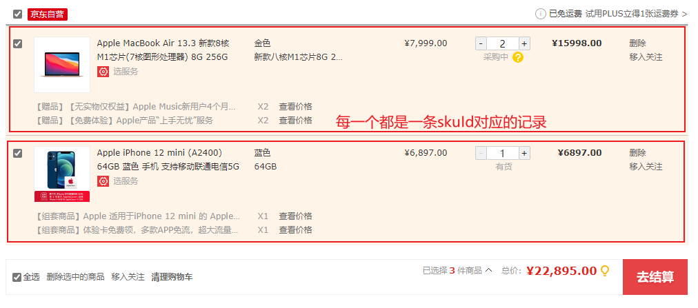
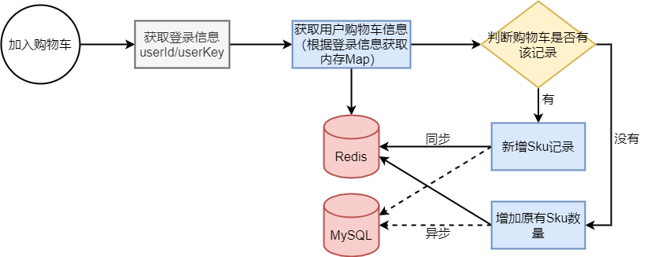
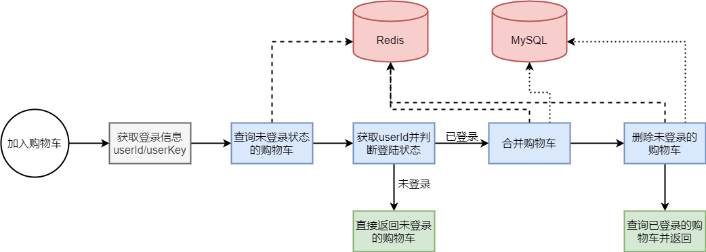
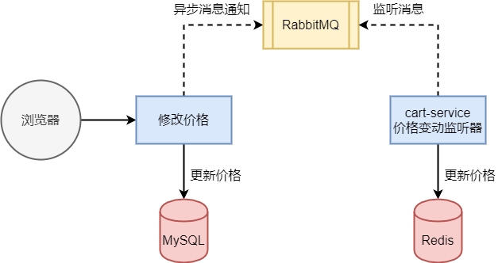

# 购物车流程

## 购物车设计

### 数据模型设计

一个用户可以有多个购物车条目，一个购物车条目对应一个sku，因此每个购物车条目必须可以由 用户id + skuId 查询的到。因此一个购物车条目必须包含 **用户id和skuId** 。

### 数据保存

购物车数据保存：Redis + Mysql

#### Redis设计

使用Hash结构存储，key为用户Id，field为skuId，value为购物车json串，即可以根据用户id与skuId来定位。

#### Mysql设计

直接保存购物车的所有数据，

## 获取登录信息

用户的登录信息存放在cookie中，可以通过**拦截器**获取用户登录信息。用户登陆状态的信息有两个：

1.  jwt令牌：存放已登陆的用户及用户ID等其他信息。
2.  临时ID：存放未登录用户的信息。

状态检查步骤如下：

1、用户信息对象（空）

2、尝试获取 临时id

-   如果临时id存在，则存放到 用户信息对象中。
-   如果临时id为空，则说明用户第一次访问购物车，则生成一个随机id作为用户的临时Id，同时存放到 用户信息对象 与 Cookie中

3、尝试获取 jwt令牌

-   如果令牌存在，则说明用户已登录，直接存放到 用户信息对象中
-   如果令牌不存在，则说明用户未登录，不作任何操作

4、将 用户信息对象 存放到贯穿整个请求链路的对象中。

-   request

-   ThreadLocal

    >   注意，在完成渲染之后需要调用 ThreadLocal的remove方法，以防内存泄露

-   方法传参

## 1、添加商品流程

流程图：

具体步骤：

2.  获取用户购物车信息：
3.  新增Sku记录：
4.  增加原有Sku数量：

## 2、商品查询流程

流程图：

具体步骤：

1.  查询未登录状态的购物车
2.  获取userId并判断登陆状态
3.  合并购物车
4.  删除未登录的购物车

## 3、比价功能流程

比价功能需要的参数由：实时价格、加入购物车时价格。

-   实时价格：在购物车商品发生修改时，实时更新价格。

-   加入购物车时价格：在加入购物车时确定价格，且后续不再修改

参数存储：

-   实时价格存储在Redis中，由于所有人的购物车条目（sku）价格一致，因此选用string类型存储，key为skuId，value为实时价格
-   加入购物车时价格：即为购物车参数之一，不需要额外存储。

比价流程：

## 4、修改商品数量

略。。
